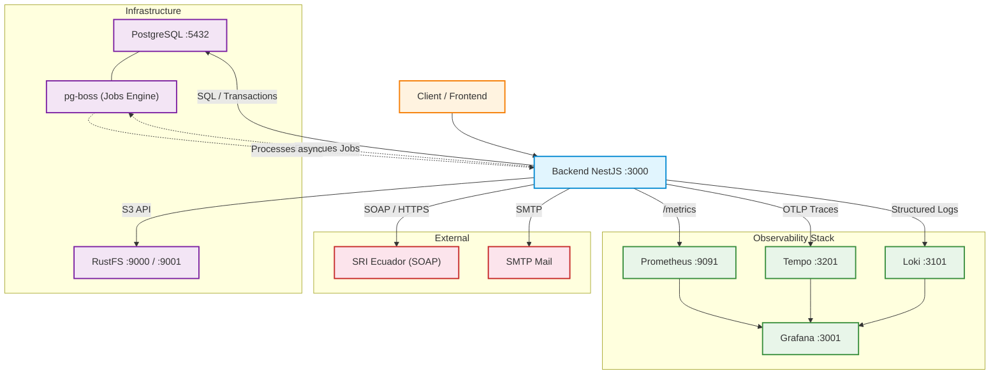

# Screaming Architecture & Hexagonal Design

## Concepto

La arquitectura "grita" el dominio de negocio, no el framework. Al abrir `src/` no ves "controllers/models/services" — ves **"billing/identity/metering"**. Cualquier desarrollador sabe qué hace el sistema sin leer una línea de código.

Cada contexto implementa **Arquitectura Hexagonal** internamente:
- `domain/` — contratos abstractos, sin dependencias externas
- `application/` — casos de uso y orquestación
- `infrastructure/` — adaptadores (Prisma, S3, SOAP, etc.)
- `interfaces/` — HTTP (controllers + DTOs)

> Ver [../standards/LAYERS.md](../standards/LAYERS.md) para el detalle de capas y patrones.

---

## Bounded Contexts

```
src/
├── identity/        ← Quién puede entrar y qué puede hacer
├── metering/        ← Ciclo del agua (medidores y lecturas)
├── billing/         ← Ciclo del dinero (prefacturas, lotes, convenios)
├── operations/      ← Relación comercial (clientes, contratos, territorio)
├── sri/             ← Facturación electrónica (integración SRI Ecuador)
├── reports/         ← Generación de reportes PDF
├── public-portal/   ← Consultas públicas para el cliente final
└── infrastructure/  ← Servicios técnicos transversales
```

---

## Detalle por Contexto

### identity/ — Identidad y Acceso

Guardián del sistema. Controla autenticación, autorización y perfiles.

```
identity/
├── auth/            ← Login, JWT, refresh tokens, estrategias Passport
├── users/           ← Gestión de usuarios y perfiles
├── roles/           ← Roles del sistema
├── permissions/     ← Permisos granulares por recurso/acción
├── sessions/        ← Sesiones activas
└── menus/           ← Menú dinámico según permisos del usuario
```

| Modelo Prisma | Sub-dominio | Descripción |
|---------------|-------------|-------------|
| Usuarios | `users/` | Usuario y perfil unificado |
| Roles | `roles/` | Roles del sistema |
| Permisos | `permissions/` | Permisos granulares |
| RolPermisos | `roles/` | Relación N:M rol-permiso |
| UsuarioPermisos | `users/` | Permisos directos al usuario |
| Sesiones | `sessions/` | Sesiones activas y tokens |
| Menus | `menus/` | Estructura de navegación |
| MenuPermisos | `menus/` | Visibilidad de menú por permiso |

---

### metering/ — Medición

Núcleo operativo del agua. Ciclo: dispositivo → lectura → consumo.

```
metering/
├── meters/          ← Medidores físicos y sus estados
├── readings/        ← Lecturas periódicas y consumo calculado
└── reading-anomaly/ ← Anomalías detectadas (fugas, daños, consumo anormal)
```

| Modelo Prisma | Sub-dominio | Descripción |
|---------------|-------------|-------------|
| Medidores | `meters/` | Dispositivos de medición |
| EstadoMedidor | `meters/` | Estados del medidor (activo, dañado, baja) |
| HistorialMedidores | `readings/` | Historial de cambios de medidor por contrato |
| Lecturas | `readings/` | Lecturas periódicas y consumo calculado |
| LecturaAnomalia | `reading-anomaly/` | Anomalías en lecturas con foto y observación |

---

### billing/ — Facturación y Cobranza

Transforma el consumo en dinero. Ciclo: lote → prefactura → cobro.

```
billing/
├── batch/           ← Lotes de generación masiva de prefacturas
├── pre-invoice/     ← Prefacturas individuales (revisión antes de emitir)
├── tariffs/         ← Categorías de tarifa y precios por consumo
└── collections/
    └── agreements/  ← Convenios de pago (acuerdos por mora)
```

| Módulo | Estado | Descripción |
|--------|--------|-------------|
| `batch/` | ✅ | Generación de lotes de prefacturas por período/comunidad |
| `pre-invoice/` | ✅ | Prefacturas individuales, estados, PDF |
| `tariffs/` | ✅ | Categorías de tarifa, precios base y excedente |
| `collections/agreements/` | ✅ | Convenios de pago y cuotas |
| pagos y cobros | ⏳ | Pagos recibidos, sesiones de caja, saldo a favor |

**Nota sobre Convenios:** están en `billing/collections/` (no en `operations/`) porque representan cobranza — negociación cuando el cliente no puede pagar, no la relación comercial inicial.

---

### operations/ — Operaciones Comerciales

Relación comercial entre la empresa y el cliente. Territorio, contratos, rutas.

```
operations/
├── clients/         ← Clientes del sistema
├── contracts/       ← Contratos de servicio (cliente ↔ medidor)
├── communities/     ← Comunidades/barrios
├── sectors/         ← Sectores dentro de comunidades
└── routes/          ← Rutas de lectura y distribución
```

| Modelo Prisma | Sub-dominio | Descripción |
|---------------|-------------|-------------|
| Clientes | `clients/` | Clientes y tipos de identificación |
| Contratos | `contracts/` | Contratos de servicio activos |
| Comunidades | `communities/` | Comunidades/barrios del territorio |
| Sectores | `sectors/` | Sectores dentro de comunidades |
| Rutas | `routes/` | Rutas de operación y lectura |

---

### sri/ — Facturación Electrónica SRI

Integración con el Servicio de Rentas Internas de Ecuador. Firma digital, SOAP, XML, autorización.

```
sri/
├── domain/
│   ├── entities/    ← Entidades de comprobantes (factura, retención, etc.)
│   ├── interfaces/  ← Contratos del dominio SRI
│   └── repositories/
├── application/
│   ├── services/    ← Orquestación del ciclo de vida del comprobante
│   └── use-cases/   ← Emisión, autorización, anulación
└── infrastructure/
    ├── soap/        ← Cliente SOAP para webservices SRI
    ├── xml/         ← Generación y firma XAdES de comprobantes
    ├── storage/     ← Almacenamiento de XMLs y PDFs en RustFS
    ├── persistence/ ← Repositorios Prisma para comprobantes
    └── queue/       ← Cola de envío asíncrono (pg-boss)
```

Tipos de comprobante soportados: facturas, notas de crédito, notas de débito, retenciones, guías de remisión.

---

### reports/ — Reportes

Generación de reportes PDF del sistema (consumos, cobros, cortes, etc.).

```
reports/
├── dto/             ← Parámetros de cada reporte
├── interfaces/http/ ← Endpoints de descarga
├── pdf/             ← Generación con Puppeteer/pdf-lib
└── specs/           ← Especificaciones de layout por reporte
```

---

### public-portal/ — Portal Público

Acceso sin autenticación para consultas del cliente final.

```
public-portal/
└── search/          ← Búsqueda de facturas y estado de cuenta por cliente
```

---

### infrastructure/ — Servicios Técnicos Transversales

No pertenece a ningún dominio de negocio. Son adaptadores y utilidades globales.

```
infrastructure/
├── database/        ← PrismaService, conexión PostgreSQL, raw-pg, s3-client
├── storage/         ← IStorageService → RustFS (S3-compatible)
├── mail/            ← IMailProvider → SMTP vía Nodemailer
├── encryption/      ← Cifrado AES, firma de certificados P12
├── pdf/             ← Motor de generación PDF compartido (Puppeteer + pdf-lib)
├── jobs/            ← Motor de colas pg-boss (sin Redis)
├── audit/           ← Registro de auditoría de acciones
├── observability/   ← Pino (logs), Prometheus (métricas), OpenTelemetry (trazas)
├── common/          ← Guards, filters, interceptors, decorators, utils, pipes
└── config/          ← Constantes, variables de entorno, configuración global
```

---

## Anatomía de un Sub-dominio

Todos los sub-dominios siguen la misma estructura hexagonal:

```
<context>/<subdomain>/
├── application/
│   ├── <entity>.service.ts
│   └── use-cases/
│       ├── find-all-<entity>.use-case.ts
│       ├── find-one-<entity>.use-case.ts
│       └── <action>-<entity>.use-case.ts
├── domain/
│   └── repositories/
│       └── <entity>.repository.ts       ← abstract class (Port)
├── infrastructure/
│   └── repositories/
│       └── prisma-<entity>.repository.ts ← Prisma impl (Adapter)
├── interfaces/
│   ├── dto/
│   │   └── <action>-<entity>.dto.ts
│   └── http/
│       └── <entity>.controller.ts
└── <entity>.module.ts
```

---

## Reglas de Asignación de Contexto

| Pregunta | Contexto |
|----------|----------|
| ¿Lo gestiona un admin del sistema? | `identity/` |
| ¿Involucra un medidor físico o una lectura? | `metering/` |
| ¿Es parte del ciclo de dinero (factura, cobro, convenio)? | `billing/` |
| ¿Es la relación comercial inicial (cliente, contrato, territorio)? | `operations/` |
| ¿Involucra firma digital y comunicación con el SRI? | `sri/` |
| ¿Es una consulta pública sin auth? | `public-portal/` |
| ¿Es un reporte descargable? | `reports/` |
| ¿Es infraestructura técnica sin dominio propio? | `infrastructure/` |

---

## Infrastructure Diagram



### Servicios del Stack

| Servicio | Puerto | Función |
|----------|--------|---------|
| Backend NestJS | `3000` | API principal + Swagger en `/docs` |
| PostgreSQL | `5432` | Base de datos relacional + motor pg-boss |
| RustFS | `9000` / `9001` | Object storage S3-compatible + consola web |
| pg-boss | — | Colas transaccionales en PostgreSQL (sin Redis) |
| Prometheus | `9091` | Scraping de métricas desde `/metrics` |
| Tempo | `3201` | Distributed tracing vía OTLP |
| Loki | `3101` | Agregación de logs estructurados |
| Grafana | `3001` | Dashboards unificados (métricas + trazas + logs) |

---

## Documentos Relacionados

| Documento | Descripción |
|-----------|-------------|
| [../standards/LAYERS.md](../standards/LAYERS.md) | Detalle de capas hexagonales con ejemplos de código |
| [../standards/NAMING.md](../standards/NAMING.md) | Naming conventions por capa |
| [modules/billing.md](./modules/billing.md) | Detalle del contexto Billing |
| [modules/identity.md](./modules/identity.md) | Detalle del contexto Identity |
| [modules/metering.md](./modules/metering.md) | Detalle del contexto Metering |
| [modules/operations.md](./modules/operations.md) | Detalle del contexto Operations |
