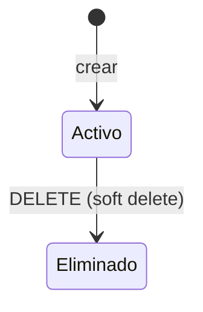

# Clientes

Subdominio de identidad y datos del titular. La API usa `/api/v1` y autenticación Bearer.

## Alcance y entradas HTTP

- **Controlador:** `ClientController` (`backend/src/operations/clients/interfaces/http/client.controller.ts`).
- **Servicio:** `ClientService`.
- **Casos:** `CreateClientUseCase`, `FindOneClientUseCase`, `UpdateClientUseCase`, `RemoveClientUseCase`.
- `GET /identification-types` no tiene caso de uso dedicado.
- `GET /clients` tampoco tiene `FindAllClientUseCase`: el servicio construye filtros y pagina directamente.

| Método y ruta | Caso/servicio ejecutado | Resultado |
|---|---|---|
| `GET /api/v1/clients/identification-types` | `ClientService.findAllIdentificaciones()` | Catálogo activo. |
| `POST /api/v1/clients` | `ClientService.create()` → `CreateClientUseCase.execute()` | Cliente creado (`201`). |
| `GET /api/v1/clients` | `ClientService.findAll()` → `buildClientFilters()` → `ClientRepository.paginateClientes()` | Página de clientes. |
| `GET /api/v1/clients/:id` | `ClientService.findOne()` → `FindOneClientUseCase.execute()` | Cliente encontrado. |
| `PATCH /api/v1/clients/:id` | `ClientService.update()` → `UpdateClientUseCase.execute()` | Cliente actualizado. |
| `DELETE /api/v1/clients/:id` | `ClientService.delete()` → `RemoveClientUseCase.execute()` | Soft delete. |

## Ejemplo JSON

```json
{
  "clienteId": "10",
  "identificacion": "1712345678",
  "nombres": "Juan",
  "apellidos": "Pérez",
  "razonSocial": null,
  "email": "juan@example.com",
  "telefono": "0991234567",
  "direccionDomicilio": "Av. Principal 123",
  "activo": true
}
```

| Campo | Tipo | Regla/uso |
|---|---|---|
| `clienteId` | string | `BigInt` serializado. |
| `tipoIdentificacionId` | number | Referencia al catálogo. |
| `identificacion` | string | Identificador del titular. |
| `nombres`, `apellidos` | string/null | Nombre personal. |
| `razonSocial` | string/null | Nombre empresarial cuando aplica. |
| `email`, `telefono`, `direccionDomicilio` | string/null | Datos de contacto y domicilio. |
| `activo` | boolean | Disponibilidad lógica expuesta por el DTO. |

## Estados

No existe enum vigente de estado de cliente. `activo=true` indica habilitación; `deletedAt != null` indica eliminación lógica y es interno.

## Efectos y transacciones

Crear, actualizar y eliminar escriben `Clientes` mediante sus casos de uso; eliminar usa soft delete. Las consultas, `buildClientFilters` y `ClientResponseDto.fromEntity` son transformaciones/serialización puras. No se confirmó una transacción adicional ni handler de eventos propio.

| Tabla Prisma | Uso |
|---|---|
| `Clientes` | Titular y soft delete. |
| `CatalogoTiposIdentificacion` | Tipos activos y relación. |

## Gráfico de estados



## Casos de uso

### Caso: Catálogo de tipos de identificación

**Descripción:** devuelve los tipos activos para formularios.

**HTTP y ruta:** `GET /api/v1/clients/identification-types`.

**Permiso:** `clientes:read`.

**Cadena:** `ClientController.findAllIdentificaciones()` → `ClientService.findAllIdentificaciones()` → `ClientRepository.findActiveTipoIdentificaciones()` (sin caso dedicado).

**Errores relevantes:** `401` no autenticado; `403` sin permiso.

**Efectos:** ninguno; consulta y mapeo puros.

**Prisma:** `CatalogoTiposIdentificacion`.

**Entrada:** sin body, path ni query.

**Salida:**

```json
[
  {
    "tipoIdentificacionId": 1,
    "codigo": "CEDULA",
    "descripcion": "Cédula"
  }
]
```

### Caso: Crear cliente

**Descripción:** registra un nuevo titular.

**HTTP y ruta:** `POST /api/v1/clients`.

**Permiso:** `clientes:create`.

**Cadena:** `ClientController.create()` → `ClientService.create()` → `CreateClientUseCase.execute()` → `ClientRepository`.

**Errores relevantes:** `400` datos inválidos; `401`; `403`; conflictos de identificación.

**Efectos:** alta en `Clientes`; el DTO de salida es serialización pura.

**Prisma:** `Clientes`, `CatalogoTiposIdentificacion`.

**Entrada:**

```json
{
  "tipoIdentificacionId": 1,
  "identificacion": "1712345678",
  "nombres": "Juan",
  "apellidos": "Pérez",
  "razonSocial": null,
  "email": "juan@example.com"
}
```

**Salida:**

```json
{
  "clienteId": "10",
  "identificacion": "1712345678",
  "nombres": "Juan",
  "apellidos": "Pérez",
  "razonSocial": null,
  "email": "juan@example.com",
  "telefono": null,
  "direccionDomicilio": null,
  "activo": true
}
```

### Caso: Listar clientes

**Descripción:** consulta clientes con filtros opcionales y paginación.

**HTTP y ruta:** `GET /api/v1/clients`.

**Permiso:** `clientes:read`.

**Cadena:** `ClientController.findAll()` → `ClientService.findAll()` → `buildClientFilters()` → `ClientRepository.paginateClientes()`; no existe `FindAllClientUseCase`.

**Errores relevantes:** `400` query inválida; `401`; `403`.

**Efectos:** ninguno; consulta y DTO puros.

**Prisma:** `Clientes`, `CatalogoTiposIdentificacion`.

**Entrada:** sin body. Query: `page`, `limit`, `identificacion`, `nombres`, `apellidos`, `nombreCompleto`.

**Salida:**

```json
{
  "data": [
    {
      "clienteId": "10",
      "identificacion": "1712345678",
      "nombres": "Juan",
      "apellidos": "Pérez",
      "activo": true
    }
  ],
  "meta": {
    "page": 1,
    "limit": 10,
    "total": 1,
    "totalPages": 1
  }
}
```

### Caso: Obtener cliente

**Descripción:** devuelve un cliente por identificador.

**HTTP y ruta:** `GET /api/v1/clients/:id`.

**Permiso:** `clientes:read`.

**Cadena:** `ClientController.findOne()` → `ClientService.findOne()` → `FindOneClientUseCase.execute()` → `ClientRepository`.

**Errores relevantes:** `400` ID inválido; `401`; `403`; `404` no encontrado.

**Efectos:** ninguno; DTO puro.

**Prisma:** `Clientes`, `CatalogoTiposIdentificacion`.

**Entrada:** sin body. Path: `{ "id": "10" }`.

**Salida:**

```json
{
  "clienteId": "10",
  "identificacion": "1712345678",
  "nombres": "Juan",
  "apellidos": "Pérez",
  "razonSocial": null,
  "email": "juan@example.com",
  "telefono": null,
  "direccionDomicilio": null,
  "activo": true
}
```

### Caso: Actualizar cliente

**Descripción:** modifica parcialmente los datos permitidos del titular.

**HTTP y ruta:** `PATCH /api/v1/clients/:id`.

**Permiso:** `clientes:update`.

**Cadena:** `ClientController.update()` → `ClientService.update()` → `UpdateClientUseCase.execute()` → `ClientRepository`.

**Errores relevantes:** `400` ID/body inválidos; `401`; `403`; `404` no encontrado.

**Efectos:** actualización de `Clientes`; DTO puro.

**Prisma:** `Clientes`, `CatalogoTiposIdentificacion`.

**Entrada:** path `{ "id": "10" }`; body:

```json
{
  "telefono": "0990000000",
  "email": "nuevo@example.com"
}
```

**Salida:**

```json
{
  "clienteId": "10",
  "telefono": "0990000000",
  "email": "nuevo@example.com",
  "activo": true
}
```

### Caso: Eliminar cliente

**Descripción:** marca el cliente como eliminado sin borrado físico.

**HTTP y ruta:** `DELETE /api/v1/clients/:id`.

**Permiso:** `clientes:delete`.

**Cadena:** `ClientController.delete()` → `ClientService.delete()` → `RemoveClientUseCase.execute()` → `ClientRepository`.

**Errores relevantes:** `400` ID inválido; `401`; `403`; `404` no encontrado.

**Efectos:** soft delete en `Clientes`; `deletedAt` no se expone.

**Prisma:** `Clientes`.

**Entrada:** sin body. Path: `{ "id": "10" }`.

**Salida:**

```json
{
  "clienteId": "10",
  "identificacion": "1712345678",
  "activo": false
}
```

## No documentado o pendiente de confirmar

- Reactivación pública y transiciones automáticas de `activo`.
- Handlers de eventos de clientes.
- Estados legacy distintos de `activo`/`deletedAt`.
