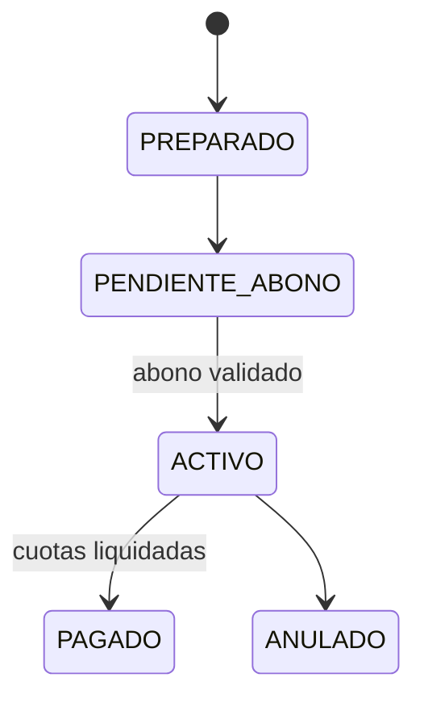

# Convenios de pago

Financiación de deuda contractual, cuotas y efectos de pagos relacionados.

## Alcance y entradas HTTP

- **Controladores:** `AgreementsController` y, para pagos que afectan cuotas, `PaymentsController`.
- **Servicios:** `AgreementsService` y `PaymentsService`.
- **Casos:** `GetDebtSummaryUseCase`, `CreateAgreementUseCase`, `FindOneAgreementUseCase`, `UpdateAgreementUseCase`, `GetPaymentAgreementPdfDataUseCase`, `CreatePaymentUseCase`, `ValidatePaymentUseCase`, `AnnulPaymentUseCase`, `ApplySaldoFavorUseCase`.
- Listar convenios y catálogos se resuelven directamente en los servicios; no se confirmó caso dedicado para `findAll` ni para catálogos.

| Método y ruta | Caso/servicio ejecutado | Resultado |
|---|---|---|
| `GET /api/v1/agreements/states` | `findAllAgreementStates()` | Estados de convenio. |
| `GET /api/v1/agreements/installment-states` | `findAllInstallmentStates()` | Estados de cuota. |
| `GET /api/v1/agreements/debt-summary/:contratoId` | `getDebtSummary()` → `GetDebtSummaryUseCase` | Deuda. |
| `POST /api/v1/agreements` | `create()` → `CreateAgreementUseCase` | Convenio y cuotas. |
| `GET /api/v1/agreements` / `:id` / `:id/installments` | servicio / `FindOneAgreementUseCase` | Convenio/cuotas. |
| `PATCH /api/v1/agreements/:id` | `update()` → `UpdateAgreementUseCase` | Estado. |
| `DELETE /api/v1/agreements/:id` | `cancel()` → `UpdateAgreementUseCase(ANULADO)` | Anulación. |
| `GET /api/v1/agreements/:id/pdf` | `generatePdf()` → `GetPaymentAgreementPdfDataUseCase` | PDF. |
| `POST/PATCH/DELETE /api/v1/payments...` | casos de pagos | Crea, valida, aplica o anula pagos. |

## Ejemplo JSON

```json
{
  "convenioId": "8",
  "contratoId": "1",
  "deudaTotal": 240.5,
  "abonoInicial": 40,
  "numeroCuotas": 5,
  "estado": "PENDIENTE_ABONO",
  "cuotas": [
    {
      "cuotaConvenioId": "81",
      "numeroCuota": 1,
      "valorCuota": 40.1,
      "estado": "PENDIENTE"
    }
  ]
}
```

| Campo | Tipo | Regla/uso |
|---|---|---|
| `convenioId`, `contratoId`, `cuotaConvenioId` | string | `BigInt` serializado. |
| `deudaTotal`, `abonoInicial`, `valorCuota` | number | Valores monetarios. |
| `numeroCuotas`, `numeroCuota` | number | Plan y posición. |
| `estado` | enum | Estado de convenio o cuota según el objeto. |

## Estados

| Entidad | Estados | Significado |
|---|---|---|
| Convenio | `PREPARADO`, `PENDIENTE_ABONO`, `ACTIVO`, `PAGADO`, `ANULADO` | Creado, abono pendiente, vigente, liquidado o anulado. |
| Cuota | `PENDIENTE`, `PAGADA` | No liquidada o liquidada. |
| Pago relacionado | `PENDIENTE`, `REGISTRADO`, `ANULADO` | Por validar, validado o anulado. |

## Efectos y transacciones

Crear convenio calcula deuda y cuotas y persiste `Convenios`/`CuotaConvenio`. Validar pagos puede actualizar cuotas, prefacturas y contrato mediante handlers (`PagoValidadoHandler`, `CuotaPagadaHandler`); anular puede revertir esos efectos. La generación de catálogos, consultas y DTO es pura. La subida de comprobante escribe RustFS y no Prisma.

| Tabla Prisma | Uso |
|---|---|
| `Convenios` | Plan y estado. |
| `CuotaConvenio` | Cuotas y pagos aplicados. |
| `Contratos`, `Prefacturas`, `PrefacturaDetalle`, `Rubros` | Deuda de origen. |
| `Pagos`, `DetallePago`, `SaldoFavor` | Cobros y saldos. |

## Gráfico de estados



## Casos de uso

### Caso: Consultar estados de convenio

**Descripción:** entrega el catálogo de estados disponibles para convenios.  
**HTTP y ruta:** `GET /api/v1/agreements/states`.  
**Permiso:** `agreements:read`.  
**Cadena:** `AgreementsController.findAllStates()` → `AgreementsService.findAllAgreementStates()` → enum.  
**Errores relevantes:** `401`; `403`.  
**Efectos:** ninguno; catálogo de lectura.  
**Prisma:** ninguna tabla.  
**Entrada:** sin body, path ni query.  
**Salida:** `[ { "codigo": "ACTIVO", "descripcion": "Activo" } ]`.

### Caso: Consultar estados de cuota

**Descripción:** entrega el catálogo de estados disponibles para cuotas.  
**HTTP y ruta:** `GET /api/v1/agreements/installment-states`.  
**Permiso:** `agreements:read`.  
**Cadena:** `AgreementsController.findAllInstallmentStates()` → `AgreementsService.findAllInstallmentStates()` → enum.  
**Errores relevantes:** `401`; `403`.  
**Efectos:** ninguno; catálogo de lectura.  
**Prisma:** ninguna tabla.  
**Entrada:** sin body, path ni query.  
**Salida:** `[ { "codigo": "PENDIENTE", "descripcion": "Pendiente" } ]`.

### Caso: Consultar resumen de deuda

**Descripción:** calcula deuda, pagos y saldo pendiente del contrato.  
**HTTP y ruta:** `GET /api/v1/agreements/debt-summary/:contratoId`.  
**Permiso:** `agreements:read`.  
**Cadena:** `AgreementsController.getDebtSummary()` → `AgreementsService.getDebtSummary()` → `GetDebtSummaryUseCase.execute()` → repositorio.  
**Errores relevantes:** `400`; `401`; `403`; `404`.  
**Efectos:** ninguno.  
**Prisma:** `Contratos`, `Prefacturas`, `PrefacturaDetalle`, `Rubros`, pagos.  
**Entrada:** sin body; path `{ "contratoId": "1" }`.  
**Salida:** `{ "contratoId": "1", "deudaTotal": 240.5, "montoPagado": 40, "saldoPendiente": 200.5 }`.

### Caso: Crear convenio

**Descripción:** crea un plan de pago y genera sus cuotas.  
**HTTP y ruta:** `POST /api/v1/agreements`.  
**Permiso:** `agreements:create`.  
**Cadena:** `AgreementsController.create()` → `AgreementsService.create()` → `CreateAgreementUseCase.execute()` → repositorio.  
**Errores relevantes:** `400`; `401`; `403`; `404`; deuda no convenible.  
**Efectos:** persiste convenio y cuotas; no activa por sí solo el contrato.  
**Prisma:** `Convenios`, `CuotaConvenio`, `Contratos`, prefacturas/rubros.  
**Entrada:** `{ "contratoId": "1", "abonoInicial": 40, "numeroCuotas": 5 }`.  
**Salida:** JSON del ejemplo principal.

### Caso: Listar convenios

**Descripción:** lista convenios paginados y filtrables.  
**HTTP y ruta:** `GET /api/v1/agreements`.  
**Permiso:** `agreements:read`.  
**Cadena:** `AgreementsController.findAll()` → `AgreementsService.findAll()` → repositorio; sin caso dedicado confirmado.  
**Errores relevantes:** `400`; `401`; `403`.  
**Efectos:** ninguno.  
**Prisma:** `Convenios`, contrato/cliente.  
**Entrada:** sin body; query `page`, `limit`, `contratoId`, `estado`, `search`.  
**Salida:** `{ "data": [{ "convenioId": "8", "estado": "ACTIVO" }], "meta": {} }`.

### Caso: Obtener convenio

**Descripción:** devuelve el detalle de un convenio por identificador.  
**HTTP y ruta:** `GET /api/v1/agreements/:id`.  
**Permiso:** `agreements:read`.  
**Cadena:** `AgreementsController.findOne()` → `AgreementsService.findOne()` → `FindOneAgreementUseCase.execute()` → repositorio.  
**Errores relevantes:** `400`; `401`; `403`; `404`.  
**Efectos:** ninguno; consulta y DTO puros.  
**Prisma:** `Convenios`, `Contratos`, `Clientes`, `CuotaConvenio`.  
**Entrada:** sin body; path `{ "id": "8" }`.  
**Salida:** objeto JSON `AgreementResponseDto` con sus datos y cuotas.

### Caso: Listar cuotas de un convenio

**Descripción:** devuelve las cuotas asociadas a un convenio.  
**HTTP y ruta:** `GET /api/v1/agreements/:id/installments`.  
**Permiso:** `agreements:read`.  
**Cadena:** `AgreementsController.findInstallments()` → `AgreementsService.findInstallments()` → repositorio.  
**Errores relevantes:** `400`; `401`; `403`; `404`.  
**Efectos:** ninguno; consulta y DTO puros.  
**Prisma:** `CuotaConvenio`, `Convenios`.  
**Entrada:** sin body; path `{ "id": "8" }`.  
**Salida:** lista JSON `[ { "cuotaConvenioId": "81", "numeroCuota": 1, "estado": "PENDIENTE" } ]`.

### Caso: Actualizar estado del convenio

**Descripción:** aprueba, paga o cambia el estado permitido del convenio.  
**HTTP y ruta:** `PATCH /api/v1/agreements/:id`.  
**Permiso:** `agreements:update`.  
**Cadena:** `AgreementsController.update()` → `AgreementsService.update()` → `UpdateAgreementUseCase.execute()` → repositorio.  
**Errores relevantes:** `400`; `401`; `403`; `404`; transición inválida.  
**Efectos:** `PAGADO` puede marcar convenio y cuotas.  
**Prisma:** `Convenios`, `CuotaConvenio`.  
**Entrada:** path `{ "id": "8" }`; body `{ "estado": "ACTIVO" }`.  
**Salida:** `{ "convenioId": "8", "estado": "ACTIVO" }`.

### Caso: Anular convenio

**Descripción:** marca un convenio como `ANULADO`.  
**HTTP y ruta:** `DELETE /api/v1/agreements/:id`.  
**Permiso:** `agreements:delete`.  
**Cadena:** `AgreementsController.cancel()` → `AgreementsService.cancel()` → `UpdateAgreementUseCase(ANULADO)`.  
**Errores relevantes:** `400`; `401`; `403`; `404`.  
**Efectos:** persiste anulación; no se confirma borrado físico.  
**Prisma:** `Convenios`, cuotas si la transición las afecta.  
**Entrada:** sin body; path `{ "id": "8" }`.  
**Salida:** `{ "convenioId": "8", "estado": "ANULADO" }`.

### Caso: Generar PDF del convenio

**Descripción:** genera el documento imprimible del plan.  
**HTTP y ruta:** `GET /api/v1/agreements/:id/pdf`.  
**Permiso:** `agreements:read`.  
**Cadena:** `AgreementsController.generatePdf()` → `AgreementsService.generatePdf()` → `GetPaymentAgreementPdfDataUseCase.execute()` → dispatcher.  
**Errores relevantes:** `400`; `401`; `403`; `404`; aborto de solicitud.  
**Efectos:** sólo lectura y proyección; PDF puro.  
**Prisma:** `Convenios`, `CuotaConvenio`, `Contratos`, `Clientes`.  
**Entrada:** sin body; path `{ "id": "8" }`.  
**Salida:** no es JSON: `application/pdf`, `Content-Disposition: inline`, `Content-Length` y bytes PDF.

## No documentado o pendiente de confirmar

- Política completa de mora y transiciones automáticas de cuotas.
- Registro efectivo de todos los handlers en cada despliegue.
- Umbral que convierte una cuota vencida en causal automática de corte.
