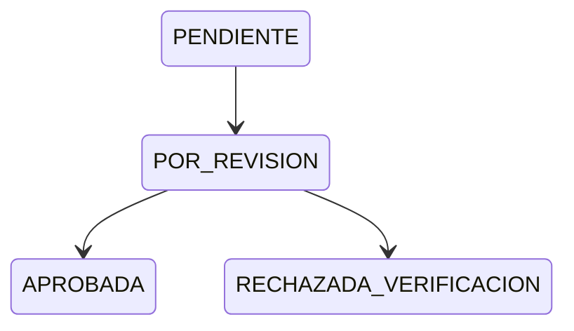

# Lecturas

Captura, revisión y operación de lecturas de consumo.

## Alcance y entradas HTTP

- **Controladores:** `ReadingController`, `OperatorController`.
- **Servicio:** `ReadingService`.
- **Casos:** `FindAllReadingsUseCase`, `FindOneReadingUseCase`, `UpdateReadingUseCase`, `RemoveReadingUseCase`, `GetOperatorReadingsUseCase`, `GetOperatorReadingsWithAnomaliesUseCase`, `UpdateOperatorReadingUseCase`.
- El catálogo `GET /estados` se construye desde el enum y no tiene servicio/caso dedicado.

| Método y ruta | Caso/servicio ejecutado | Resultado |
|---|---|---|
| `GET /api/v1/readings` | `findAll()` → `FindAllReadingsUseCase` | Página. |
| `GET /api/v1/readings/estados` | `getEstados()` → `buildStateCatalog()` | Catálogo. |
| `GET /api/v1/readings/:id` | `findOne()` → `FindOneReadingUseCase` | Lectura. |
| `PATCH /api/v1/readings/:id` | `update()` → `UpdateReadingUseCase` | Lectura actualizada. |
| `DELETE /api/v1/readings/:id` | `delete()` → `RemoveReadingUseCase`/repositorio | Soft delete. |
| `GET /api/v1/operator/readings` | `GetOperatorReadingsUseCase` | Lecturas propias. |
| `GET /api/v1/operator/readings/anomalies` | `GetOperatorReadingsWithAnomaliesUseCase` | Anomalías pendientes. |
| `PATCH /api/v1/operator/readings/:id` | `UpdateOperatorReadingUseCase` | Lectura/evidencia. |

## Ejemplo JSON

```json
{
  "lecturaId": "101",
  "fecha": "2026-08-19",
  "lecturaAnterior": 500,
  "lecturaActual": 530,
  "consumoCalculado": 30,
  "estado": "APROBADA"
}
```

| Campo | Tipo | Regla/uso |
|---|---|---|
| `lecturaId` | string | `BigInt` serializado. |
| `fecha` | string | Fecha de lectura. |
| `lecturaAnterior`, `lecturaActual`, `consumoCalculado` | number | Valores y diferencia de consumo. |
| `estado` | enum | Revisión y resultado. |
| `evidenciaFotoUrl` | string/null | Evidencia de la orden vinculada cuando aplica. |

## Estados

| Estado | Significado |
|---|---|
| `PENDIENTE` | Capturada y aún no revisada. |
| `POR_REVISION` | Requiere validación. |
| `APROBADA` | Elegible para prefacturación. |
| `RECHAZADA_VERIFICACION` | Rechazada. |
| `ESTIMADA` | Valor estimado. |
| `PLANILLADA` | Incorporada a planilla. |
| `CON_NOVEDAD` | Tiene anomalía/novedad. |

## Efectos y transacciones

La actualización administrativa persiste `Lecturas` y protege el cambio con control de concurrencia. La operación del operador puede persistir lectura, novedad y evidencia en RustFS; si falla, elimina la foto recién subida. Consultas, resta de consumo y DTO son transformaciones puras. DELETE usa soft delete.

| Tabla Prisma | Uso |
|---|---|
| `Lecturas` | Valores, estado y soft delete. |
| `Contratos`, `Medidores`, `Periodos` | Contexto de lectura. |
| `OrdenTrabajo`, `NovedadOrdenTrabajo` | Operación y anomalías. |

## Gráfico de estados



## Casos de uso

### Caso: Listar lecturas

**Descripción:** devuelve lecturas filtradas y paginadas.  
**HTTP y ruta:** `GET /api/v1/readings`.  
**Permiso:** `lecturas:read`.  
**Cadena:** `ReadingController.findAll()` → `ReadingService.findAll()` → `FindAllReadingsUseCase.execute()` → repositorio.  
**Errores relevantes:** `400`; `401`; `403`.  
**Efectos:** ninguno; lectura y DTO puros.  
**Prisma:** `Lecturas`, `Contratos`, `Medidores`, `Periodos`.  
**Entrada:** sin body; query `page`, `limit`, `contratoId`, `estado`, `search`.  
**Salida:** `{ "data": [{ "lecturaId": "101", "estado": "PENDIENTE" }], "meta": {} }`.

### Caso: Consultar catálogo de estados

**Descripción:** entrega etiquetas e iconos de `EstadoLectura`.  
**HTTP y ruta:** `GET /api/v1/readings/estados`.  
**Permiso:** `lecturas:read`.  
**Cadena:** `ReadingController.getEstados()` → `buildStateCatalog()` (sin caso dedicado).  
**Errores relevantes:** `401`; `403`.  
**Efectos:** ninguno.  
**Prisma:** ninguna tabla.  
**Entrada:** sin body, path ni query.  
**Salida:** `[{ "codigo": "APROBADA", "descripcion": "Aprobada", "icono": "bi-check-circle" }]`.

### Caso: Obtener lectura

**Descripción:** devuelve una lectura por ID.  
**HTTP y ruta:** `GET /api/v1/readings/:id`.  
**Permiso:** `lecturas:read`.  
**Cadena:** `ReadingController.findOne()` → `ReadingService.findOne()` → `FindOneReadingUseCase.execute()` → repositorio.  
**Errores relevantes:** `400`; `401`; `403`; `404`.  
**Efectos:** ninguno; DTO puro.  
**Prisma:** `Lecturas`, `Medidores`, `Periodos`, `Contratos`.  
**Entrada:** sin body; path `{ "id": "101" }`.  
**Salida:** el JSON del ejemplo principal.

### Caso: Actualizar lectura administrativa

**Descripción:** actualiza campos no fotográficos y estado.  
**HTTP y ruta:** `PATCH /api/v1/readings/:id`.  
**Permiso:** `lecturas:update`.  
**Cadena:** `ReadingController.actualizarLectura()` → `ReadingService.update()` → `UpdateReadingUseCase.execute()` → repositorio.  
**Errores relevantes:** `400` body/transición/CAS; `401`; `403`; `404`; `409`.  
**Efectos:** persiste lectura; cálculo y DTO puros.  
**Prisma:** `Lecturas`, `Medidores`, `OrdenTrabajo`, `NovedadOrdenTrabajo`.  
**Entrada:** path `{ "id": "101" }`; body `{ "lecturaActual": 530, "estado": "POR_REVISION" }`.  
**Salida:** `{ "lecturaId": "101", "lecturaActual": 530, "consumoCalculado": 30, "estado": "POR_REVISION" }`.

### Caso: Eliminar lectura

**Descripción:** aplica eliminación lógica.  
**HTTP y ruta:** `DELETE /api/v1/readings/:id`.  
**Permiso:** `lecturas:delete`.  
**Cadena:** `ReadingController.eliminarLectura()` → `ReadingService.delete()` → `RemoveReadingUseCase`/repositorio.  
**Errores relevantes:** `400`; `401`; `403`; `404`.  
**Efectos:** establece `deletedAt` en `Lecturas`.  
**Prisma:** `Lecturas`.  
**Entrada:** sin body; path `{ "id": "101" }`.  
**Salida:** `{ "message": "Lectura eliminada" }`.

### Caso: Listar lecturas del operador

**Descripción:** devuelve las lecturas del período activo asignadas al operador autenticado.  
**HTTP y ruta:** `GET /api/v1/operator/readings`.  
**Permiso:** `lecturas:read`.  
**Cadena:** `OperatorController.getOperatorReadings()` → `GetOperatorReadingsUseCase.execute()` → repositorio y DTO.  
**Errores relevantes:** `400`; `401`; `403`; `404` sin período activo.  
**Efectos:** ninguno; consulta y DTO puros.  
**Prisma:** `Lecturas`, `Rutas`, `OrdenTrabajo`, `Periodos`.  
**Entrada:** sin body ni query; operador desde JWT.  
**Salida:** lista JSON de `ResponseReadingDto`.

### Caso: Listar anomalías pendientes del operador

**Descripción:** devuelve las lecturas del operador que tienen anomalías pendientes de atención.  
**HTTP y ruta:** `GET /api/v1/operator/readings/anomalies`.  
**Permiso:** `lecturas:read`.  
**Cadena:** `OperatorController.getOperatorReadingsWithAnomalies()` → `GetOperatorReadingsWithAnomaliesUseCase.execute()` → repositorios y DTO.  
**Errores relevantes:** `400`; `401`; `403`; `404` sin período activo.  
**Efectos:** ninguno; consulta y DTO puros.  
**Prisma:** `Lecturas`, `Rutas`, `OrdenTrabajo`, `NovedadOrdenTrabajo`, `Periodos`.  
**Entrada:** sin body ni query; operador desde JWT.  
**Salida:** lista JSON, por ejemplo `[ { "lecturaId": "101", "estado": "CON_NOVEDAD" } ]`.

### Caso: Actualizar lectura del operador

**Descripción:** captura valor, fecha, novedad y foto de campo.  
**HTTP y ruta:** `PATCH /api/v1/operator/readings/:id`.  
**Permiso:** `lecturas:update`.  
**Cadena:** `OperatorController.updateOperatorReading()` → `UpdateOperatorReadingUseCase.execute()` → repositorios/RustFS.  
**Errores relevantes:** `400`; `401`; `403` fuera de ruta; `404`; `409`.  
**Efectos:** persiste lectura/novedad y guarda `foto` como `evidenciaFotoUrl` de la orden; rollback si falla.  
**Prisma:** `Lecturas`, `NovedadOrdenTrabajo`, `OrdenTrabajo`.  
**Entrada:** path `{ "id": "101" }`; multipart campos DTO y archivo opcional `foto`; sin body JSON.  
**Salida:** `{ "lecturaId": "101", "estado": "POR_REVISION", "evidenciaFotoUrl": "ordenes/9/foto.jpg" }`.

## No documentado o pendiente de confirmar

- Transiciones de `ESTIMADA`, `PLANILLADA` y `CON_NOVEDAD`.
- Alta independiente `POST /readings`.
- Promoción exacta de lectura aprobada a planilla.
