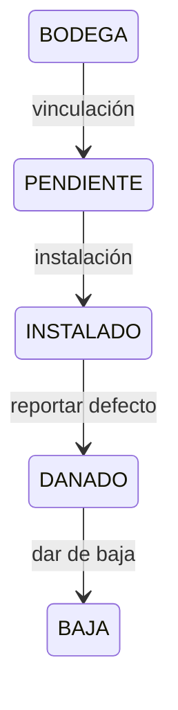

# Medidores

Inventario, asignación, reemplazo y retiro operativo de medidores.

## Alcance y entradas HTTP

- **Controladores:** `MeterController`, `OperatorController`.
- **Servicio:** `MeterService`.
- **Casos:** `CreateMeterUseCase`, `FindAllMetersUseCase`, `FindOneMeterUseCase`, `UpdateMeterUseCase`, `RemoveMeterUseCase`, `FindMeterHistoryUseCase`, `FindReplacementUseCase`, `ReplaceMeterUseCase`, `ExportMetersUseCase`, `ExportMetersPdfUseCase`, `ReportDefectUseCase`, `DecommissionMeterUseCase`.

| Método y ruta | Caso/servicio ejecutado | Resultado |
|---|---|---|
| `GET /api/v1/meters/status` | `MeterService.findAllStates()` | Catálogo. |
| `POST /api/v1/meters` | `create()` → `CreateMeterUseCase` | Alta. |
| `GET /api/v1/meters` / `:id` | `findAll()` / `findOne()` → consultas | Inventario/detalle. |
| `PATCH /api/v1/meters/:id` | `update()` → `UpdateMeterUseCase` | Actualización. |
| `DELETE /api/v1/meters/:id` | `remove()` → `RemoveMeterUseCase` | Soft delete. |
| `GET /api/v1/meters/export/csv` / `export/pdf` | exportación CSV/PDF | Archivo. |
| `GET /api/v1/meters/:id/history` | `FindMeterHistoryUseCase` | Historial. |
| `GET /api/v1/meters/replacements/:id` | `FindReplacementUseCase` | Reemplazo. |
| `POST /api/v1/meters/replace` | `ReplaceMeterUseCase` | Reemplazo transaccional. |
| `POST /api/v1/meters/replacements/:id/approve` | aprobación del servicio | Resolución aprobada. |
| `POST /api/v1/operator/:id/report-defect` | `ReportDefectUseCase` | `DANADO`. |
| `POST /api/v1/operator/:id/decommission` | `DecommissionMeterUseCase` | `BAJA`. |

## Ejemplo JSON

```json
{
  "medidorId": "10",
  "serie": "MED-12345",
  "marca": "Elster",
  "modelo": "V200",
  "estado": "INSTALADO"
}
```

| Campo | Tipo | Regla/uso |
|---|---|---|
| `medidorId` | string | `BigInt` serializado. |
| `serie` | string | Identificador único del inventario. |
| `marca`, `modelo` | string | Datos del equipo. |
| `estado` | enum | Ciclo operativo. |
| `evidenciaFotoUrl` | string/null | Evidencia de orden cuando corresponde. |

## Estados

| Estado | Significado |
|---|---|
| `BODEGA` | Disponible. |
| `PENDIENTE` | Reservado durante instalación. |
| `INSTALADO` | En servicio. |
| `DANADO` | Defecto reportado. |
| `BAJA` | Retirado del inventario. |

## Efectos y transacciones

Crear/actualizar/eliminar escriben `Medidores`; eliminar usa soft delete. Reemplazar registra reemplazo, historial, lecturas y resolución económica en la transacción del caso. Reportar defecto y dar de baja cambian estado y pueden crear tarea/novedad. Exportaciones, consultas y DTO son puras; CSV/PDF no son respuestas JSON.

Los medidores ya no almacenan coordenadas (`latitud`/`longitud`): esa ubicación describe el predio, no el equipo físico, y ahora vive en `Contratos` (ver `contratos.md`). `PATCH /api/v1/meters/:id` ya no acepta `latitud`/`longitud`: con `forbidNonWhitelisted: true` en el `ValidationPipe` global, enviarlos responde `400`.

| Tabla Prisma | Uso |
|---|---|
| `Medidores` | Inventario, estado y soft delete. |
| `Contratos`, `HistorialMedidores` | Asignación y trazabilidad. |
| `ReemplazoMedidor` | Ciclo de reemplazo. |
| `Lecturas` | Lectura final/inicial. |
| `OrdenTrabajo`, `NovedadOrdenTrabajo` | Inspección y evidencia. |

## Gráfico de estados



## Casos de uso

### Caso: Crear medidor

**Descripción:** registra un equipo en inventario.  
**HTTP y ruta:** `POST /api/v1/meters`.  
**Permiso:** `meters:create`.  
**Cadena:** `MeterController.create()` → `MeterService.create()` → `CreateMeterUseCase.execute()` → repositorio.  
**Errores relevantes:** `400`; `401`; `403`; `409` serie duplicada.  
**Efectos:** alta en `Medidores`.  
**Prisma:** `Medidores`.  
**Entrada:** `{ "serie": "MED-12345", "marca": "Elster", "modelo": "V200" }`.  
**Salida:** `{ "medidorId": "10", "serie": "MED-12345", "estado": "BODEGA" }`.

### Caso: Listar medidores

**Descripción:** consulta el inventario paginado y filtrable.  
**HTTP y ruta:** `GET /api/v1/meters`.  
**Permiso:** `meters:read`.  
**Cadena:** `MeterController.findAll()` → `MeterService.findAll()` → `FindAllMetersUseCase.execute()` → repositorio.  
**Errores relevantes:** `400`; `401`; `403`.  
**Efectos:** ninguno; consulta y DTO puros.  
**Prisma:** `Medidores`, relaciones contractuales.  
**Entrada:** sin body; query `page`, `limit`, estado y búsqueda.  
**Salida:** `{ "data": [{ "medidorId": "10", "estado": "INSTALADO" }], "meta": {} }`.

### Caso: Obtener medidor

**Descripción:** devuelve el detalle de un medidor por identificador.  
**HTTP y ruta:** `GET /api/v1/meters/:id`.  
**Permiso:** `meters:read`.  
**Cadena:** `MeterController.findOne()` → `MeterService.findOne()` → `FindOneMeterUseCase.execute()` → repositorio.  
**Errores relevantes:** `400`; `401`; `403`; `404`.  
**Efectos:** ninguno; DTO puro.  
**Prisma:** `Medidores`, relaciones contractuales.  
**Entrada:** sin body; path `{ "id": "10" }`.  
**Salida:** objeto `MeterResponseDto`, como el ejemplo principal.

### Caso: Actualizar medidor

**Descripción:** modifica datos permitidos del inventario.  
**HTTP y ruta:** `PATCH /api/v1/meters/:id`.  
**Permiso:** `meters:update`.  
**Cadena:** `MeterController.update()` → `MeterService.update()` → `UpdateMeterUseCase.execute()` → repositorio.  
**Errores relevantes:** `400`; `401`; `403`; `404`; `409` serie duplicada.  
**Efectos:** actualiza `Medidores`; DTO puro.  
**Prisma:** `Medidores`.  
**Entrada:** path `{ "id": "10" }`; body `{ "marca": "Itron" }`.  
**Salida:** `{ "medidorId": "10", "marca": "Itron", "estado": "BODEGA" }`.

### Caso: Eliminar medidor

**Descripción:** marca el medidor como eliminado lógicamente.  
**HTTP y ruta:** `DELETE /api/v1/meters/:id`.  
**Permiso:** `meters:delete`.  
**Cadena:** `MeterController.delete()` → `MeterService.remove()` → `RemoveMeterUseCase.execute()` → repositorio.  
**Errores relevantes:** `400`; `401`; `403`; `404`.  
**Efectos:** establece `deletedAt`.  
**Prisma:** `Medidores`.  
**Entrada:** sin body; path `{ "id": "10" }`.  
**Salida:** `{ "message": "Medidor eliminado correctamente" }`.

### Caso: Reemplazar medidor

**Descripción:** cambia el equipo de un contrato y conserva trazabilidad de lecturas y resolución económica.  
**HTTP y ruta:** `POST /api/v1/meters/replace`.  
**Permiso:** `meters:update`.  
**Cadena:** `MeterController.replace()` → `MeterService.replaceMeter()` → `ReplaceMeterUseCase.execute()` → transacción/repositorios.  
**Errores relevantes:** `400`; `401`; `403`; `404`; lectura inconsistente.  
**Efectos:** reemplazo, historial y lecturas en transacción.  
**Prisma:** `ReemplazoMedidor`, `Medidores`, `HistorialMedidores`, `Lecturas`, `Contratos`.  
**Entrada:** body `ReplaceMeterDto` con contrato, medidores y lecturas final/inicial.  
**Salida:** `{ "reemplazoMedidorId": "4", "medidorAnteriorId": "10", "medidorNuevoId": "11" }`.

### Caso: Obtener reemplazo de medidor

**Descripción:** consulta el detalle de un reemplazo registrado.  
**HTTP y ruta:** `GET /api/v1/meters/replacements/:id`.  
**Permiso:** `meters:read`.  
**Cadena:** `MeterController.findReplacement()` → `MeterService.findReplacement()` → repositorio.  
**Errores relevantes:** `400`; `401`; `403`; `404`.  
**Efectos:** ninguno; consulta y DTO puros.  
**Prisma:** `ReemplazoMedidor`, `Medidores`, `Contratos`.  
**Entrada:** sin body; path `{ "id": "4" }`.  
**Salida:** `{ "reemplazoMedidorId": "4", "medidorAnteriorId": "10", "medidorNuevoId": "11" }`.

### Caso: Aprobar reemplazo de medidor

**Descripción:** aprueba el tratamiento económico o técnico de un reemplazo pendiente.  
**HTTP y ruta:** `POST /api/v1/meters/replacements/:id/approve`.  
**Permiso:** `meter-replacements:approve`.  
**Cadena:** `MeterController.approveReplacement()` → `MeterService.approveReplacement()` → caso/repositorio de aprobación.  
**Errores relevantes:** `400`; `401`; `403`; `404`; conflicto de resolución.  
**Efectos:** persiste la aprobación y su resolución.  
**Prisma:** `ReemplazoMedidor`, `Medidores`, `Contratos`, pagos/prefacturación si aplica.  
**Entrada:** sin body; path `{ "id": "4" }`.  
**Salida:** `{ "reemplazoMedidorId": "4", "estado": "APROBADO" }`.

### Caso: Exportar inventario CSV

**Descripción:** descarga el inventario filtrado en formato CSV.  
**HTTP y ruta:** `GET /api/v1/meters/export/csv`.  
**Permiso:** `meters:read`.  
**Cadena:** `MeterController.exportCsv()` → `MeterService.exportCsv()` → `ExportMetersUseCase.execute()`.  
**Errores relevantes:** `400`; `401`; `403`; error de generación.  
**Efectos:** sólo lectura y generación.  
**Prisma:** `Medidores` y relaciones seleccionadas.  
**Entrada:** sin body; query `ExportMeterDto`.  
**Salida:** no es JSON: `Content-Type: text/csv; charset=utf-8`, `Content-Disposition: attachment` y contenido CSV.

### Caso: Exportar inventario PDF

**Descripción:** genera un reporte PDF del inventario filtrado.  
**HTTP y ruta:** `GET /api/v1/meters/export/pdf`.  
**Permiso:** `meters:read`.  
**Cadena:** `MeterController.exportPdf()` → `MeterService.exportPdf()` → `ExportMetersPdfUseCase.execute()`.  
**Errores relevantes:** `400`; `401`; `403`; error de generación.  
**Efectos:** sólo lectura y generación.  
**Prisma:** `Medidores` y relaciones seleccionadas.  
**Entrada:** sin body; query `ExportMeterDto`.  
**Salida:** no es JSON: `application/pdf`, `Content-Disposition: attachment`, `Content-Length` y bytes PDF.

### Caso: Reportar defecto de medidor

**Descripción:** registra que un medidor presenta un defecto operativo.  
**HTTP y ruta:** `POST /api/v1/operator/:id/report-defect`.  
**Permiso:** `meters:update`.  
**Cadena:** `OperatorController.reportDefect()` → `ReportDefectUseCase.execute()` → repositorio.  
**Errores relevantes:** `400` estado/ID; `401`; `403`; `404`; `409`.  
**Efectos:** actualiza el estado a `DANADO` y puede crear novedad/evidencia.  
**Prisma:** `Medidores`, `NovedadOrdenTrabajo`, `OrdenTrabajo`.  
**Entrada:** path `{ "id": "10" }`; body según el DTO de defecto.  
**Salida:** `MeterResponseDto`, por ejemplo `{ "medidorId": "10", "estado": "DANADO" }`.

### Caso: Dar de baja un medidor

**Descripción:** retira un medidor del inventario operativo.  
**HTTP y ruta:** `POST /api/v1/operator/:id/decommission`.  
**Permiso:** `meters:delete`.  
**Cadena:** `OperatorController.decommissionMeter()` → `DecommissionMeterUseCase.execute()` → repositorio.  
**Errores relevantes:** `400` estado/ID; `401`; `403`; `404`; `409`.  
**Efectos:** actualiza el estado a `BAJA` y registra el motivo/historial.  
**Prisma:** `Medidores`, historial y auditoría relacionada.  
**Entrada:** path `{ "id": "10" }`; body `{ "motivoBaja": "Replacement" }`.  
**Salida:** `MeterResponseDto`, por ejemplo `{ "medidorId": "10", "estado": "BAJA" }`.

## No documentado o pendiente de confirmar

- Estados internos completos de resolución de reemplazo.
- Reversión/reactivación desde `BAJA`.
- Campos exactos de DTO de defecto y baja.
