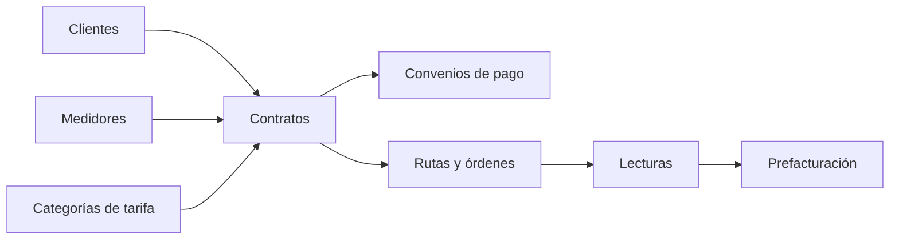

# Dominio de contratos

Documentación técnica del dominio completo de contratos del backend. La API usa el prefijo global `/api/v1`; los endpoints de las tablas se muestran con ese prefijo. Se documenta el código actual, no el comportamiento deseado ni endpoints retirados.

## Mapa del dominio

| Submódulo | Documento | Responsabilidad |
|---|---|---|
| Clientes | [clientes.md](./clientes.md) | Identidad y datos del titular. |
| Contratos | [contratos.md](./contratos.md) | Vínculo cliente–medidor–tarifa y ciclo del servicio. |
| Convenios | [convenios-pago.md](./convenios-pago.md) | Financiación de deuda y cuotas. |
| Rutas | [rutas.md](./rutas.md) | Despacho, órdenes y operación de campo. |
| Lecturas | [lecturas.md](./lecturas.md) | Revisión y aprobación de lecturas. |
| Consumo | [lectura-consumo.md](./lectura-consumo.md) | Cálculo de consumo y alimentación de prefacturación. |
| Medidores | [medidores.md](./medidores.md) | Inventario, vínculo y reemplazos. |
| Categorías de tarifa | [categorias-tarifa.md](./categorias-tarifa.md) | Vigencia, rubros y clasificación tarifaria. |

## Convenciones transversales

- Requiere autenticación y el permiso indicado por cada controlador.
- Los `BigInt` se transportan como strings; las listas incluyen `data` y `meta`.
- `deletedAt` representa soft delete. Una transformación DTO pura no es efecto de dominio: sólo adapta entidades a JSON.
- Cada documento incluye tablas Prisma afectadas, límites transaccionales, estados, handlers/efectos y reserva de diagrama.

## Pendiente de gráfico

Los gráficos de este índice son únicamente el mapa verificado. Los subflujos con transiciones incompletas quedan señalados en sus documentos.
