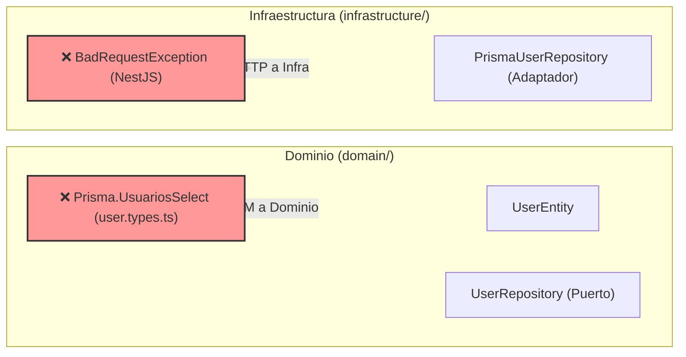
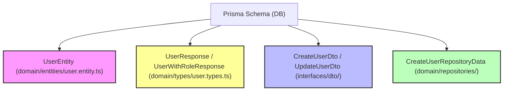
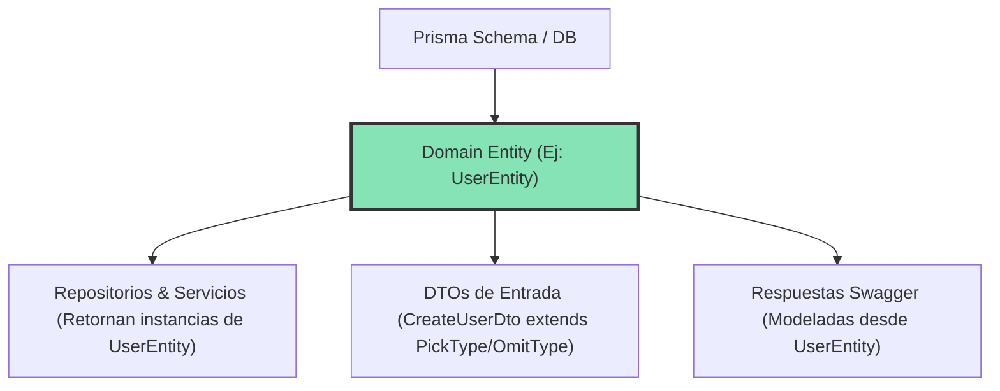

# Auditoría de Entidades, Redundancia de Types/DTOs y Fuga de Capas

## 1. Resumen Ejecutivo

Durante la revisión de arquitectura del backend, se identificaron tres problemas estructurales principales:
1. **Modelo de Dominio Anémico (15/15 entidades):** Las clases de entidad se limitan a estructuras planas con constructores pasivos `Object.assign(this, partial)` sin validación de invariantes.
2. **Redundancia Masiva de Types, DTOs e Interfaces:** Violación sistemática del principio **DRY** (*Don't Repeat Yourself*). Las propiedades de una misma entidad se reescriben a mano entre 4 y 6 veces en distintas capas.
3. **Fuga de Abstracciones (Layer Leakage):** Acoplamiento indebido de tecnologías de infraestructura (Prisma) dentro del Dominio, y excepciones de HTTP (NestJS) dentro de la capa de Repositorios.

---

## 2. Fugas de Abstracción e Violaciones de Capas

### Inconsistencias Detectadas:

> [!CAUTION]
> **Fuga 1: Prisma importado dentro de `domain/types/`**
> Archivo: [`user.types.ts`](file:///home/yan2005dris-afk/Documentos/GitHub/JASRAPO-BACKEND/backend/src/identity/users/domain/types/user.types.ts#L1)
> El dominio importa `import type { Prisma } from 'src/generated/prisma/client'` y define constantes como `userWithRolesSelect satisfies Prisma.UsuariosSelect`.
> **Corrección:** Los `selects` e intenciones de consulta del ORM deben mudarse a la capa de `infrastructure/repositories/`. El dominio debe permanecer 100% libre de dependencias de bases de datos.

> [!WARNING]
> **Fuga 2: Excepciones de Transporte HTTP en Repositorios de Infraestructura**
> Archivo: [`prisma-user.repository.ts`](file:///home/yan2005dris-afk/Documentos/GitHub/JASRAPO-BACKEND/backend/src/identity/users/infrastructure/repositories/prisma-user.repository.ts#L1)
> El repositorio importa y lanza `BadRequestException` de NestJS.
> **Corrección:** La capa de persistencia debe lanzar errores de dominio o excepciones de persistencia agnósticas a HTTP. La traducción a códigos de estado HTTP (400, 404, 500) le corresponde exclusivamente a la capa de aplicación/controladores o a un Exception Filter de NestJS.

---

## 3. Diagnóstico de Redundancia (Types vs Entidades vs DTOs)

Actualmente, para una misma entidad (ej. `Usuario`), el sistema mantiene de forma redundante:

### Ineficiencias Detectadas:
1. **Entidades Muertas vs Interfaces Paralelas:** `UserEntity` se usa únicamente para Swagger, mientras que repositorios y servicios devuelven la interface `UserWithRoleResponse`.
2. **DTOs de Entrada Duplicados:** `CreateUserDto` y `CreateUserRepositoryData` duplican los mismos campos de entrada.
3. **Interfaces de Respuesta Fragmentadas:** Se definen interfaces campo por campo sin reutilización.

---

## 4. Matriz de Entidades e Inconsistencias

| Módulo | Entidad / Archivo | Estado Actual | Invariantes y Reglas Faltantes | Nivel de Redundancia | Fuga de Capas |
| :--- | :--- | :--- | :--- | :--- | :--- |
| **Metering** | [`LecturaEntity`](file:///home/yan2005dris-afk/Documentos/GitHub/JASRAPO-BACKEND/backend/src/metering/readings/domain/entities/lectura.entity.ts) | Anémico (`Object.assign`) | No valida `lecturaActual >= lecturaAnterior`. No calcula `consumoCalculado`. | **ALTO** | No |
| **Operations** | [`ContractEntity`](file:///home/yan2005dris-afk/Documentos/GitHub/JASRAPO-BACKEND/backend/src/operations/contracts/domain/entities/contract.entity.ts) | Anémico (`Object.assign`) | Sin máquina de estados para `estado`. | **ALTO** | No |
| **Billing** | [`DiscountEntity`](file:///home/yan2005dris-afk/Documentos/GitHub/JASRAPO-BACKEND/backend/src/billing/discounts/domain/entities/discount.entity.ts) | Anémico | No valida rangos de porcentaje (0-100%) ni montos negativos. | **ALTO** | No |
| **Identity** | [`UserEntity`](file:///home/yan2005dris-afk/Documentos/GitHub/JASRAPO-BACKEND/backend/src/identity/users/domain/entities/user.entity.ts) | Anémico | No valida formato de `email` o `telefono`. | **CRÍTICO** | **SÍ** (Prisma en `user.types.ts`) |
| **Identity** | [`PrismaUserRepository`](file:///home/yan2005dris-afk/Documentos/GitHub/JASRAPO-BACKEND/backend/src/identity/users/infrastructure/repositories/prisma-user.repository.ts) | Correcto uso de Prisma | N/A (Implementación de infraestructura) | N/A | **SÍ** (`BadRequestException` en Infra) |
| **Operations** | [`ClientEntity`](file:///home/yan2005dris-afk/Documentos/GitHub/JASRAPO-BACKEND/backend/src/operations/clients/domain/entities/client.entity.ts) | Anémico | No valida cédula/RUC. | **CRÍTICO** | No |
| **Identity** | [`SessionEntity`](file:///home/yan2005dris-afk/Documentos/GitHub/JASRAPO-BACKEND/backend/src/identity/sessions/domain/entities/session.entity.ts) | Anémico | Sin validación de expiración de sesión. | **ALTO** | No |

---

## 5. Arquitectura de Solución Propuesta (Single Source of Truth)

### Plan de Refactorización Integrado:

1. **Desacoplar Prisma del Dominio:**
   * Mover `safeUserSelect`, `userWithRolesSelect`, etc. desde `domain/types/user.types.ts` hacia `infrastructure/repositories/prisma-user.repository.ts` o un archivo de selecciones dentro de `infrastructure/`.
2. **Remover Excepciones HTTP de Repositorios:**
   * Reemplazar `BadRequestException` en repositorios por excepciones de dominio o validaciones previas en la capa de Aplicación/Servicios.
3. **Establecer la Entidad como Fuente Única de Verdad:**
   * Eliminar interfaces duplicadas en `*.types.ts`. Los métodos de repositorios y servicios deben devolver `UserEntity`.
4. **DTOs Basados en Mapped Types:**
   * `CreateUserDto` extiende `OmitType(UserEntity, ['usuarioId', 'createdAt'])`.
