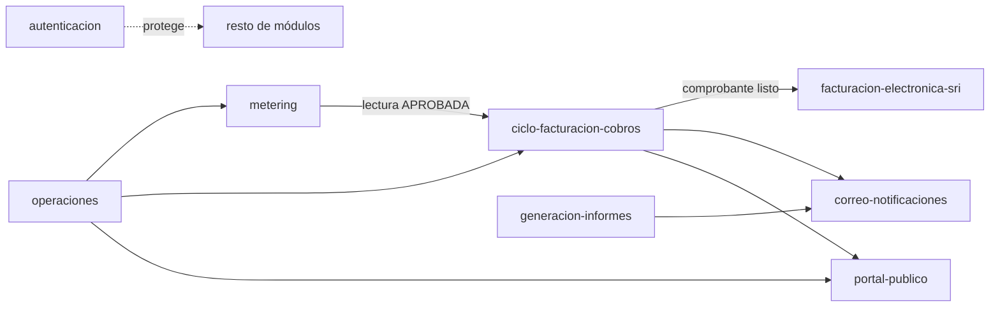

# Flujos del Sistema

Documentación de los flujos end-to-end **tal como están implementados hoy** en `backend/src/` (no diseño aspiracional). Cada documento traza el camino real de código: controlador → servicio/caso de uso → repositorio/integración externa → respuesta, con referencias a archivos concretos y, donde aporta, un diagrama Mermaid.

Fecha de referencia: 2026-07. Si el código cambia, estos documentos deben actualizarse junto con el cambio — no son un contrato aparte de la implementación.

## Índice

| Documento | Descripción |
|---|---|
| [autenticacion.md](./autenticacion.md) | Login, emisión/refresh de JWT, guards globales de autenticación y permisos, detección de reuso de refresh tokens. |
| [facturacion-electronica-sri.md](./facturacion-electronica-sri.md) | Generación, firma XAdES y envío al SRI de facturas/NC/ND/retenciones; modo manual/automático; webhooks salientes de notificación. |
| [ciclo-facturacion-cobros.md](./ciclo-facturacion-cobros.md) | Generación de prefacturas vía función SQL, revisión, pagos, convenios de pago, y disparo de la emisión fiscal vía outbox. |
| [metering.md](./metering.md) | Inventario de medidores, captura de lecturas en campo, revisión/aprobación, anomalías. |
| [operaciones.md](./operaciones.md) | Clientes, contratos, territorio (comunidades/sectores) y rutas — datos maestros de la relación comercial. |
| [portal-publico.md](./portal-publico.md) | Único endpoint público del backend: búsqueda de deuda sin autenticación. |
| [generacion-informes.md](./generacion-informes.md) | Generación de PDFs de reportes, negociación de contenido JSON/PDF, envío por correo. |
| [correo-notificaciones.md](./correo-notificaciones.md) | Infraestructura de envío de correo (cola pg-boss, failover SMTP, plantillas Handlebars). |

## Cómo se relacionan

## Convenciones de estos documentos

- Cada flujo referencia rutas de archivo reales bajo `backend/src/` — si un archivo se mueve o renombra, el documento queda desactualizado y debe corregirse.
- Se documentan *gaps* conocidos cuando el propio código los señala (comentarios `TODO`, estados "pendiente de definir", etc.) porque forman parte del comportamiento actual.
- No se documentan aquí decisiones de diseño futuras — para eso existen `docs/architecture/` y los artefactos SDD del proyecto.
