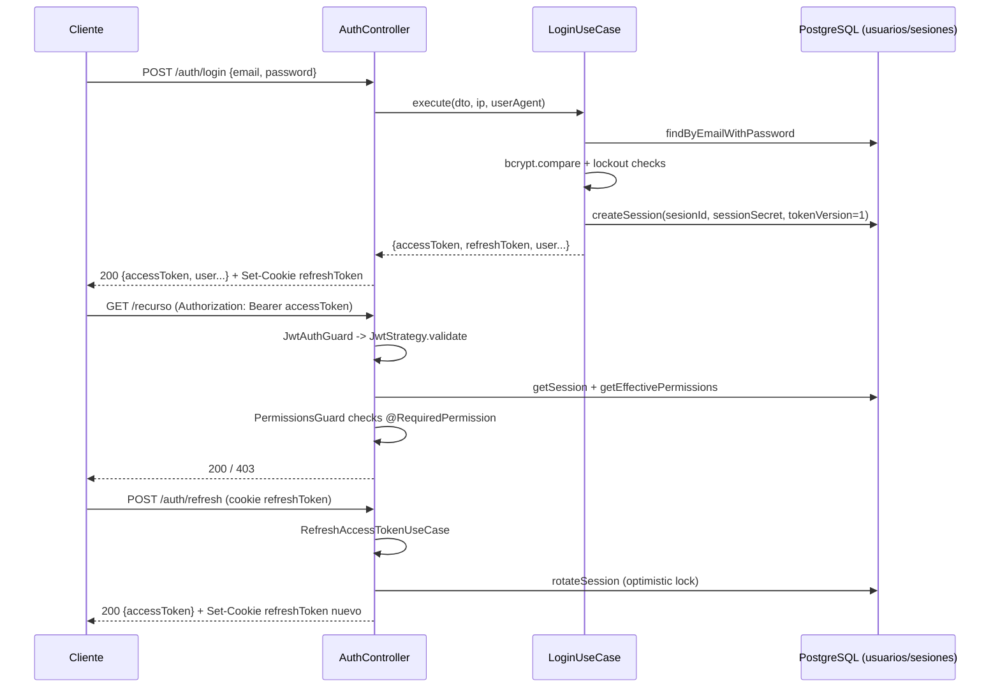

# Flujo: Autenticación y Autorización

> Estado: documenta el código **tal como está implementado** en `backend/src/identity/`, no el diseño deseado. Fecha de referencia: 2026-07.

## Resumen

Login con email/password, JWT de acceso + refresh, sesiones persistidas en BD (revocables), guards globales de autenticación y permisos, y detección de reuso de refresh tokens (replay).

## Guards globales

`AppModule` (`backend/src/app.module.ts`) registra dos `APP_GUARD` que corren en **todas** las rutas salvo que se marque `@Public()`:

1. `JwtAuthGuard` (Passport `jwt` strategy) — valida el `Authorization: Bearer <accessToken>`.
2. `PermissionsGuard` — exige `@RequiredPermission(recurso, accion)` en el handler o la clase. Si un endpoint protegido no tiene el decorador, el guard falla cerrado (`ForbiddenException`) en vez de dejar pasar.

## 1. Login

`POST /auth/login` — `@Public()`, `ThrottlerGuard` global (20/min por IP) + `@Throttle` específico de **5/min** en este endpoint.

Ruta de código: `AuthController.login` → `AuthService.login` → `LoginUseCase.execute`
(`backend/src/identity/auth/application/use-cases/login.use-case.ts`)

1. `validateUser`: busca el usuario por email (`findByEmailWithPassword`). Si no existe o está soft-deleted, responde el mismo mensaje genérico "Credenciales inválidas" (no filtra si la cuenta existe).
2. Si `bloqueadoHasta` está en el futuro, rechaza sin comparar password (lockout activo).
3. Compara password con `bcrypt.compare`. Si falla, registra el intento (`recordFailedLoginAttempt`) contra un umbral/ventana configurables (`LOGIN_LOCKOUT_THRESHOLD`, `LOGIN_LOCKOUT_WINDOW_MS`, `LOGIN_LOCKOUT_DURATION_MS`) y puede bloquear la cuenta 30 min.
4. Login exitoso: limpia contadores de fallos y, si el hash bcrypt guardado usa un cost factor menor al configurado (`BCRYPT_COST`, default 12, rango 4–15), lo re-hashea en caliente con la contraseña ya verificada (upgrade OWASP 2024, best-effort).
5. Genera `sesionId` (UUID) y `sessionSecret` (32 bytes aleatorios), `tokenVersion = 1`.
6. Firma `accessToken` y `refreshToken` como JWT **independientes** (secrets y expiraciones distintas: `JWT_ACCESS_SECRET`/`JWT_ACCESS_EXPIRES_IN`, `JWT_REFRESH_SECRET`/`JWT_REFRESH_EXPIRES_IN`). El refresh incluye además `sessionSecret`.
7. Persiste la sesión (`SessionsService.createSession`) con IP, user-agent, `expiraEn`, `revocado: false`.
8. Responde con `accessToken` en el body y setea `refreshToken` en cookie `httpOnly`, `sameSite: lax`, `secure` solo en producción.

## 2. Acceso a rutas protegidas

`JwtStrategy.validate` (`backend/src/identity/auth/interfaces/http/strategies/jwt.strategy.ts`):

1. Extrae `sub` (usuarioId), `sid` (sesionId) del payload.
2. Recarga la sesión en BD; rechaza si no existe, está `revocado`, expiró, o su `tokenVersion` no coincide con el del JWT (invalida tokens viejos tras un refresh).
3. Carga permisos efectivos del usuario (`UserService.getEffectivePermissions`) — combina permisos de rol + permisos directos al usuario.
4. Adjunta `{ sub, usersId, sid, email, permisos }` a `req.user`.

`PermissionsGuard` (`backend/src/infrastructure/common/guards/permissions.guard.ts`) compara `req.user.permisos` contra el `@RequiredPermission('recurso', 'accion')` del handler; si no hay match, `403`.

## 3. Refresh token

`POST /auth/refresh` — `@Public()` + `JwtRefreshGuard`. Ruta: `RefreshAccessTokenUseCase.execute`
(`backend/src/identity/auth/application/use-cases/refresh-access-token.use-case.ts`)

1. Verifica firma/expiración del refresh JWT.
2. Valida que `sid`/`sub`/`tokenVersion` del payload coincidan con lo esperado.
3. Recarga la sesión; rechaza si revocada o expirada.
4. **Detección de replay**: si `session.tokenVersion !== payload.tokenVersion`, asume que el token ya fue usado antes (reuso) y revoca **todas** las sesiones del usuario (no solo la actual), porque un atacante pudo quedarse con una copia del refresh token robado.
5. Compara `sessionSecret` del payload contra el guardado en sesión con `timingSafeEqual` (evita timing attacks).
6. Rota la sesión de forma atómica: `rotateSession` hace un `UPDATE ... WHERE tokenVersion = <esperado>`; si `affectedRows === 0` (otra request ganó la carrera), también se interpreta como replay y se revocan todas las sesiones.
7. Emite un nuevo par de tokens con `tokenVersion + 1` y un `sessionSecret` nuevo.

**Gap conocido** (comentario `TODO(security/refresh-family)` en el código, issue #150): no hay *family tracking* de refresh tokens — la detección de reuso solo mira la sesión puntual, no una familia de tokens rotados. Documentado aquí porque es parte del comportamiento actual, no una completitud.

## 4. Logout

`POST /auth/logout` — `@Public()` + `JwtRefreshGuard`. Marca la sesión como `revocado` en BD y limpia la cookie `refreshToken`.

## 5. Registro de usuarios

`POST /auth/register` — protegido por `JwtAuthGuard` + `PermissionsGuard` + `@RequiredPermission('users', 'create')`. No es un endpoint público de auto-registro; solo un usuario con permiso puede crear otros usuarios.

## Diagrama

## Archivos clave

- `backend/src/app.module.ts` — registro de guards globales.
- `backend/src/identity/auth/interfaces/http/auth.controller.ts`
- `backend/src/identity/auth/application/use-cases/login.use-case.ts`
- `backend/src/identity/auth/application/use-cases/refresh-access-token.use-case.ts`
- `backend/src/identity/auth/interfaces/http/strategies/jwt.strategy.ts`
- `backend/src/infrastructure/common/guards/permissions.guard.ts`
