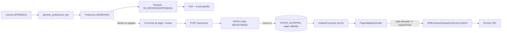

# Flujo: Ciclo de Facturación y Cobros

> Estado: documenta el código **tal como está implementado** en `backend/src/billing/`, no el diseño deseado. Fecha de referencia: 2026-07.

## Resumen

Convierte el consumo medido (`metering/`, lecturas `APROBADA`) en prefacturas, aplica tarifas/descuentos/mora vía una función SQL en PostgreSQL, gestiona el ciclo de pago (pagos, convenios, saldo a favor) y dispara la emisión del comprobante fiscal (`sri/`) cuando un comprobante queda totalmente pagado — usando un patrón *outbox* para que ese disparo sea durable ante caídas del proceso.

## 1. Generación del lote de prefacturas

`POST /batches/generate` (`batches:create`) → `BatchController.generate` → `BatchService.generate` → `GenerateBatchUseCase.execute(dto)` → `BatchRepository.generate(periodoId, comunidadId, creadoPor)`.

El use-case es una capa fina: toda la lógica de negocio vive en una **función almacenada de PostgreSQL**, invocada vía `$queryRawUnsafe`:

```sql
SELECT generar_prefacturas_lote($1, $2, $3) as "loteId"
```

(`backend/prisma/migrations/20260621140000_fix_sp_parametro_tasa_interes/migration.sql`, última versión de la función a la fecha de este documento)

Lógica de `generar_prefacturas_lote(periodoId, comunidadId?, creadoPor)`, por cada contrato `ACTIVO` del período/comunidad indicados:

1. Requiere una `lectura` en estado `APROBADA` para ese contrato y período; si no existe, el contrato se **omite** y queda registrado en `lote.notas`.
2. `consumo = lectura_actual - lectura_anterior`.
3. `excedente = max(0, consumo - consumo_minimo_mensual) * valor_excedente_m3` (tarifa de la categoría del contrato).
4. `cargo_fijo = valor_base` de la categoría de tarifa.
5. `tasa_seguridad = (cargo_fijo + excedente) * porcentaje_tasa_seguridad` (configurable por comunidad).
6. **Deuda previa**: suma `total_pagar - abono` de prefacturas anteriores no `PAGADA`/`ANULADA` → `saldo_vencido` y cuenta cuántos períodos atrasados (`meses_atrasado`).
7. **Interés de mora**: si `meses_atrasado >= 3` y hay una tasa vigente en `parametro_tasa_interes`, `interes_mora = saldo_vencido * (tasa/100) * meses_atrasado`. Sin tasa configurada, es `0`.
8. **Descuentos automáticos** (dinámicos, desde `catalogo_descuento`): `TERCERA_EDAD` tiene prioridad sobre `DISCAPACIDAD` si el contrato/cliente califica para ambos; el descuento puede ser porcentual o un monto fijo (capado al cargo fijo) y se aplica solo sobre el cargo fijo. Queda registrado en `descuento_detalle` para auditoría.
9. **IVA**: resuelto dinámicamente por rubro (`codigo_sri` 001–004: consumo, cargo fijo, interés, tasa de seguridad) contra `catalogo_tarifas_impuesto`/`catalogo_impuestos` vigentes — no está hardcodeado.
10. Inserta una fila en `prefacturas` (estado inicial `GENERADA`) y una fila en `prefactura_detalle` por cada rubro no-cero (cargo fijo, excedente, tasa de seguridad, interés de mora, descuento).
11. Acumula el total del lote (`lote.total_monto`, `lote.total_emisiones`).

Contratos sin lectura aprobada, sin tarifa vigente o sin rubros/impuestos resueltos generan una excepción o se saltan explícitamente — el lote nunca falla en silencio para un contrato individual salvo que falte configuración global (rubros 001–004 son obligatorios, si faltan la función aborta con `RAISE EXCEPTION`).

## 2. Revisión y aprobación de la prefactura

Estados y transiciones válidas (`backend/src/billing/pre-invoice/application/pre-invoice-states.ts`):

```
GENERADA  → EN_REVISION | ANULADA
EN_REVISION → APROBADA | RECHAZADA | GENERADA
APROBADA  → PAGADA | ANULADA
RECHAZADA → EN_REVISION | GENERADA
ANULADA, PAGADA → (terminales)
```

`UpdatePreInvoiceStateUseCase` aplica la transición solicitada validando contra esta tabla. No hay transición automática a `PAGADA` en este módulo — ese salto ocurre indirectamente cuando el pago asociado se completa (sección 4).

## 3. PDF y envío ("planilla")

`GeneratePreInvoicePdfUseCase` renderiza la prefactura a PDF. `SendPreInvoiceByEmailUseCase` (una prefactura) y `SendBatchEmailsUseCase` (`POST /batches/:id/send-email`, todas las prefacturas de un lote) llaman a `MailService.sendPlanilla(...)`, que encola el envío asíncrono (ver [correo-notificaciones.md](./correo-notificaciones.md)).

## 4. Pagos (`billing/collections/payments/`)

`POST /payments` → `CreatePaymentUseCase`:

1. Valida cliente y, si se indica `cajaId`, que la sesión de caja esté `ABIERTA`.
2. Valida que `montoTotalRecibido` cuadre exactamente con la suma del detalle.
3. Por cada línea de detalle según `tipoPago`:
   - `COMPROBANTE`: bloquea la fila del comprobante (`lockComprobante`, evita condiciones de carrera con pagos concurrentes) y valida que lo abonado no exceda el saldo pendiente.
   - `CUOTA_CONVENIO`: valida que la cuota no esté ya `PAGADA` y aplica el abono con lock optimista (`updateMany` condicionado al `saldoPendiente` leído); si la cuota queda saldada, escribe un evento `cuota.pagada` en el outbox.
   - `SALDO_FAVOR`: crea un registro de saldo a favor del cliente.
   - `PAGO_LIBRE`: sin validación adicional.

El pago nace en estado `PENDIENTE`. `PATCH /payments/:id/state` con `REGISTRADO` (`ValidatePaymentUseCase`) es la confirmación:

- Transición de estados: `PENDIENTE → {REGISTRADO, ANULADO}`, `REGISTRADO → ANULADO`, `ANULADO` terminal.
- Al pasar a `REGISTRADO`, dentro de la **misma transacción** que actualiza el pago, escribe una fila `pago.validado` en la tabla outbox (`eventos_pendientes`). Esto es deliberado: antes se emitía un evento in-process (`EventEmitter2`) que se perdía si el proceso caía entre el `UPDATE` y el `emit()`; con el outbox, el evento sobrevive un crash porque queda persistido junto con el cambio de estado.
- `DELETE /payments/:id` (anulación) revierte cuota de convenio y saldo a favor generados por ese pago (`AnnulPaymentUseCase`).

## 5. Outbox → emisión del comprobante fiscal

`OutboxProcessor` (`backend/src/shared/outbox/application/outbox.processor.ts`) hace polling cada 5s (lotes de 10 filas `PENDIENTE`) y despacha cada evento al handler registrado para su `tipo`:

- `pago.validado` → `PagoValidadoHandler.procesarPagoValidado(pagoId)`:
  1. Encuentra los `detalle_pago` de ese pago y los `comprobanteId` que tocan.
  2. Para cada comprobante, suma **todos** los `montoAbonado` activos aplicados a él (across todos los pagos, no solo este — cubre pagos parciales acumulados).
  3. Si el total abonado `>=` el `importeTotal` del comprobante, delega en `SRIEmissionDispatcherService.tryEmit(comprobanteId)` (ver [facturacion-electronica-sri.md](./facturacion-electronica-sri.md)) — el mismo punto de entrada que usa la emisión manual.
- `cuota.pagada` → `CuotaPagadaHandler`, mismo patrón, disparado cuando una cuota de convenio queda completamente pagada.

Un evento fallido queda marcado `FAILED` con el motivo y no bloquea el resto del lote (aislamiento por fila).

## 6. Convenios de pago (`billing/collections/agreements/`)

Cuando un cliente no puede pagar el total, se puede crear un convenio (`POST` en `agreements.controller.ts`, `CreateAgreementUseCase`) que fracciona la deuda en cuotas (`CuotaConvenio`). `GetDebtSummaryUseCase` calcula el resumen de deuda que alimenta la propuesta de convenio. Las cuotas se pagan a través del mismo `POST /payments` con `tipoPago: CUOTA_CONVENIO` descrito arriba.

## Diagrama



## Archivos clave

- `backend/src/billing/batch/application/use-cases/generate-batch.use-case.ts`
- `backend/src/billing/batch/infrastructure/repositories/prisma-batch.repository.ts`
- `backend/prisma/migrations/20260621140000_fix_sp_parametro_tasa_interes/migration.sql` — versión vigente de `generar_prefacturas_lote`
- `backend/src/billing/pre-invoice/application/pre-invoice-states.ts`
- `backend/src/billing/collections/payments/application/use-cases/create-payment.use-case.ts`
- `backend/src/billing/collections/payments/application/use-cases/validate-payment.use-case.ts`
- `backend/src/billing/collections/payments/application/pago-validado.handler.ts`
- `backend/src/shared/outbox/application/outbox.processor.ts`
- `backend/src/billing/collections/agreements/`
- `docs/billing-rules.md`, `backend/src/billing/collections/payments/payments.md`
