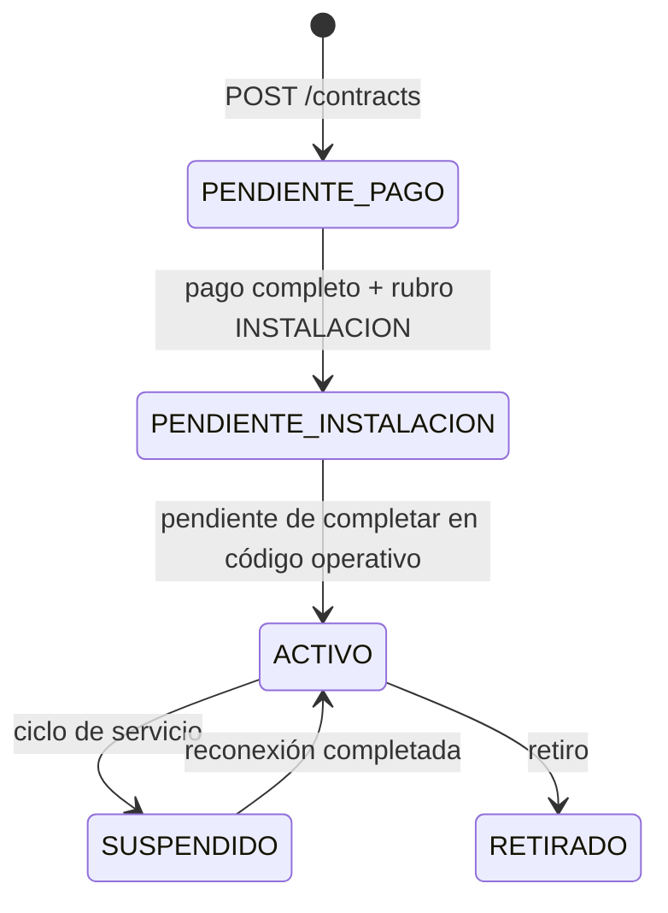
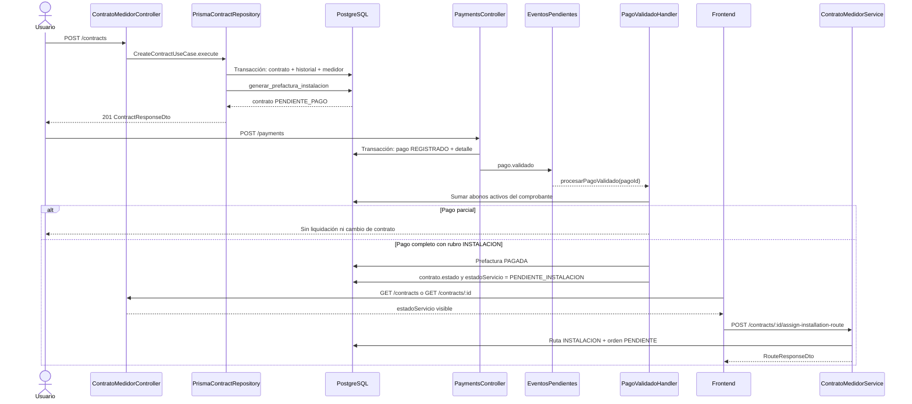

# Ciclo de vida del contrato hasta la instalación

Este documento describe el comportamiento **actual** del flujo de contratos de instalación, desde la creación del contrato hasta el pago y la generación de la orden de trabajo. La regla operativa que debe quedar explícita es la siguiente: **cuando se valida el pago completo de un comprobante que contiene un rubro `INSTALACION`, el contrato pasa de `PENDIENTE_PAGO` a `PENDIENTE_INSTALACION`**. La escritura de ambos campos (`estado` y `estadoServicio`) está implementada en `PagoValidadoHandler`.

## Recorrido rápido

1. Un usuario con `contracts:create` llama a `POST /contracts` con cliente, tarifa, medidor, guía, dirección y comunidad.
2. El backend valida dependencias y estado del medidor, y en una única transacción crea contrato, historial del medidor, prefactura de instalación y estado `PENDIENTE` del medidor.
3. La prefactura se paga mediante `POST /payments`. El pago nace como `REGISTRADO` y se registra un evento outbox `pago.validado`.
4. `PagoValidadoHandler` suma todos los pagos no anulados del comprobante. Si cubren `importeTotal` y existe un detalle de rubro `INSTALACION`, actualiza la prefactura a `PAGADA` y el contrato a `PENDIENTE_INSTALACION`.
5. El frontend muestra **Asignar a ruta de instalación** solamente cuando `estadoServicio === 'PENDIENTE_INSTALACION'`.
6. `POST /contracts/:id/assign-installation-route` reutiliza una ruta de instalación pendiente o crea una nueva, y crea una orden de trabajo `INSTALACION` en estado `PENDIENTE`.
7. La finalización operativa de la instalación se registra sobre la orden de trabajo. En el código inspeccionado no se observó todavía una escritura automática de `contratos.estadoServicio = ACTIVO` al completar esa orden.

## Alcance y actores

| Actor o módulo | Responsabilidad en este flujo |
|---|---|
| Secretaría/operador administrativo | Registra el contrato, registra o valida el pago y asigna la ruta. |
| `ContratoMedidorController` / módulo de contratos | Expone contratos, estados y asignación de rutas. |
| `PrismaContractRepository` | Ejecuta la creación transaccional, relaciones y llamada a la función de prefacturación. |
| Módulo de cobros | Registra pagos, detalles y eventos outbox. |
| `PagoValidadoHandler` | Liquida comprobantes completos y promueve contratos de instalación. |
| Módulo de convenios | Crea convenios sobre deuda pendiente; no es necesario para el pago al contado. |
| Rutas y órdenes de trabajo | Resuelven la ruta de instalación y la orden que ejecutará el operario. |
| Frontend Angular | Oculta o muestra la acción de instalación según `estadoServicio` y opera el modal. |
| PostgreSQL/Prisma | Persiste contratos, prefacturas, comprobantes, pagos, rutas, órdenes y outbox. |

## Entradas HTTP

Todas las rutas requieren autenticación y el permiso indicado por el decorador `@RequiredPermission`.

| Operación | Endpoint | Permiso | Implementación |
|---|---|---|---|
| Crear contrato con medidor | `POST /contracts` | `contracts:create` | `ContratoMedidorController.crear` |
| Listar contratos | `GET /contracts` | `contracts:read` | `ContratoMedidorController.buscarContratos` |
| Obtener un contrato | `GET /contracts/:id` | `contracts:read` | `ContratoMedidorController.buscarContrato` |
| Catálogo de estados legacy | `GET /contracts/states` | `contracts:read` | `ContratoMedidorController.getContractStates` |
| Registrar pago | `POST /payments` | `payments:create` | `PaymentsController.create` → `PaymentsService.create` |
| Cambiar estado de pago | `PATCH /payments/:id/state` | `payments:update` | `PaymentsController.updateState` → `ValidatePaymentUseCase.execute` |
| Subir comprobante | `POST /payments/upload-comprobante` | `payments:create` | `PaymentsController.uploadComprobante` |
| Crear convenio, si aplica | `POST /agreements` | `agreements:create` | `AgreementsController.create` |
| Asignar/crear ruta de instalación | `POST /contracts/:id/assign-installation-route` | `contracts:update` | `ContratoMedidorController.assignInstallationRoute` |
| Consultar órdenes de una ruta | `GET /routes/:id/work-orders` | `routes:read` | Servicio de rutas del frontend |
| Actualizar estado de orden | `PATCH /work-orders/:id/state` | `routes:update` | `OrdenesTrabajoController.updateEstado` |
| Actualizar orden como operario | `PATCH /operator/work-orders/:id` | `routes:update` | `OperatorController.updateOperatorWorkOrder` |

Los identificadores `:id` de contratos, pagos, comprobantes, convenios y órdenes se convierten con `ParseBigIntPipe` cuando el controlador lo declara; en la API se transportan como strings.

## 1. Creación del contrato

### Datos de entrada y validaciones

`CrearContratoMedidorDto` es el contrato de entrada de `POST /contracts`. Los campos funcionalmente obligatorios son `clienteId`, `categoriaTarifaId`, `medidorId`, `numeroGuia`, `direccionSuministro` y `comunidadId`; `sectorId`, `lecturaInicial`, `estado` y `creadoPor` son opcionales según el DTO. La validación HTTP de `class-validator` se ejecuta antes del controlador.

`CreateContractUseCase.execute` convierte los identificadores a `bigint`/`number`, usa `EstadoContrato.PENDIENTE_PAGO` cuando no llega `estado` y usa `0` como lectura inicial predeterminada.

Dentro de la transacción, `PrismaContractRepository.validateContractDependencies` verifica en paralelo:

- que exista el `cliente`;
- que exista el `medidor` y que esté en `BODEGA`;
- que exista la `categoriaTarifa`;
- que exista la `comunidad`;
- que exista el `sector` si `sectorId` no es `null`.

Un fallo de existencia produce `EntityNotFoundException`; un medidor que no está en `BODEGA` produce `InvalidDomainOperationException`.

### Escrituras y límites transaccionales

`PrismaContractRepository.createContractWithMeterHistory` ejecuta `this.prisma.$transaction(async (tx) => ...)`. El orden actual es:

1. Validar todas las dependencias usando `tx`.
2. Crear `contratos` con cliente, tarifa, guía, dirección, comunidad, estado, sector opcional y creador opcional.
3. Crear `historialMedidores` con el medidor, contrato, `lecturaInicial` decimal y motivo `VINCULACION MANUAL`.
4. Actualizar `medidores.estado` a `PENDIENTE`.
5. Si el contrato tiene `estado = PENDIENTE_PAGO`, ejecutar `SELECT generar_prefactura_instalacion(...)` dentro de la misma transacción.
6. Volver a leer el contrato con sus relaciones (`contractDefaultInclude`) y mapearlo a `ContractEntity`.

Si falla la función de prefacturación, una relación o cualquier escritura de la transacción, se revierte el conjunto. La función SQL es responsable de localizar el rubro `INSTALACION`, un período abierto y los datos necesarios del comprobante borrador; también evita crear otra prefactura activa de instalación cuando ya existe una con ese detalle.

### Estado inicial

Con la entrada normal, el contrato queda en `estado = PENDIENTE_PAGO`. El esquema define además `estadoServicio = PENDIENTE_PAGO` y `estadoCobranza = AL_DIA` como valores predeterminados, aunque la escritura de esta operación pasa explícitamente el campo legacy `estado` y depende de los defaults de Prisma para los campos nuevos.

## 2. Convenio de pago, cuando corresponde

El convenio es una alternativa para deuda pendiente y no es requerido para pagar al contado la prefactura de instalación.

`POST /agreements` ejecuta `CreateAgreementUseCase.execute`, que:

1. verifica que exista el contrato;
2. rechaza otro convenio activo o pendiente para ese contrato;
3. calcula la deuda desde prefacturas impagas;
4. rechaza deuda cero y un `abonoInicial` mayor o igual a la deuda;
5. obtiene la tasa de mora vigente;
6. calcula deuda financiada, intereses, cuotas y residuo de la última cuota con `Decimal.js`;
7. asigna `PENDIENTE_ABONO` si hay abono inicial o `PREPARADO` si no lo hay;
8. crea el convenio y sus cuotas mediante `AgreementRepository.create`.

El código inspeccionado no usa la creación del convenio para promover el servicio a `ACTIVO` ni a `PENDIENTE_INSTALACION`. El pago de cuotas se procesa como detalles `CUOTA_CONVENIO` y tiene su propio evento `cuota.pagada` cuando una cuota queda completamente pagada.

## 3. Registro y validación del pago

### Registro: `POST /payments`

`CreatePaymentUseCase.execute` realiza primero validaciones fuera de la transacción:

1. Verifica que exista el cliente.
2. Si se proporciona `cajaId`, verifica que exista una caja abierta.
3. Comprueba con `Decimal` que la suma de `detalle[].montoAbonado`, redondeada a dos decimales, sea igual a `montoTotalRecibido`.

Después abre `paymentRepository.executeTransaction` y:

1. Valida cada detalle dentro de la transacción.
2. Para `COMPROBANTE`, exige `comprobanteId`, bloquea el comprobante con `FOR UPDATE`, verifica que exista y rechaza superar `importeTotal` considerando abonos previos no anulados y los detalles repetidos de la solicitud.
3. Para `CUOTA_CONVENIO`, exige `cuotaConvenioId`, verifica que la cuota exista y no esté eliminada ni ya pagada.
4. Crea `pagos` con `estadoPago = REGISTRADO`.
5. Crea los registros de `detallePago`.
6. Actualiza cuotas de convenio dentro de la misma transacción; un pago completo deja la cuota en `PAGADA` y genera `cuota.pagada`.
7. Los detalles `SALDO_FAVOR` generan `saldoFavorCliente`.
8. Registra el evento outbox `pago.validado` dentro de esa transacción.

El evento contiene el `pagoId`, estado `REGISTRADO` y el actor. El consumidor/dispatcher termina invocando `PagoValidadoHandler.procesarPagoValidado`.

### Cambio de estado explícito: `PATCH /payments/:id/state`

`ValidatePaymentUseCase` permite solamente `PENDIENTE → REGISTRADO/ANULADO` y `REGISTRADO → ANULADO`. Para pasar a `REGISTRADO`, actualiza el pago y crea `pago.validado` en una única transacción. La ruta de anulación delega a `AnnulPaymentUseCase`, que revierte cuotas y escribe `pago.anulado`; una anulación no debe considerarse un pago válido para liquidar el comprobante.

### Tratamiento del comprobante en `PagoValidadoHandler`

Para cada comprobante distinto referido por los detalles del pago, el handler:

1. Si no encuentra el comprobante, registra una advertencia y continúa con el siguiente.
2. Busca todos sus detalles activos cuyos pagos no estén anulados.
3. Suma `Number(montoAbonado)` de esos detalles.
4. Lee `Number(comprobante.importeTotal)`.
5. Si `totalAbonado < totalComprobante`, registra pago parcial, **no** marca prefacturas como pagadas, **no** cambia el contrato y salta la emisión SRI.
6. Si `totalAbonado >= totalComprobante`, abre una transacción y busca prefacturas activas vinculadas al comprobante.
7. En esa transacción marca esas prefacturas como `PAGADA`, fija `saldoActual = 0`, `saldoVencido = 0` y `abono = totalAbonado`.
8. En la misma consulta identifica prefacturas cuyo detalle activo referencia un rubro con `codigoSistemaRubro = 'INSTALACION'`.
9. Para los contratos identificados, ejecuta un `updateMany` condicionado a `estado = 'PENDIENTE_PAGO'` y `deletedAt = null`, escribiendo:

   ```text
   estado        = PENDIENTE_INSTALACION
   estadoServicio = PENDIENTE_INSTALACION
   ```

10. Después de confirmar la transacción, solicita `sriDispatcher.tryEmit(comprobanteId)`.

Por tanto, el total se evalúa contra el comprobante completo y no solo contra el último pago. Un primer abono puede registrar el pago, pero mientras el acumulado no alcance `importeTotal` la prefactura y el contrato permanecen pendientes.

### Condición exacta de promoción a instalación

La promoción requiere simultáneamente:

- el acumulado de detalles activos y no anulados es mayor o igual a `comprobante.importeTotal`;
- existe una `prefactura` activa para el comprobante;
- esa prefactura tiene al menos un `prefacturaDetalle` activo cuyo `rubro.codigoSistemaRubro` es `INSTALACION`;
- el contrato todavía está en `estado = PENDIENTE_PAGO` y no está eliminado.

La condición legacy evita sobrescribir contratos que ya avanzaron. La prueba del handler confirma la escritura de ambos campos. La implementación local pendiente se distingue en la tabla de trazabilidad.

## Estados del contrato

El modelo tiene tres dimensiones. No deben tratarse como sinónimos.

| Campo | Fuente | Valores relevantes | Significado operativo actual |
|---|---|---|---|
| `estado` | `Contratos.estado`, `EstadoContrato` | `SOLICITUD`, `PENDIENTE_PAGO`, `PENDIENTE_INSTALACION`, `ACTIVO`, `EN_MORA`, `ORDEN_CORTE`, `SUSPENDIDO`, `EN_CONVENIO`, `RETIRADO`, `RECONEXION` | Campo legacy que siguen usando filtros, procedimientos y algunas reglas. |
| `estadoServicio` | `Contratos.estadoServicio`, `EstadoServicioContrato` | `PENDIENTE_PAGO`, `PENDIENTE_INSTALACION`, `ACTIVO`, `SUSPENDIDO`, `RETIRADO` | Ciclo operativo del servicio; es el campo que consume la acción de instalación del frontend. |
| `estadoCobranza` | `Contratos.estadoCobranza`, `EstadoCobranzaContrato` | `AL_DIA`, `EN_MORA`, `EN_CONVENIO` | Situación de cobro independiente del servicio. |

### Transición documentada



La flecha `PENDIENTE_INSTALACION → ACTIVO` representa el objetivo del ciclo de servicio aceptado en `ADR-006`, no una escritura comprobada en el handler de órdenes revisado. En el estado actual, completar una orden mediante `PATCH /work-orders/:id/state` actualiza la orden y `completadoEn`; no se observó allí una actualización de `Contratos`.

### Riesgos de compatibilidad

- `ContractMapper.toDomain` usa `estadoServicio` y `estadoCobranza` cuando existen; si faltan, proyecta valores desde `ContractState.fromLegacyState(raw.estado)`.
- `ContractResponseDto.fromEntity` expone `estado` y `estadoServicio`, pero el campo de cobranza no forma parte de la respuesta mostrada en el DTO inspeccionado.
- `GET /contracts` filtra por `estado` legacy, no por `estadoServicio`.
- Procedimientos, consumidores antiguos o integraciones que solo lean `estado` pueden observar un valor diferente al de la dimensión de servicio.
- Cambiar manualmente solo uno de los campos puede crear divergencia y ocultar la acción en frontend o producir filtros inconsistentes.

## 4. Comportamiento del frontend

En `service-contracts`, la tabla de contratos calcula `canAssignInstallationRoute(contract)` así:

```typescript
return contract.estadoServicio === 'PENDIENTE_INSTALACION';
```

El menú de acciones por fila muestra **Asignar a ruta de instalación** solamente si esa función devuelve `true`. Al seleccionarla, `ServiceContractsComponent.openAssignInstallationModal` guarda el contrato en `assigningContract` y renderiza `AssignInstallationRouteModalComponent`.

El modal puede:

- **Crear nueva ruta**: exige una fecha planificada y envía `{ fechaPlanificada }`. La comunidad se toma del contrato y la ruta queda sin operario para despacho posterior.
- **Agregar a ruta existente**: carga rutas con `tipoRuta = INSTALACION`, `estado = PENDIENTE`, la comunidad del contrato, página 1 y límite 50; exige seleccionar una ruta y envía `{ routeId }`.

Tras una respuesta exitosa muestra un mensaje, cierra el modal y vuelve a cargar contratos. Si la respuesta anterior del listado no contiene `estadoServicio`, el gate es falso aunque el contrato se encuentre realmente pendiente; por eso el backend debe seguir exponiendo el campo en `ContractResponseDto`.

La acción no aparece en `PENDIENTE_PAGO`, `ACTIVO`, `SUSPENDIDO`, `RETIRADO` ni en cualquier otro estado porque permitiría crear una orden de instalación fuera del ciclo de servicio permitido. El gate visual no sustituye la validación backend.

## 5. Asignación o creación de la ruta

`POST /contracts/:id/assign-installation-route` recibe `AssignInstallationRouteDto`:

```json
{ "routeId": 42 }
```

o:

```json
{ "fechaPlanificada": "2026-08-20" }
```

`ContratoMedidorService.assignInstallationRoute` ejecuta el siguiente orden:

1. Obtiene el contrato con `FindOneContractUseCase`.
2. Exige `contrato.estadoServicio === PENDIENTE_INSTALACION`.
3. Si llega `routeId`, busca la ruta y exige que exista, que `tipoRuta` sea `INSTALACION` y que `estado` sea `PENDIENTE`.
4. Si no llega `routeId`, crea una ruta con nombre `Instalaciones <numeroGuia o contratoId>`, tipo `INSTALACION`, comunidad del contrato, sin operario, sin sector ni período, estado `PENDIENTE` y fecha opcional parseada por `DateUtil.parseFrontendDate`.
5. Crea una `orden_trabajo` con la ruta, contrato, el medidor del primer historial y estado `PENDIENTE`.
6. Devuelve la ruta. La respuesta no cambia explícitamente el estado del contrato.

La operación de asignación no está envuelta en una transacción conjunta que incluya la creación de la ruta y de la orden. Si la creación de la orden falla después de crear una ruta nueva, puede quedar una ruta sin orden; debe considerarse un punto de revisión operacional.

## 6. Ejecución y finalización de la instalación

La orden creada tiene `tipoActividad` derivado de la ruta (`INSTALACION`) y estado inicial `PENDIENTE`.

- `PATCH /work-orders/:id/state` actualiza el estado administrativo de la orden. Al pasar a `COMPLETADA`, `FALLIDA` o `CANCELADA`, establece `completadoEn` si aún no existe; al reabrir a `PENDIENTE` o `EN_PROGRESO`, lo limpia.
- `PATCH /operator/work-orders/:id` permite al operario actualizar una orden técnica, siempre que tenga medidor y la orden pertenezca al medidor/ruta autorizados. Para instalación puede enviar estado, observación, evidencia y datos operativos.
- En el repositorio inspeccionado, estas operaciones persisten la orden y, en el flujo de operario, la ejecución asociada. No se encontró una llamada que actualice automáticamente `contratos.estadoServicio` al completar una orden de instalación.

## Diagrama de secuencia



## Casos de error y operación

| Situación | Resultado esperado | Verificación operativa |
|---|---|---|
| Pago parcial | No se marca la prefactura como `PAGADA` ni se promueve el contrato. | Revisar suma de `detallePago` activos frente a `comprobantes.importeTotal`. |
| `COMPROBANTE` sin `comprobanteId` | `400`; el detalle es inválido. | Revisar payload de `POST /payments`. |
| Comprobante inexistente | `404` durante la creación del pago; si falta al procesar el evento, el handler registra advertencia y continúa. | Revisar logs por `Comprobante <id> no encontrado`. |
| Detalle que supera saldo | `400`; el bloqueo `FOR UPDATE` evita carreras al aplicar el comprobante. | Revisar pagos no anulados y solicitudes concurrentes. |
| Pago repetido/evento repetido | La actualización usa prefactura activa y contrato en `PENDIENTE_PAGO`; el test del handler cubre llamada repetida sin nueva transición lógica. | Comprobar que no existan pagos duplicados y que el contrato no haya sido modificado manualmente. |
| Respuesta frontend stale | La acción puede no aparecer si el listado conserva un contrato sin `estadoServicio` actualizado. | Volver a llamar `GET /contracts/:id` y recargar la lista. |
| Ruta inexistente | `404`. | Confirmar `routeId` y que no haya sido eliminada. |
| Ruta de otro tipo | `400`; debe ser `INSTALACION`. | Consultar la ruta y su catálogo de actividad. |
| Ruta no pendiente | `400`; debe estar en `PENDIENTE`. | No reutilizar rutas iniciadas, completadas o canceladas. |
| Comunidad/rubro/período faltante al crear contrato | Falla la transacción o la función SQL. | Verificar cliente, medidor en `BODEGA`, tarifa, comunidad, rubro `INSTALACION` activo y período `ABIERTO`. |
| Ruta creada sin orden | Posible si falla la segunda escritura, porque asignación no es una transacción conjunta. | Buscar rutas `INSTALACION` recientes sin `ordenesTrabajo` y corregir mediante operación controlada. |
| Divergencia de estados | Legacy y servicio pueden mostrar valores distintos. | Comparar `estado`, `estadoServicio`, `estadoCobranza`; no corregir solo la UI. |

## Trazabilidad

| Comportamiento | Fuente exacta | Pruebas relacionadas |
|---|---|---|
| Endpoint y orquestación de contratos | `backend/src/operations/contracts/interfaces/http/contrato-medidor.controller.ts`: `crear`, `buscarContratos`, `buscarContrato`, `assignInstallationRoute`; `backend/src/operations/contracts/application/contrato-medidor.service.ts` | `backend/src/operations/contracts/interfaces/http/contrato-medidor.controller.spec.ts`; `backend/src/operations/contracts/application/contrato-medidor.service.spec.ts` |
| Conversión y estado inicial | `backend/src/operations/contracts/application/use-cases/create-contract.use-case.ts`: `CreateContractUseCase.execute` | `backend/src/operations/contracts/application/use-cases/create-contract.use-case.spec.ts` |
| Validación y transacción de creación | `backend/src/operations/contracts/infrastructure/repositories/prisma-contract.repository.ts`: `createContractWithMeterHistory`, `validateContractDependencies` | `backend/src/operations/contracts/infrastructure/repositories/prisma-contract.repository.spec.ts` |
| Prefactura automática | `backend/prisma/migrations/20260822010000_add_codigo_sistema_rubro_and_update_sp/migration.sql`: `generar_prefactura_instalacion`; llamada desde `createContractWithMeterHistory` | No se identificó una prueba unitaria de la función SQL en el alcance inspeccionado |
| Registro de pago | `backend/src/billing/collections/payments/interfaces/http/payments.controller.ts`: `create`; `backend/src/billing/collections/payments/application/use-cases/create-payment.use-case.ts`: `execute`, `validateHeader`, `validateTotals`, `validateDetails` | `backend/src/billing/collections/payments/application/use-cases/create-payment.use-case.spec.ts`; `backend/src/billing/collections/payments/application/payments.service.spec.ts` |
| Validación de transición del pago | `backend/src/billing/collections/payments/application/use-cases/validate-payment.use-case.ts`: `VALID_TRANSITIONS`, `execute` | `backend/src/billing/collections/payments/application/use-cases/validate-payment.use-case.spec.ts` |
| Liquidación y promoción a instalación | `backend/src/billing/collections/payments/application/handlers/pago-validado.handler.ts`: `PagoValidadoHandler.procesarPagoValidado` | `backend/src/billing/collections/payments/application/handlers/pago-validado.handler.spec.ts`: promoción con rubro de instalación y repetición |
| Contrato response y fallback | `backend/src/operations/contracts/infrastructure/mappers/contract.mapper.ts`: `ContractMapper.toDomain`; `backend/src/operations/contracts/interfaces/dto/contract-response.dto.ts`: `ContractResponseDto.fromEntity` | `backend/src/operations/contracts/infrastructure/mappers/contract.mapper.spec.ts`; `backend/src/operations/contracts/interfaces/dto/contract-response.dto.spec.ts` |
| Estados persistidos | `backend/prisma/schema/models/logica-de-negocio/Contratos.prisma`: `Contratos`, `EstadoContrato`, `EstadoServicioContrato`, `EstadoCobranzaContrato` | `backend/src/operations/contracts/domain/contract-state.spec.ts` |
| Modal y gate frontend | `JASRAPO-FRONTEND/src/app/features/contracts/service-contracts/components/contracts-table/contracts-table.component.ts`: `canAssignInstallationRoute`; `.../contracts-table.component.html` | `JASRAPO-FRONTEND/src/app/features/contracts/service-contracts/components/contracts-table/contracts-table.component.spec.ts` |
| Payload y modal de ruta | `JASRAPO-FRONTEND/src/app/features/contracts/service-contracts/components/assign-installation-route-modal/assign-installation-route-modal.component.ts`; `.../services/contracts.service.ts` | `JASRAPO-FRONTEND/src/app/features/contracts/service-contracts/components/assign-installation-route-modal/assign-installation-route-modal.component.spec.ts`; `.../services/contracts.service.spec.ts` |
| Ruta y orden | `backend/src/operations/contracts/application/contrato-medidor.service.ts`: `assignInstallationRoute`; `backend/src/operations/routes/infrastructure/repositories/prisma-orden-trabajo.repository.ts`: `updateEstado`, `updateOperatorWorkOrder` | `backend/src/operations/contracts/application/contrato-medidor.service.spec.ts`; `backend/src/operations/routes/application/use-cases/update-orden-estado.use-case.spec.ts`; `backend/src/metering/operator/application/use-cases/update-operator-work-order.use-case.spec.ts` |
| Transición de pago a instalación | `backend/src/billing/collections/payments/application/handlers/pago-validado.handler.ts` y `pago-validado.handler.spec.ts` | Verificar que el despliegue incluya el cambio; la prueba del handler cubre ambos campos |

## Guion de aceptación manual

Usar una base de pruebas y valores existentes o crear previamente los catálogos requeridos.

1. Crear un contrato con `POST /contracts` usando un cliente existente, una categoría con rubro `INSTALACION`, un medidor en `BODEGA`, una comunidad y una guía única.
2. Confirmar respuesta `201`, `estado = PENDIENTE_PAGO`, historial de medidor y prefactura/comprobante de instalación.
3. Registrar un pago parcial con `POST /payments`; confirmar que el acumulado es menor que `importeTotal` y que el contrato sigue en `PENDIENTE_PAGO`.
4. Registrar el saldo restante con otro pago válido o un pago total en una base limpia.
5. Esperar/procesar `pago.validado` y llamar `GET /contracts/:id`. Confirmar: prefactura `PAGADA`, `estado = PENDIENTE_INSTALACION` y `estadoServicio = PENDIENTE_INSTALACION`.
6. Recargar el listado frontend. Abrir acciones del contrato y confirmar que aparece **Asignar a ruta de instalación**.
7. En el modal, probar **Agregar a ruta existente** con una ruta `INSTALACION` y `PENDIENTE`; confirmar una orden `INSTALACION` `PENDIENTE`.
8. Repetir con **Crear nueva ruta**, enviando una fecha; confirmar una ruta nueva sin operario y otra orden vinculada.
9. Intentar la asignación para un contrato `PENDIENTE_PAGO` o `ACTIVO`; confirmar `400` y que el frontend no muestre la acción.
10. Completar la orden con `PATCH /work-orders/:id/state` y confirmar `estado` de orden y `completadoEn`. No afirmar que el contrato pasó a `ACTIVO` hasta que exista una implementación específica que lo pruebe.

## Supuestos y preguntas abiertas

### Supuestos usados

- El procesamiento outbox de `pago.validado` se ejecuta finalmente; este documento describe el handler que consume el evento, no un mecanismo de entrega concreto no mostrado en las fuentes citadas.
- `importeTotal` del comprobante es el total autorizado para comparar contra el acumulado de detalles no anulados.
- `codigoSistemaRubro = INSTALACION` es la clasificación vigente para identificar una instalación, no el texto visible del nombre del rubro.
- Los nombres de tablas Prisma corresponden a las relaciones observadas: `contratos`, `historialMedidores`, `medidores`, `prefacturas`, `prefacturaDetalle`, `pagos`, `detallePago`, `rutas` y `ordenesTrabajo`.

### Preguntas abiertas

- ¿Debe la finalización de una orden `INSTALACION` actualizar `estadoServicio` a `ACTIVO` y, en ese caso, bajo qué condiciones adicionales?
- ¿Debe esa finalización también sincronizar `estado` legacy, o debe mantenerse solo como puente de compatibilidad?
- ¿Debe `estadoCobranza` pasar explícitamente de `AL_DIA` a otro valor durante la creación o liquidación de deuda de instalación?
- ¿Se requiere una transacción única para crear una ruta nueva y su primera orden de trabajo?
- ¿Qué componente procesa y reintenta exactamente `EventosPendientes` en el despliegue actual y cuál es su política de deduplicación?
- ¿La API debe incluir `estadoCobranza` en `ContractResponseDto` para que los consumidores no dependan de inferencias sobre `estado`?

## Referencias relacionadas

- `docs/architecture/decisions/ADR-006-contract-service-lifecycle-and-collection-status.md` — decisión de separar ciclo de servicio y cobranza; algunas consecuencias descritas allí son objetivo arquitectónico y no necesariamente comportamiento ya implementado.
- `docs/legacy/08-otros-modulos/contrato-instalacion.md` — antecedente legacy del contrato de instalación.
- `docs/flujos/ciclo-facturacion-cobros.md` — flujo general de facturación y cobros.
