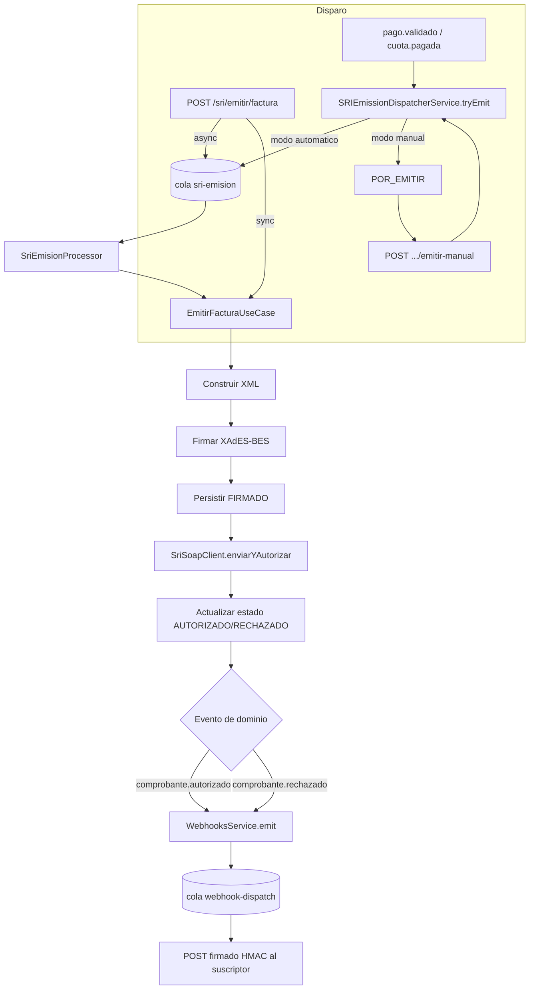

# Flujo: Facturación Electrónica SRI

> Estado: documenta el código **tal como está implementado** en `backend/src/sri/`, no el diseño deseado. Fecha de referencia: 2026-07.

## Resumen

Generación, firma XAdES-BES y envío al SRI (Ecuador) de facturas, notas de crédito, notas de débito y retenciones. Soporta emisión síncrona o asíncrona (cola `pg-boss`), dos disparadores (API manual y automático post-pago), un "modo manual" operativo, y notificaciones salientes (webhooks propios, no del SRI) sobre el resultado.

Todos los endpoints de `sri/` requieren `JwtAuthGuard` + `PermissionsGuard` + `@RequiredPermission('sri', 'admin')` a nivel de clase — no hay superficie pública.

## 1. Disparadores de emisión

Hay dos formas de iniciar la emisión de un comprobante:

### A) Manual vía API

`POST /sri/emitir/factura` (o `/nota-credito`, `/nota-debito`, `/retencion`) → `SriController` valida acceso al RUC del emisor (`EmisoresService.validateRucAccess`) → `SriService.emitirFactura(dto)`.

- Si `SRI_EMISION_ASYNC !== 'false'` (asíncrono por defecto): encola un job `sri-emision` con `{ tipo: 'FACTURA', dto }` vía `JobsService` (pg-boss) y responde `201` con `{ jobId, estado: 'EN_COLA' }`.
- Si es síncrono: llama directo a `EmitirFacturaUseCase.emitirFactura(dto)` y responde con el resultado ya autorizado/rechazado.

### B) Automático tras pago completo (integración con `billing/`)

`SRIEmissionDispatcherService.tryEmit(comprobanteId)` (`backend/src/sri/emision/application/services/sri-emission-dispatcher.service.ts`) es el único punto de entrada para "intentar emitir un comprobante ya existente en `BORRADOR`". Lo llaman `PagoValidadoHandler` y `CuotaPagadaHandler` del módulo `billing/collections/payments/` cuando un pago cubre el total del comprobante (ver [ciclo-facturacion-cobros.md](./ciclo-facturacion-cobros.md)).

Lee el **modo de emisión** (`SriEmisionModeService.getMode()`, cacheado ~60s, configurable en runtime) y bifurca:

- **`automatico`**: si el comprobante está en `BORRADOR`, hace un lock optimista `BORRADOR → ENVIANDO` (`updateEstadoWithLock`, falla si otro proceso ya lo movió) y encola un job `sri-emision` de tipo `FACTURA_DESDE_PREFACTURA` con el `comprobanteId`. Si el envío del job falla, revierte el estado a `BORRADOR`.
- **`manual`**: no llama al SRI. Mueve el comprobante `BORRADOR → POR_EMITIR` y registra una fila de auditoría (`accion: 'parqueado-manual'`). Un operador debe disparar la emisión explícitamente.

### Emisión manual explícita (modo `manual`)

`POST /sri/comprobantes/:claveAcceso/emitir-manual` → `EmitirComprobanteManualUseCase.execute` → `SRIEmissionDispatcherService.tryEmitManual(id)`, que acepta comprobantes en `{BORRADOR, POR_EMITIR}` y sigue el mismo camino de lock + encolado que el modo automático. Cada intento (éxito o fallo) queda auditado (`accion: 'emision-manual'`, incluye usuario/IP/user-agent). Outcomes: `EMITTED` (200), `INVALID_STATE`/`LOCK_LOST` (409), `NOT_FOUND` (404).

## 2. Worker de la cola (`sri-emision`)

`SriEmisionProcessor` (`backend/src/sri/emision/infrastructure/queue/processors/sri-emision.processor.ts`) se registra como worker de pg-boss en `onModuleInit` y despacha por `tipo`:

- `FACTURA` / `NOTA_CREDITO` / `NOTA_DEBITO` / `RETENCION` → llama al use-case de emisión correspondiente con el DTO original.
- `FACTURA_DESDE_PREFACTURA` → `SriIntegrationService.emitirDesdeComprobante(comprobanteId)` (arma el DTO a partir de un comprobante ya persistido y reutiliza el mismo pipeline de emisión).

## 3. Pipeline de emisión de una factura (`EmitirFacturaUseCase`)

`backend/src/sri/emision/application/use-cases/emitir-factura.use-case.ts` — patrón de 3 fases explícitamente diseñado para **no mantener una conexión de BD abierta durante la llamada SOAP al SRI** (que puede tardar 2–10s):

1. **Validaciones en paralelo**: identificación del comprador, catálogos SRI (tipo de identificación, impuestos por detalle, formas de pago) y búsqueda del emisor, todo con `Promise.all`.
2. **Fase 1 — transacción corta (~5ms)**: reserva el siguiente secuencial (`SecuencialRepository.getNextSecuencial`) por punto de emisión + tipo de comprobante, o usa el secuencial explícito del DTO.
3. **Fase 2 — fuera de transacción**: genera la `claveAcceso` (49 dígitos), construye el XML (`XmlBuilderService.buildFactura`), verifica que el emisor tenga certificado P12 configurado, firma el XML (`XmlSignerService.signXmlForEmisor`, XAdES-BES) y **auto-verifica** la firma antes de enviar.
4. **Fase 2.5 — transacción corta**: persiste el comprobante en estado `FIRMADO` junto con sus detalles, impuestos, totales, pagos e info adicional; guarda el XML firmado en storage (RustFS, vía `XmlStorageService`).
5. **Envío al SRI**: `SriSoapClient.enviarYAutorizar(xmlFirmado, claveAcceso)` — combina recepción + polling de autorización en una sola llamada SOAP. Si el SRI no responde, el registro ya persistido queda en `FIRMADO` (recuperable vía reintento).
6. **Fase 3 — transacción corta**: actualiza el comprobante a `AUTORIZADO` (o al estado que devuelva el SRI: `RECHAZADO`, `DEVUELTA`, etc.) y guarda el XML autorizado si vino en la respuesta.
7. **Eventos de dominio** (`EventEmitter2`, in-process): emite `comprobante.autorizado` o `comprobante.rechazado` — consumidos por el módulo de webhooks (ver más abajo).

Notas de crédito, notas de débito y retenciones siguen el mismo patrón en sus propios use-cases (`emitir-nota-credito.use-case.ts`, `emitir-nota-debito.use-case.ts`, `emitir-retencion.use-case.ts`), cada uno con su propio secuencial y builder XML, pero comparten `SriSoapClient`, `XmlSignerService` y `XmlStorageService`.

## 4. Consulta, reconciliación y anulación

- `GET /sri/autorizar/:claveAcceso` — consulta directa al SRI (`consultarAutorizacion`), no toca la BD local.
- `GET /sri/verificar/:claveAcceso` — compara estado local vs. estado real en el SRI sin modificar nada (`sincronizado: boolean`).
- `POST /sri/sincronizar` — reconciliación batch: recorre comprobantes en estados `PENDIENTE`/`EN_PROCESO`/`DEVUELTA` (configurable), consulta el SRI por cada uno con *rate limiting* configurable (`SRI_REQUEST_DELAY_MS`, default 150ms) para no ser bloqueado por IP, actualiza estado local si el SRI ya lo autorizó/rechazó, y opcionalmente reintenta el envío (`reintentar: true`) para los que el SRI no tiene registrados.
- `POST /sri/comprobantes/:claveAcceso/reintentar` — reenvía el XML firmado ya guardado (sin regenerar ni refirmar) para comprobantes en `DEVUELTA`/`RECHAZADO`/`PENDIENTE`/`EN_PROCESO`.
- `PATCH /sri/comprobantes/:claveAcceso/anular` — anulación **local**, solo permitida si el comprobante **no** está `AUTORIZADO`. Un comprobante ya autorizado por el SRI solo puede anularse emitiendo una Nota de Crédito (ver `docs/guides/FACTURACION_FISCAL.md`), nunca borrando el registro.

## 5. Webhooks salientes (no confundir con "webhooks del SRI")

El SRI no envía webhooks — la comunicación con él es SOAP síncrono. El módulo `sri/webhooks/` implementa **notificaciones salientes propias**: terceros configuran una URL para enterarse de eventos de comprobantes.

`WebhooksService` (`backend/src/sri/webhooks/application/webhooks.service.ts`) escucha `@OnEvent('comprobante.autorizado')` y `@OnEvent('comprobante.rechazado')`, busca las configuraciones de webhook activas que incluyan ese evento (y opcionalmente coincidan con el `emisorId`), y encola un job `webhook-dispatch` por cada suscriptor vía pg-boss (reintentos configurables por webhook, backoff exponencial, tope 180s).

`webhook.processor.ts` firma el payload con HMAC-SHA256 usando el secreto (`whsec_...`) del webhook, resuelve la URL con protección **SSRF** (`ssrf-resolver.ts` — bloquea IPs internas/peligrosas antes de conectar) y hace el POST. Cada intento queda en `webhookLogs` (consultable vía `GET /sri/webhooks/:id/logs`).

## Diagrama

## Archivos clave

- `backend/src/sri/emision/interfaces/http/sri.controller.ts`
- `backend/src/sri/emision/application/services/sri.service.ts`
- `backend/src/sri/emision/application/services/sri-emission-dispatcher.service.ts`
- `backend/src/sri/emision/application/use-cases/emitir-factura.use-case.ts`
- `backend/src/sri/emision/infrastructure/queue/processors/sri-emision.processor.ts`
- `backend/src/sri/emision/application/use-cases/emitir-comprobante-manual.use-case.ts`
- `backend/src/sri/webhooks/application/webhooks.service.ts`
- `backend/src/sri/webhooks/infrastructure/queue/processors/webhook.processor.ts`
- `docs/guides/FACTURACION_FISCAL.md` — reglas fiscales de NC/ND/retenciones.
