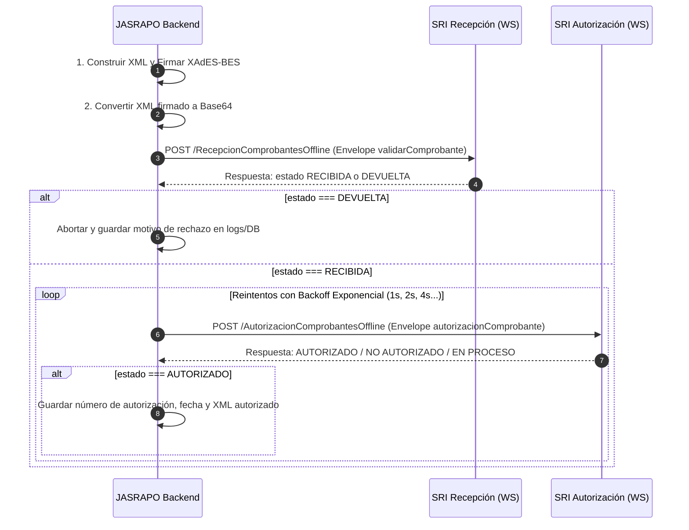

# Guía Maestra de Integración con el SRI (Ecuador) - 2026

Esta guía documenta la totalidad de la normativa, arquitectura técnica, esquemas XML, flujo criptográfico y protocolos de comunicación web necesarios para operar con el **Servicio de Rentas Internas (SRI)** de Ecuador bajo la modalidad **Off-line** en el año 2026.

---

## 1. Fundamento Legal y Resoluciones 2026

1. **Resolución NAC-DGERCGC25-00000017 (Obligatoriedad de Transmisión Inmediata):**
   * A partir del **1 de enero de 2026**, queda eliminada la prórroga de contingencia de 72 horas para transmisión diferida rutinaria. Todo comprobante electrónico debe transmitirse al SRI en tiempo real al momento de su generación.
2. **Ficha Técnica de Comprobantes Electrónicos Esquema Off-line (v2.34+):**
   * Exige la inclusión del **RUC del proveedor del sistema de facturación** en el bloque `<infoAdicional>` con el nombre de campo exacto:
     ```xml
     <campoAdicional nombre="RUC Proveedor">1790000000001</campoAdicional>
     ```
   * Versión de esquemas XSD vigentes:
     * Factura: `v1.1.0` / `v2.1.0`
     * Comprobante de Retención: `v2.0.0`
     * Nota de Crédito: `v1.1.0`
     * Nota de Débito: `v1.0.0`
     * Guía de Remisión: `v1.1.0`
3. **Inmutabilidad Fiscal:**
   * El documento fiscal válido legalmente ante la ley tributaria de Ecuador es exclusivamente el **XML firmado y autorizado**. El PDF (RIDE) es solo una representación gráfica informativa.

---

## 2. Ambientes y Endpoints del SRI

El SRI dispone de dos ambientes totalmente aislados:

| Ambiente | Código SRI | Propósito | Prefijo Dominio |
|---|---|---|---|
| **Pruebas** | `1` | Validación, QA, staging y certificación | `celcer.sri.gob.ec` |
| **Producción** | `2` | Operación fiscal real | `cel.sri.gob.ec` |

### URLs de los WebServices (SOAP 1.1 sobre HTTPS)

* **Servicio de Recepción (`RecepcionComprobantesOffline`):**
  * Pruebas: `https://celcer.sri.gob.ec/comprobantes-electronicos-ws/RecepcionComprobantesOffline`
  * Producción: `https://cel.sri.gob.ec/comprobantes-electronicos-ws/RecepcionComprobantesOffline`
* **Servicio de Autorización (`AutorizacionComprobantesOffline`):**
  * Pruebas: `https://celcer.sri.gob.ec/comprobantes-electronicos-ws/AutorizacionComprobantesOffline`
  * Producción: `https://cel.sri.gob.ec/comprobantes-electronicos-ws/AutorizacionComprobantesOffline`

> [!NOTE]
> Las URLs terminadas en `?wsdl` solo se utilizan para consultar la definición del servicio. El cliente HTTP directo de producción realiza peticiones `POST` a la URL base sin el sufijo `?wsdl`.

---

## 3. Clave de Acceso (49 dígitos)

La clave de acceso identifica unívocamente a cada comprobante ante el SRI y sirve simultáneamente como número de autorización una vez aprobado.

### Estructura de los 49 dígitos

| Posición | Longitud | Campo | Descripción | Ejemplo |
|---|---|---|---|---|
| 01 - 08 | 8 | Fecha de Emisión | Formato `ddmmaaaa` | `10102026` |
| 09 - 10 | 2 | Tipo de Comprobante | Catálogo SRI (`01`=Factura, `04`=NC, `05`=ND, `07`=Retención) | `01` |
| 11 - 23 | 13 | RUC del Emisor | RUC de 13 dígitos | `1790012345001` |
| 24 | 1 | Tipo de Ambiente | `1` = Pruebas, `2` = Producción | `1` |
| 25 - 27 | 3 | Establecimiento | Código de 3 dígitos | `001` |
| 28 - 30 | 3 | Punto de Emisión | Código de 3 dígitos | `001` |
| 31 - 39 | 9 | Secuencial | Número secuencial con ceros a la izquierda | `000000123` |
| 40 - 47 | 8 | Código Numérico | Número aleatorio de 8 dígitos para evitar predecibilidad | `12345678` |
| 48 | 1 | Tipo de Emisión | `1` = Emisión Normal | `1` |
| 49 | 1 | Dígito Verificador | Calculado con algoritmo Módulo 11 ponderado | `5` |

### Algoritmo Módulo 11 (Cálculo del Dígito Verificador)
1. Se toman los primeros 48 dígitos de derecha a izquierda.
2. Se multiplican por los factores cíclicos `[2, 3, 4, 5, 6, 7]`.
3. Se calcula el residuo: `residuo = suma % 11`.
4. Dígito verificador:
   * Si `11 - residuo === 11` ➔ `0`
   * Si `11 - residuo === 10` ➔ `1`
   * En cualquier otro caso ➔ `11 - residuo`.

---

## 4. Firma Electrónica (XAdES-BES)

El SRI rechaza cualquier comprobante cuya firma no cumpla con los estándares criptográficos definidos en la Ficha Técnica:

* **Estándar:** XML Advanced Electronic Signatures (XAdES), perfil **XAdES-BES**.
* **Tipo de envoltorio:** *Enveloped Signature* (el nodo `<ds:Signature>` va insertado como último hijo del elemento raíz del XML, ej: dentro de `<factura>`).
* **Canonicalización (C14N):** `http://www.w3.org/TR/2001/REC-xml-c14n-20010315`.
* **Algoritmo de Digest:** `SHA-256` (`http://www.w3.org/2001/04/xmlenc#sha256`) o `SHA-1` (`http://www.w3.org/2000/09/xmldsig#sha1`).
* **Algoritmo de Firma:** `RSA-SHA1` (`http://www.w3.org/2000/09/xmldsig#rsa-sha1`) por requerimiento estricto del SRI.
* **Certificado digital:** Formato PKCS#12 (`.p12` o `.pfx`) emitido por una Autoridad de Certificación acreditada por ARCOTEL (BCE, Security Data, Consejo de la Judicatura, ANF, Uanataca, etc.).

---

## 5. Protocolo de Envío y Consulta HTTP Nativo

### Flujo en 2 Pasos (Recepción y Autorización)



### Protocolo HTTP de Recepción (`validarComprobante`)
* **Método:** `POST`
* **Headers:**
  ```http
  Content-Type: text/xml; charset=utf-8
  SOAPAction: ""
  ```
* **Body (SOAP Envelope):**
  ```xml
  <soapenv:Envelope xmlns:soapenv="http://schemas.xmlsoap.org/soap/envelope/" xmlns:ec="http://ec.gob.sri.ws.recepcion">
    <soapenv:Header/>
    <soapenv:Body>
      <ec:validarComprobante>
        <xml>{{XML_FIRMADO_EN_BASE64}}</xml>
      </ec:validarComprobante>
    </soapenv:Body>
  </soapenv:Envelope>
  ```

### Protocolo HTTP de Autorización (`autorizacionComprobante`)
* **Método:** `POST`
* **Headers:**
  ```http
  Content-Type: text/xml; charset=utf-8
  SOAPAction: ""
  ```
* **Body (SOAP Envelope):**
  ```xml
  <soapenv:Envelope xmlns:soapenv="http://schemas.xmlsoap.org/soap/envelope/" xmlns:ec="http://ec.gob.sri.ws.autorizacion">
    <soapenv:Header/>
    <soapenv:Body>
      <ec:autorizacionComprobante>
        <claveAccesoComprobante>{{CLAVE_ACCESO_49_DIGITOS}}</claveAccesoComprobante>
      </ec:autorizacionComprobante>
    </soapenv:Body>
  </soapenv:Envelope>
  ```

---

## 6. Catálogos Principales del SRI

### Tipos de Comprobante
* `01`: Factura
* `04`: Nota de Crédito
* `05`: Nota de Débito
* `07`: Guía de Remisión
* `07`: Comprobante de Retención (código tributario 07)

### Tipos de Identificación de Comprador
* `04`: RUC (13 dígitos)
* `05`: Cédula de Identidad (10 dígitos)
* `06`: Pasaporte
* `07`: Consumidor Final (`9999999999999`)
* `08`: Identificación del Exterior

### Tarifas de IVA vigentes
* Código de impuesto IVA: `2`
* Códigos de porcentaje:
  * `0`: 0%
  * `2`: 12% (histórico)
  * `3`: 14% (histórico)
  * `4`: 15% (vigente desde abril 2024 / 2026)
  * `5`: 5% (materiales de construcción)
  * `6`: No Objeto de Impuesto
  * `7`: Exento de IVA
  * `8`: 8% (sector turismo en feriados decretados)
  * `10`: 13% (tarifa transitoria previa)

### Formas de Pago
* `01`: Sin utilización del sistema financiero (Efectivo)
* `16`: Tarjeta de débito
* `19`: Tarjeta de crédito
* `20`: Otros con utilización del sistema financiero (Transferencia bancaria / Depósito)
* `21`: Endoso de títulos
