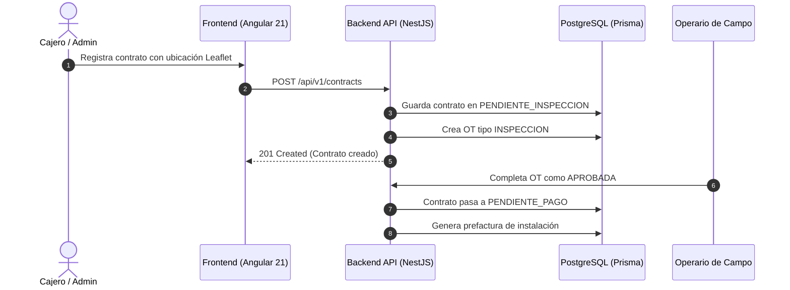
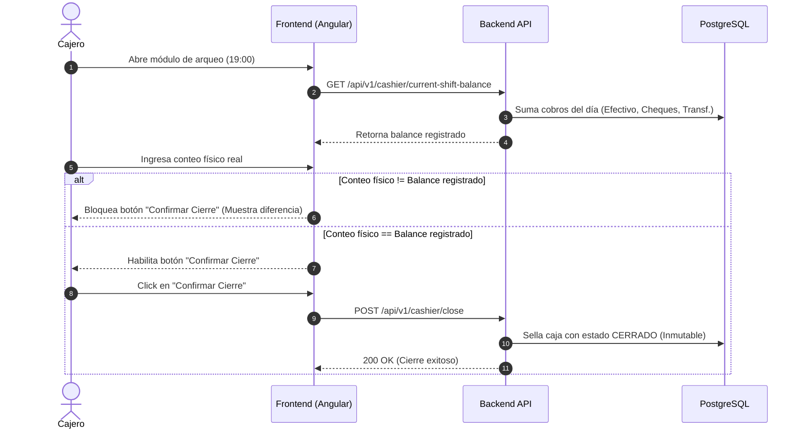

# Informe de Arquitectura Funcional
# ORGANIZACIÓN FUNCIONAL Y FLUJOS TÉCNICOS — JASRAPO

**Organización:** Junta Administradora de Servicios de Agua Potable de Olón (JASRAPO)  
**Versión:** 1.0  
**Fecha:** Septiembre 2026  
**Estado:** Oficial / Arquitectura Aprobada  

---

# 1 Introducción
JASRAPO organiza el ciclo de gestión integral de agua potable en Olón estructurando sus capacidades en dominios funcionales desacoplados bajo una arquitectura de **Monolito Modular con Clean Architecture** en el backend (NestJS 11 + Prisma + PostgreSQL) y una **Single Page Application / PWA** en el frontend (Angular 21 + Angular Material + Leaflet).

---

# 2 Enfoque Funcional y Capas
El sistema organiza cada dominio en capas concéntricas:
* **Capa de Dominio:** Entidades puras, reglas de negocio, máquinas de estado y puertos de persistencia.
* **Capa de Aplicación:** Casos de uso (`*UseCase`) que coordinan operaciones transaccionales y disparan eventos.
* **Capa de Infraestructura:** Adaptadores para Prisma ORM, Web Services SOAP del SRI, firma XAdES-BES (`.p12`), colas durables `pg-boss`, mailer y almacenamiento.
* **Capa de Presentación / Interfaces:** Controladores REST con validación OpenAPI y la SPA/PWA Angular.

---

# 3 Dominios y Módulos Funcionales

1. **Dominio de Operaciones y Clientes (`operations`):**
   * Padrón de clientes e identidades.
   * Contratos con georreferenciación (Leaflet) y máquina de estados del servicio.
   * Planificación y despacho de rutas de campo con control de balance mensual.
   * Gestión de Órdenes de Trabajo (Inspección, Instalación, Corte, Reconexión) y Novedades.

2. **Dominio de Medición y Campo (`metering`):**
   * Parque de medidores, trazabilidad de series y reemplazos transaccionales.
   * Toma móvil de lecturas con soporte offline (Service Worker) y detección automática de anomalías.
   * Portal y endpoints optimizados para el operario lector.

3. **Dominio de Facturación, Tarifas y Cobranzas (`billing` / `collections`):**
   * Catálogo de categorías tarifarias escalonadas y rubros con códigos SRI.
   * Periodos de facturación y generación de prefacturas mensuales (borrador el día 31).
   * Refacturación auditada (motivo explicativo y autor obligatorios).
   * Cobranza multicanal (efectivo, cheque, transferencias).
   * Módulo de arqueo y cierre diario a las 19:00 con bloqueo por diferencias físicas.
   * Convenios de pago en cuotas niveladas y amortización automática.
   * Ciclo de corte por mora y reconexión automática tras pago.

4. **Dominio Tributario y Firma Electrónica (`sri`):**
   * Generación de XML RIDE v2.1.0 y firma digital criptográfica XAdES-BES con certificados PKCS#12.
   * Cliente SOAP para Web Services de Recepción y Autorización del SRI.
   * Visor de PDF integrado en el frontend (`ngx-extended-pdf-viewer`).

5. **Dominio de Reportería y Portal Público:**
   * Motor de reportes de cartera vencida, padrón de usuarios y recaudación.
   * Portal de consulta pública de planillas para abonados.

---

# 4 Flujos Técnicos e Interacciones Críticas

### 4.1 Creación de Contrato con Inspección Previa

### 4.2 Cuadre y Cierre de Caja a las 19:00

---

# 5 Procesamiento Asíncrono en Segundo Plano
Las operaciones intensivas se delegan a `pg-boss` para no bloquear el hilo HTTP:
* **Firma y Envío SRI (`sri:sign-and-send`):** Firma XAdES-BES y llamadas SOAP al SRI con reintentos automáticos.
* **Generación de RIDE (`pdf:generate-ride`):** Renderizado de PDFs con Puppeteer y almacenamiento de comprobantes.
* **Notificaciones (`mail:send-receipt`):** Despacho de facturas y avisos por correo electrónico con plantillas Handlebars.

---

# 6 Conclusiones
La arquitectura funcional de JASRAPO garantiza un desacoplamiento claro entre la captura de datos en campo, la validación fiscal/contable y la recaudación en ventanilla, asegurando una plataforma robusta, auditable y escalable para la comunidad de Olón.
