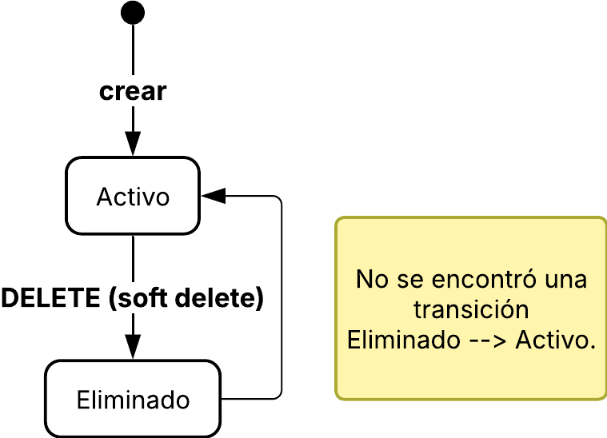

# Clientes  
Subdominio de identidad y datos del titular. La API usa /api/v1 y autenticación Bearer.  
> **Ficha de dominio:** documenta el alta, consulta, actualización y baja lógica de clientes, además del catálogo de tipos de identificación. El alcance cubre las superficies HTTP confirmadas en `ClientController`.*  
## Alcance y entradas HTTP  
- **Controlador:** ClientController (backend/src/operations/clients/interfaces/http/client.controller.ts).  
- **Servicio:** ClientService.  
- **Casos:** CreateClientUseCase, FindOneClientUseCase, UpdateClientUseCase, RemoveClientUseCase.  
- GET /identification-types no tiene caso de uso dedicado.  
- GET /clients tampoco tiene FindAllClientUseCase: el servicio construye filtros y pagina directamente.  
|-|-|-|  
| **Método y ruta** | **Caso/servicio ejecutado** | **Resultado** |   
| GET /api/v1/clients/identification-types | ClientService.findAllIdentificaciones() | Catálogo activo. |   
| POST /api/v1/clients | ClientService.create() → CreateClientUseCase.execute() | Cliente creado (201). |   
| GET /api/v1/clients | ClientService.findAll() → buildClientFilters() → ClientRepository.paginateClientes() | Página de clientes. |   
| GET /api/v1/clients/:id | ClientService.findOne() → FindOneClientUseCase.execute() | Cliente encontrado. |   
| PATCH /api/v1/clients/:id | ClientService.update() → UpdateClientUseCase.execute() | Cliente actualizado. |   
| DELETE /api/v1/clients/:id | ClientService.delete() → RemoveClientUseCase.execute() | Soft delete. |   

## Ejemplo JSON  
```json
{
"clienteId": "10",
"identificacion": "1712345678",
"nombres": "Juan",
"apellidos": "Pérez",
"razonSocial": null,
"email": "juan@example.com",
"telefono": "0991234567",
"direccionDomicilio": "Av. Principal 123",
"activo": true
}
```

|-|-|-|  
| **Campo** | **Tipo** | **Regla/uso** |   
| clienteId | string | BigInt serializado. |   
| tipoIdentificacionId | number | Referencia al catálogo. |   
| identificacion | string | Identificador del titular. |   
| nombres, apellidos | string/null | Nombre personal. |   
| razonSocial | string/null | Nombre empresarial cuando aplica. |   
| email, telefono, direccionDomicilio | string/null | Datos de contacto y domicilio. |   
| activo | boolean | Disponibilidad lógica expuesta por el DTO. |   

## Estados

No existe enum vigente de estado del cliente. La disponibilidad se expresa con los siguientes campos:

| Campo | Tipo | Significado |
|---|---|---|
| `activo` | `boolean` | Habilitación lógica expuesta por el DTO. Por defecto `true`. |
| `deletedAt` | `DateTime?` | Soft delete; **interno** para el flujo de consulta, pero **SÍ se expone** en el DTO `ClientResponseDto`. Un cliente puede tener `activo=true` y `deletedAt != null` simultáneamente. |
| `aplicaTerceraEdad` | `boolean` | Calculado en create/update según `TerceraEdadUtil.aplica(fechaNacimiento)`. Por defecto `false`. |
| `aplicaDiscapacidad` | `boolean` | Flag configurable desde el DTO. Por defecto `false`. |
| `telefonoSecundario` | `string?` | Teléfono alternativo. Presente en el modelo y en el DTO. |
| `tipoIdentificacion` | `CatalogoTiposIdentificacion` | Relación al catálogo; el enum `TipoIdentificacion` tiene 5 valores (`CEDULA`, `RUC`, `PASAPORTE`, `CONSUMIDOR_FINAL`, `IDENTIFICACION_EXTRANJERA`). |

No hay reactivación pública: el flujo `POST /clients` reactiva un registro existente solo cuando el `tipoIdentificacionId=4` (CONSUMIDOR_FINAL) o cuando la `identificacion` ya existía con `deletedAt != null`.

### Validación de identificación por algoritmo verificador

`CreateClientUseCase` y `UpdateClientUseCase` invocan `TipoIdentificacionUtil.validar(codigo, identificacion)` antes de persistir. Las reglas por tipo son:

| `codigo` (SRI) | Tipo | Regla |
|---|---|---|
| `05` | CEDULA | 10 dígitos, algoritmo módulo 10. |
| `04` (con terminación `001`) | RUC persona natural | Cédula + `001`. |
| `04` (con tercer dígito `9`, terminación `001`) | RUC privado | Algoritmo módulo 11 con coeficientes `[4,3,2,7,6,5,4,3,2]`. |
| `04` (con tercer dígito `6`, terminación `0001`) | RUC público | Algoritmo módulo 11 con coeficientes `[3,2,7,6,5,4,3,2]`. |
| `08` | PASAPORTE | Sin validación de checksum (solo presencia). |
| `09` | IDENTIFICACION_EXTRANJERA | Sin validación de checksum. |
| `07` | CONSUMIDOR_FINAL | No requiere `identificacion`; usa lógica de singleton con reactivación (ver más abajo). |

> **Nota cross-doc:** la nota en `../HISTORIAS-DE-USUARIO.md`, escenario HU-01, marcaba esta validación como "pendiente de implementación". La implementación SÍ existe en `backend/src/shared/utils/tipo-identificacion.util.ts`. Esa nota está desactualizada.

### Singleton CONSUMIDOR_FINAL

El tipo de identificación con `id=4` (codigo SRI `07`, `CONSUMIDOR_FINAL`) tiene semántica especial: existe **a lo sumo un** registro activo de este tipo en toda la tabla.

- `CreateClientUseCase` detecta `tipoIdentificacionId === 4` y llama a `clientRepository.reactivateOrCreateConsumidorFinal(...)`.
- Si existe al menos un registro activo o soft-deleted, se reutiliza el más antiguo y se reactivan los datos del request (`email`, `teléfono`, `dirección`).
- Si hay más de un registro, los extras se marcan con `deletedAt = now` para mantener el invariante de singleton.

No requiere `identificacion` ni `nombres/apellidos`.

## Efectos y transacciones
Crear, actualizar y eliminar escriben Clientes mediante sus casos de uso; eliminar usa soft delete. Las consultas, buildClientFilters y ClientResponseDto.fromEntity son transformaciones/serialización puras. No se confirmó una transacción adicional ni handler de eventos propio.  
|-|-|  
| **Tabla Prisma** | **Uso** |   
| Clientes | Titular y soft delete. |   
| CatalogoTiposIdentificacion | Tipos activos y relación. |   

## Gráfico de estados  
Alcance del diagrama: **Confirmado**. El código confirma alta y baja lógica; no se encontró una operación pública de reactivación.  
  

## Casos de uso  
### Caso: Catálogo de tipos de identificación  
**Descripción:** devuelve los tipos activos para formularios.  

**HTTP y ruta:** GET /api/v1/clients/identification-types.  

**Permiso:** clientes:read.  

**Cadena:** ClientController.findAllIdentificaciones() → ClientService.findAllIdentificaciones() → ClientRepository.findActiveTipoIdentificaciones() (sin caso dedicado).  

**Errores relevantes:** 401 no autenticado; 403 sin permiso.  

**Efectos:** ninguno; consulta y mapeo puros.  

**Prisma:** CatalogoTiposIdentificacion.  

**Entrada:** sin body, path ni query.  

**Salida:**  
```json
[
{
"tipoIdentificacionId": 1,
"codigo": "CEDULA",
"descripcion": "Cédula"
}
]
```

### Caso: Crear cliente  
**Descripción:** registra un nuevo titular.  

**HTTP y ruta:** POST /api/v1/clients.  

**Permiso:** clientes:create.  

**Cadena:** ClientController.create() → ClientService.create() → CreateClientUseCase.execute() → ClientRepository.  

**Errores relevantes:**
- `400` datos inválidos (incluye validación del algoritmo verificador según el tipo).
- `401`.
- `403`.
- **Conflicto de identificación** (ya activa) — `EntityAlreadyExistsException`.
- **Identificación inválida** según el algoritmo — `InvalidDomainOperationException`.
- **Campos requeridos faltantes** según el tipo (`nombres`/`apellidos`/`direccionDomicilio` para tipos genéricos; `razonSocial` adicional para RUC).

**Efectos:**
- Alta en `Clientes` **o reactivación** si la identificación existía soft-deleted.
- Cálculo automático de `aplicaTerceraEdad` vía `TerceraEdadUtil.aplica(fechaNacimiento)`.
- Normalización: emails a lowercase, nombres/apellidos/razonSocial a uppercase, identificación con `trim`.
- El DTO de salida es serialización pura.  

**Prisma:** Clientes, CatalogoTiposIdentificacion.  

**Entrada:**  
```json
{
"tipoIdentificacionId": 1,
"identificacion": "1712345678",
"nombres": "Juan",
"apellidos": "Pérez",
"razonSocial": null,
"email": "juan@example.com",
"telefono": null,
"direccionDomicilio": null
}
```

**Salida:**  
```json
{
"clienteId": "10",
"identificacion": "1712345678",
"nombres": "Juan",
"apellidos": "Pérez",
"razonSocial": null,
"email": "juan@example.com",
"telefono": null,
"direccionDomicilio": null,
"activo": true
}
```

### Caso: Listar clientes  
**Descripción:** consulta clientes con filtros opcionales y paginación.  

**HTTP y ruta:** GET /api/v1/clients.  

**Permiso:** clientes:read.  

**Cadena:** ClientController.findAll() → ClientService.findAll() → buildClientFilters() → ClientRepository.paginateClientes(); no existe FindAllClientUseCase.  

**Errores relevantes:** 400 query inválida; 401; 403.  

**Efectos:** ninguno; consulta y DTO puros.  

**Prisma:** Clientes, CatalogoTiposIdentificacion.  

**Entrada:** sin body. Query: page, limit, identificacion, nombres, apellidos, nombreCompleto.  

**Salida:**  
```json
{
"data": [
{
"clienteId": "10",
"identificacion": "1712345678",
"nombres": "Juan",
"apellidos": "Pérez",
"activo": true
}
],
"meta": {
"page": 1,
"limit": 10,
"total": 1,
"totalPages": 1
}
}
```

### Caso: Obtener cliente  
**Descripción:** devuelve un cliente por identificador.  

**HTTP y ruta:** GET /api/v1/clients/:id.  

**Permiso:** clientes:read.  

**Cadena:** ClientController.findOne() → ClientService.findOne() → FindOneClientUseCase.execute() → ClientRepository.  

**Errores relevantes:** 400 ID inválido; 401; 403; 404 no encontrado.  

**Efectos:** ninguno; DTO puro.  

**Prisma:** Clientes, CatalogoTiposIdentificacion.  

**Entrada:** sin body. Path: id=10.  

**Salida:**  
```json
{
"clienteId": "10",
"identificacion": "1712345678",
"nombres": "Juan",
"apellidos": "Pérez",
"razonSocial": null,
"email": "juan@example.com",
"telefono": null,
"direccionDomicilio": null,
"activo": true
}
```

### Caso: Actualizar cliente  
**Descripción:** modifica parcialmente los datos permitidos del titular.  

**HTTP y ruta:** PATCH /api/v1/clients/:id.  

**Permiso:** clientes:update.  

**Cadena:** ClientController.update() → ClientService.update() → UpdateClientUseCase.execute() → ClientRepository.  

**Errores relevantes:** 400 ID/body inválidos; 401; 403; 404 no encontrado.  

**Efectos:** actualización de Clientes; DTO puro.  

**Prisma:** Clientes, CatalogoTiposIdentificacion.  

**Entrada:** path id=10; body:  
```json
{
"telefono": "0990000000",
"email": "nuevo@example.com"
}
```

**Salida:**  
```json
{
"clienteId": "10",
"telefono": "0990000000",
"email": "nuevo@example.com",
"activo": true
}
```

### Caso: Eliminar cliente  
**Descripción:** marca el cliente como eliminado sin borrado físico.  

**HTTP y ruta:** DELETE /api/v1/clients/:id.  

**Permiso:** clientes:delete.  

**Cadena:** ClientController.delete() → ClientService.delete() → RemoveClientUseCase.execute() → ClientRepository.  

**Errores relevantes:** 400 ID inválido; 401; 403; 404 no encontrado.  

**Efectos:** soft delete en Clientes; **solo** setea `deletedAt = now()` (no toca `activo`). Tras la operación, el cliente tiene `activo=true` y `deletedAt != null` simultáneamente.

**Prisma:** Clientes.  

**Entrada:** sin body. Path: id=10.  

**Salida:**  
```json
{
"clienteId": "10",
"identificacion": "1712345678",
"activo": false
}
```

## Pendientes funcionales

Bloqueos confirmados como pendientes en el código revisado. Cuando se cierre cada uno, sacar de acá y mover a la sección correspondiente.

- **Forma exacta de `CreateClientDto` y `UpdateClientDto`** (campos opcionales vs obligatorios, validaciones anidadas como `@IsEmail`, `@Matches`). Confirmar contra el código actual; la lista de campos en este doc es funcional, no de validación.
- **Forma exacta del query string de `GET /api/v1/clients`** (`page, limit, identificacion, nombres, apellidos, nombreCompleto`). Confirmar que el filtro `nombreCompleto` sigue vigente en el repositorio (vista en `client-filters.mapper.ts`).
- **Reactivación pública de clientes soft-deleted.** Existe **solo** para `CONSUMIDOR_FINAL` y como efecto secundario al crear con la misma identificación. No hay endpoint público para reactivar un cliente regular; si se requiere, hay que decidir el criterio (¿solo admin?) y agregar el endpoint.

## No documentado o pendiente de confirmar

- Handlers de eventos de clientes. No hay event dispatcher que reaccione a cambios en `Clientes`. Si se requiere propagar a `Contratos` automáticamente (por ejemplo, cambio de dirección), hay que implementar el patrón outbox como en pagos.
- Estados legacy distintos de `activo` y `deletedAt`. Confirmar contra seeds y migraciones si existe alguna columna legacy.

## Comportamiento de negocio verificable

Las tablas relacionadas son `Clientes` y `CatalogoTiposIdentificacion`; `Contratos` consume la identidad del titular. La transición del contrato al completar una instalación (`INSTALACION`) o reconexión (`RECONEXION`) **sí** existe — está implementada vía `applyContractLifecycleTransition` (`backend/src/operations/routes/infrastructure/repositories/prisma-orden-trabajo.repository.ts:356-403`) y documentada en `02-contratos.md`, sección "Transiciones de estado del contrato". El flujo del cliente es alta/actualización/baja lógica y consulta del catálogo; las validaciones de identificación (algoritmo verificador) son ejecutadas en `CreateClientUseCase` y `UpdateClientUseCase`.
