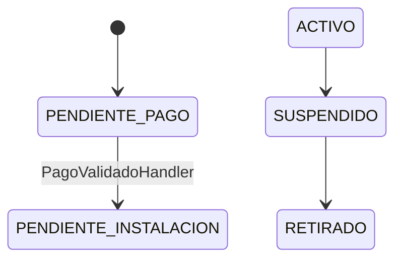

# Contratos

Vínculo entre cliente, medidor, tarifa y servicio.

> **Ficha de dominio:** documenta el ciclo contractual, el vínculo con medidores, la asignación de rutas de instalación, la baja lógica y la generación de documentos PDF.

## Alcance y entradas HTTP

- **Controlador:** `ContratoMedidorController`.
- **Servicio:** `ContratoMedidorService`.
- **Casos:** `CreateContractUseCase`, `FindAllContractsUseCase`, `FindOneContractUseCase`, `UpdateContractUseCase`, `FinalizeMeterLinkUseCase`, `RemoveContractUseCase`.
- La asignación de ruta usa el servicio/repositorios; no se confirmó un caso de uso dedicado.

| Método y ruta | Caso/servicio ejecutado | Resultado |
|---|---|---|
| `POST /api/v1/contracts` | `crearContrato()` → `CreateContractUseCase.execute()` | Contrato creado. |
| `GET /api/v1/contracts` | `buscarContratos()` → `FindAllContractsUseCase.execute()` | Página. |
| `GET /api/v1/contracts/:id` | `buscarContrato()` → `FindOneContractUseCase.execute()` | Detalle. |
| `PATCH /api/v1/contracts/:id` | `actualizar()` → `UpdateContractUseCase.execute()` | Contrato actualizado. |
| `POST /api/v1/contracts/:id/finalize` | `finalizarVinculo()` → `FinalizeMeterLinkUseCase.execute()` | Vínculo finalizado. |
| `POST /api/v1/contracts/:id/assign-installation-route` | `assignInstallationRoute()` → servicio/repositorios | Ruta y orden de instalación. |
| `DELETE /api/v1/contracts/:id` | `eliminar()` → `RemoveContractUseCase.execute()` | Soft delete. |
| `GET /api/v1/contracts/:id/pdf/connection-request` | `generateConnectionRequestPdf()` | PDF. |
| `GET /api/v1/contracts/:id/pdf/responsibility-agreement` | `generateResponsibilityAgreementPdf()` | PDF. |

## Ejemplo JSON

```json
{
  "contratoId": "1",
  "clienteId": "10",
  "medidorId": "20",
  "estadoServicio": "PENDIENTE_PAGO",
  "estadoCobranza": "NO_APLICA"
}
```

| Campo | Tipo | Regla/uso |
|---|---|---|
| `contratoId`, `clienteId`, `medidorId` | string | `BigInt` serializado. |
| `categoriaTarifaId`, `comunidadId`, `sectorId` | number | Relaciones territoriales/tarifarias. |
| `numeroGuia`, `direccionSuministro` | string | Datos de instalación. |
| `estadoServicio` | enum | Ciclo operativo del servicio. |
| `estadoCobranza` | enum | Situación de cobro. |

## Estados

| Dimensión | Valores confirmados | Significado |
|---|---|---|
| Servicio | `PENDIENTE_PAGO`, `PENDIENTE_INSTALACION`, `ACTIVO`, `SUSPENDIDO`, `RETIRADO` | Pago, instalación, operación, suspensión y retiro. |
| Cobranza | `NO_APLICA`, `AL_DIA`, `EN_MORA` | Sin cobro, corriente o vencido. |

## Cadena POST de creación y validaciones

La cadena confirmada es `ContratoMedidorController.crear()` → `ContratoMedidorService.crearContrato()` → `CreateContractUseCase.execute()` → `PrismaContractRepository`. Fuentes: `backend/src/operations/contracts/application/use-cases/create-contract.use-case.ts` (aprox. líneas 30--190), `backend/src/operations/contracts/infrastructure/repositories/prisma-contract.repository.ts` (aprox. líneas 1--220) y `backend/src/operations/contracts/interfaces/dto/create-contrato-medidor.dto.ts` (aprox. líneas 1--140).

Antes de escribir se validan el DTO, la existencia de cliente, categoría y medidor, la disponibilidad del medidor y la coherencia de relaciones/estado inicial. La operación se ejecuta transaccionalmente. El caso escribe contrato, historial y medidor; la prefactura de instalación tiene un camino SQL específico.

## Efectos directos e indirectos

| Superficie | Tipo | Comportamiento confirmado |
|---|---|---|
| `contratos` | Directo | Inserta el vínculo con `PENDIENTE_PAGO` y `NO_APLICA`. |
| `historial_medidores` | Directo | Registra el vínculo inicial del medidor. |
| `medidores` | Directo | Reserva/actualiza el estado del medidor. |
| `Comprobante`, `ComprobanteDetalle`, `Prefacturas`, `PrefacturaDetalle` | Indirecto dentro de la misma transacción | Se crean mediante `SELECT generar_prefactura_instalacion(...)`, no por un `create` Prisma directo, cuando `estadoServicio=PENDIENTE_PAGO`. |

La función está en `backend/prisma/migrations/20260822010000_add_codigo_sistema_rubro_and_update_sp/migration.sql` (aprox. líneas 1--260). Crea `Comprobante`, `ComprobanteDetalle`, `Prefacturas` y `PrefacturaDetalle`. Busca el rubro por `categoria_tarifa_id = v_contrato.categoria_tarifa_id` y `codigo_sistema_rubro = 'INSTALACION'`. El criterio `codigo_sri LIKE 'SERV-GUIA-%'` es histórico/legacy y no es la regla vigente.

### Fórmula de instalación

```text
subtotal = precioUnitario
iva      = ROUND(subtotal × tasaImpuesto, 2)
total    = subtotal + iva
```

Fuente: bloque `generar_prefactura_instalacion` de la misma migración SQL (aprox. líneas 80--220).

| Tabla Prisma | Uso |
|---|---|
| `Contratos` | Contrato, estados y soft delete. |
| `HistorialMedidores` | Historial del vínculo. |
| `Medidores` | Medidor asociado. |
| `CategoriaTarifa`, `Clientes` | Relaciones principales. |
| `Prefacturas`, `PrefacturaDetalle`, `Rubros` | Cargo de instalación. |
| `Rutas`, `OrdenTrabajo` | Instalación asignada. |

## Gráfico de estados



## Casos de uso

### Caso: Crear contrato

**Descripción:** crea el contrato y prepara la instalación del medidor.  
**HTTP y ruta:** `POST /api/v1/contracts`.  
**Permiso:** `contracts:create`.  
**Cadena:** `ContratoMedidorController.crear()` → `ContratoMedidorService.crearContrato()` → `CreateContractUseCase.execute()` → repositorios.  
**Errores relevantes:** `400` datos/relaciones inválidas; `401`; `403`; `404`; medidor no disponible.  
**Efectos:** crea directamente `Contratos`, `HistorialMedidores` y `Medidores`; invoca la función SQL dentro de la transacción cuando corresponde.  
**Prisma/SQL:** `Contratos`, `HistorialMedidores`, `Medidores`, `CategoriaTarifa`, `Clientes`; indirectamente `Comprobantes`, `ComprobanteDetalle`, `Prefacturas`, `PrefacturaDetalle` y `Rubros`.  
**Entrada:**

```json
{"clienteId":"10","medidorId":"20","categoriaTarifaId":1,"numeroGuia":"G-0001","direccionSuministro":"Av. Amazonas 123","comunidadId":1}
```

**Salida:**

```json
{"contratoId":"1","clienteId":"10","medidorId":"20","estadoServicio":"PENDIENTE_PAGO","estadoCobranza":"NO_APLICA"}
```

### Caso: Listar contratos

**Descripción:** devuelve contratos filtrados y paginados.  
**HTTP y ruta:** `GET /api/v1/contracts`.  
**Permiso:** `contracts:read`.  
**Cadena:** `ContratoMedidorController.buscarContratos()` → `ContratoMedidorService.buscarContratos()` → `FindAllContractsUseCase.execute()` → repositorio.  
**Errores relevantes:** `400` query inválida; `401`; `403`.  
**Efectos:** ninguno; consulta y DTO puros.  
**Prisma:** `Contratos`, `Clientes`, `Medidores`, `CategoriaTarifa`.  
**Entrada:** sin body; query del `FilterContractsDto` (paginación y filtros definidos por el DTO).  
**Salida:**

```json
{"data":[{"contratoId":"1","estadoServicio":"ACTIVO"}],"meta":{"page":1,"limit":10,"total":1,"totalPages":1}}
```

### Caso: Obtener contrato

**Descripción:** consulta el detalle de un contrato.  
**HTTP y ruta:** `GET /api/v1/contracts/:id`.  
**Permiso:** `contracts:read`.  
**Cadena:** `ContratoMedidorController.buscarContrato()` → `ContratoMedidorService.buscarContrato()` → `FindOneContractUseCase.execute()` → repositorio.  
**Errores relevantes:** `400`; `401`; `403`; `404`.  
**Efectos:** ninguno; mapeo puro.  
**Prisma:** `Contratos`, `Clientes`, `Medidores`, `CategoriaTarifa`, `HistorialMedidores`.  
**Entrada:** sin body; path `{ "id": "1" }`.  
**Salida:**

```json
{"contratoId":"1","clienteId":"10","estadoServicio":"ACTIVO","estadoCobranza":"AL_DIA","historialMedidores":[]}
```

### Caso: Actualizar contrato

**Descripción:** actualiza estados, dirección, sector o reemplaza el medidor si se envía `medidorId`.  
**HTTP y ruta:** `PATCH /api/v1/contracts/:id`.  
**Permiso:** `contracts:update`.  
**Cadena:** `ContratoMedidorController.actualizarContrato()` → `ContratoMedidorService.actualizar()` → `UpdateContractUseCase.execute()` → repositorio.  
**Errores relevantes:** `400`; `401`; `403`; `404`; conflicto de estado/relación.  
**Efectos:** actualización; el reemplazo indicado se ejecuta transaccionalmente según el caso.  
**Prisma:** `Contratos`, `Medidores`, `HistorialMedidores`.  
**Entrada:** path `{ "id": "1" }`; body `{ "direccionSuministro": "Calle Nueva 10" }`.  
**Salida:**

```json
{"contratoId":"1","direccionSuministro":"Calle Nueva 10","estadoServicio":"ACTIVO"}
```

### Caso: Finalizar vínculo de medidor

**Descripción:** finaliza el vínculo activo del contrato con su medidor.  
**HTTP y ruta:** `POST /api/v1/contracts/:id/finalize`.  
**Permiso:** `contracts:update`.  
**Cadena:** `ContratoMedidorController.finalizarVinculo()` → `ContratoMedidorService.finalizarVinculo()` → `FinalizeMeterLinkUseCase.execute()` → repositorio.  
**Errores relevantes:** `400`; `401`; `403`; `404`.  
**Efectos:** registra el cierre en el historial.  
**Prisma:** `HistorialMedidores`, `Contratos`, `Medidores`.  
**Entrada:** sin body; path `{ "id": "1" }`.  
**Salida:**

```json
{"contratoId":"1","fechaFin":"2026-09-16"}
```

### Caso: Asignar ruta de instalación

**Descripción:** asigna un contrato pendiente de instalación a una ruta existente o crea una ruta de instalación y su orden.  
**HTTP y ruta:** `POST /api/v1/contracts/:id/assign-installation-route`.  
**Permiso:** `contracts:update`.  
**Cadena:** `ContratoMedidorController.assignInstallationRoute()` → `ContratoMedidorService.assignInstallationRoute()` → repositorios de rutas/órdenes.  
**Errores relevantes:** `400`; `401`; `403`; `404`; ruta destino inválida.  
**Efectos:** crea/reutiliza `Rutas` y crea `OrdenTrabajo`; no se confirma atomicidad de ambas escrituras.  
**Prisma:** `Rutas`, `OrdenTrabajo`, `Contratos`, `Medidores`.  
**Entrada:** path `{ "id": "1" }`; body `{ "routeId": "42" }` o DTO sin `routeId` según el código.  
**Salida:**

```json
{"rutaId":"42","tipoRuta":"INSTALACION","ordenesTrabajo":[{"ordenTrabajoId":"9","estado":"PENDIENTE"}]}
```

### Caso: Eliminar contrato

**Descripción:** marca el contrato como eliminado lógicamente.  
**HTTP y ruta:** `DELETE /api/v1/contracts/:id`.  
**Permiso:** `contracts:delete`.  
**Cadena:** `ContratoMedidorController.eliminarContrato()` → `ContratoMedidorService.eliminar()` → `RemoveContractUseCase.execute()` → repositorio.  
**Errores relevantes:** `400`; `401`; `403`; `404`.  
**Efectos:** soft delete en `Contratos`.  
**Prisma:** `Contratos`.  
**Entrada:** sin body; path `{ "id": "1" }`.  
**Salida:**

```json
{"contratoId":"1","estadoServicio":"ACTIVO","estadoCobranza":"AL_DIA"}
```

### Caso: Generar PDF de solicitud de conexión

**Descripción:** genera la solicitud oficial de conexión.  
**HTTP y ruta:** `GET /api/v1/contracts/:id/pdf/connection-request`.  
**Permiso:** `contracts:read`.  
**Cadena:** `ContratoMedidorController.connectionRequestPdf()` → `ContratoMedidorService.generateConnectionRequestPdf()` → `GetConnectionRequestPdfDataUseCase` → generador.  
**Errores relevantes:** `400`; `401`; `403`; `404`; aborto de solicitud.  
**Efectos:** sólo lectura y proyección; serialización PDF pura.  
**Prisma:** `Contratos`, `Clientes`, `Medidores`, `CategoriaTarifa`.  
**Entrada:** sin body; path `{ "id": "1" }`.  
**Salida:** no es JSON: `Content-Type: application/pdf`, `Content-Disposition: inline` y `Content-Length`, con bytes PDF.

### Caso: Generar PDF de acuerdo de responsabilidad

**Descripción:** genera el acta de responsabilidad asociada al contrato.  
**HTTP y ruta:** `GET /api/v1/contracts/:id/pdf/responsibility-agreement`.  
**Permiso:** `contracts:read`.  
**Cadena:** `ContratoMedidorController.responsibilityAgreementPdf()` → `ContratoMedidorService.generateResponsibilityAgreementPdf()` → `GetResponsibilityAgreementPdfDataUseCase` → generador.  
**Errores relevantes:** `400`; `401`; `403`; `404`; aborto de solicitud.  
**Efectos:** no se confirma escritura de dominio; proyección y PDF puros.  
**Prisma:** `Contratos`, `Clientes`, `Medidores`, `HistorialMedidores`.  
**Entrada:** sin body; path `{ "id": "1" }`.  
**Salida:** no es JSON: `application/pdf`, `Content-Disposition: inline`, `Content-Length` y bytes PDF.

## No documentado o pendiente de confirmar

- No se encontró transición automática a `ACTIVO`. `PagoValidadoHandler`, en `backend/src/billing/collections/payments/application/handlers/pago-validado.handler.ts` (aprox. líneas 1--220), confirma `PENDIENTE_PAGO` → `PENDIENTE_INSTALACION` y cobranza `NO_APLICA`.
- Parámetros exactos de los DTO de finalización/asignación si cambian.
- Sincronización del campo legacy `estado`.
