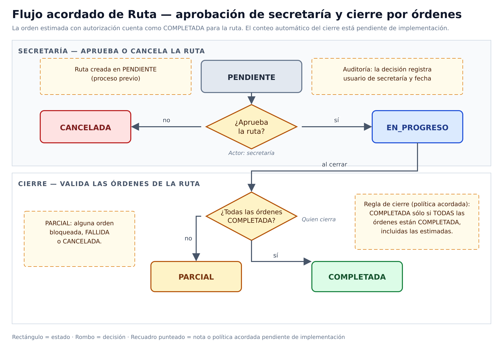

# Rutas y órdenes de trabajo

Despacho de lecturas, instalaciones y operación de campo.

> **Ficha de dominio:** documenta períodos, rutas, órdenes de trabajo y operaciones del personal de campo, incluida la vinculación de lecturas y la evidencia externa.

## Alcance y entradas HTTP

- **Controladores:** `RoutesController`, `OrdenesTrabajoController`, `OperatorController`.
- **Servicios:** `RoutesService`, `OrdenesTrabajoService`.
- **Casos:** `CreateRouteUseCase`, `FindAllRoutesUseCase`, `FindOneRouteUseCase`, `UpdateRouteUseCase`, `DeleteRouteUseCase`, `ReassignRouteUseCase`, `GetEligibleReadingsUseCase`, `GetReadingsByRutaUseCase`, `FindOrdenesByRutaUseCase`, `ExportFieldSheetPdfUseCase`, `UpdateOrdenEstadoUseCase`, `LinkLecturaUseCase`, `GetOperatorRoutesUseCase`, `UpdateRouteStateUseCase`, `UpdateOperatorWorkOrderUseCase`.
- Los períodos se consultan directamente desde `RoutesService`; no se confirmó caso dedicado para listar rutas administrativas ni para algunos cambios de órdenes.

| Método y ruta | Caso/servicio ejecutado | Resultado |
|---|---|---|
| `GET /api/v1/routes/periods` | `RoutesService.getPeriodos()` | Períodos. |
| `GET /api/v1/routes/eligible-readings` | `getEligibleReadings()` → `GetEligibleReadingsUseCase` | Lecturas elegibles paginadas. |
| `GET /api/v1/routes/:rutaId/readings` | `getReadingsByRuta()` → `GetReadingsByRutaUseCase` | Lecturas de ruta. |
| `POST /api/v1/routes` | `create()` → `CreateRouteUseCase` | Ruta creada. |
| `GET /api/v1/routes` / `:id` | `findAll()` / `findOne()` → casos de consulta | Rutas. |
| `PATCH /api/v1/routes/:id` | `update()` → `UpdateRouteUseCase` | Ruta actualizada. |
| `PATCH /api/v1/routes/:id/reassign` | `ReassignRouteUseCase.execute()` | Operario reasignado. |
| `DELETE /api/v1/routes/:id` | `delete()` → `DeleteRouteUseCase` | Soft delete. |
| `GET /api/v1/routes/:id/pdf` | `ExportFieldSheetPdfUseCase` | PDF. |
| `GET /api/v1/routes/:id/work-orders` | `FindOrdenesByRutaUseCase` | Órdenes paginadas. |
| `PATCH /api/v1/work-orders/:id/state` | `UpdateOrdenEstadoUseCase` | Estado de orden. |
| `PATCH /api/v1/work-orders/:id/reading` | `LinkLecturaUseCase` | Lectura vinculada. |
| `GET/PATCH /api/v1/operator/routes...` | `GetOperatorRoutesUseCase` / `UpdateRouteStateUseCase` | Vista y estado del operador. |
| `PATCH /api/v1/operator/work-orders/:id` | `UpdateOperatorWorkOrderUseCase` | Ejecución/evidencia. |

## Ejemplo JSON

En los JSON de entrada, `null` representa un campo opcional omitido.

```json
{
  "rutaId": "42",
  "nombre": "Lecturas agosto",
  "tipoRuta": "LECTURA",
  "estado": "PENDIENTE",
  "ordenesTrabajo": []
}
```

| Campo | Tipo | Regla/uso |
|---|---|---|
| `rutaId`, `ordenTrabajoId`, `lecturaId` | string | `BigInt` serializado. |
| `tipoRuta` | enum | Actividad de la ruta. |
| `estado` | enum | Estado de ruta u orden según el DTO. |
| `operarioId`, `periodoId`, `comunidadId` | number/null | Asignación y contexto. |
| `ordenesTrabajo` | array | Órdenes asociadas. |

## Estados

| Entidad | Estados confirmados | Significado |
|---|---|---|
| Ruta | `PENDIENTE`, `EN_PROGRESO`, `COMPLETADA`, `PARCIAL`, `CANCELADA` | Pendiente, ejecutada, finalizada, incompleta o cancelada. |
| Orden | `PENDIENTE`, `EN_PROGRESO`, `COMPLETADA`, `CANCELADA`, `FALLIDA` | Ciclo de trabajo. |

### Máquina de estados de la Ruta

La máquina está implementada como una tabla de transiciones explícita en `backend/src/operations/routes/domain/route-state.ts`:

| Desde | Hacia permitidas |
|---|---|
| `PENDIENTE` | `EN_PROGRESO`, `CANCELADA` |
| `EN_PROGRESO` | `COMPLETADA`, `PARCIAL`, `PENDIENTE`, `CANCELADA` |
| `COMPLETADA` | `EN_PROGRESO` (reabre para corrección de cierre) |
| `PARCIAL` | `EN_PROGRESO` (reabre para continuar trabajo) |
| `CANCELADA` | `PENDIENTE` (reabre para reactivación) |

La función `canTransitionRouteState(from, to)` valida la transición; `UpdateRouteUseCase.execute()` (líneas 25-31) rechaza con `InvalidDomainOperationException` si la transición no está permitida. **No existe máquina equivalente para `OrdenTrabajo`** — sus transiciones las acepta todas `UpdateOrdenEstadoUseCase` mientras el estado pertenezca al enum.

## Regla de novedades sin estado adicional de orden

> **Decisión funcional propuesta — pendiente de implementación.** No se agregará un estado persistido `NOVEDAD` a `OrdenTrabajo`. Mientras exista una novedad, la orden permanece en `EN_PROGRESO`; la interfaz muestra una alerta derivada al consultar la relación de novedades activas.

### Flujo acordado de orden con novedad


Fuente editable: `diagrams/orden-lectura-novedad.drawio`. Versión vectorial: `images/04-orden-lectura-flujo.svg` (y `images/04-orden-lectura-flujo.pdf` para LaTeX).

Resumen textual del flujo (accesibilidad):

1. La orden inicia en `PENDIENTE`; el operador la pasa a `EN_PROGRESO` al iniciar el trabajo.
2. Sin novedad, la orden se completa (`COMPLETADA`).
3. Con novedad en una orden que NO es de lectura, la orden queda en `EN_PROGRESO` con `tieneNovedadActiva=true` hasta resolverla; si el caso es irrecuperable pasa a `FALLIDA`, y si se cancela pasa a `CANCELADA`.
4. En una orden de `LECTURA` con medidor dañado, el operador crea una `NovedadOrdenTrabajo` en `OPEN`; la lectura queda en `CON_NOVEDAD` y la orden permanece en `EN_PROGRESO` bloqueada.
5. Sólo secretaría puede autorizar la estimación con los últimos 3 meses (**política acordada, pendiente de implementación**): si autoriza, la lectura pasa a `ESTIMADA` y la orden a `COMPLETADA`, mientras la novedad sigue en `OPEN` para un reemplazo futuro; si no autoriza o no se puede estimar, la orden sigue bloqueada.
6. La orden `COMPLETADA` no implica lectura `APROBADA`: la estimación genera `ESTIMADA`, no `APROBADA`.
7. La orden completada por estimación autorizada cuenta como `COMPLETADA` para el cierre de la ruta.

`NOVEDAD` no es un valor del enum de `OrdenTrabajo`: es una condición derivada de la relación con `NovedadOrdenTrabajo` y de la existencia de novedades activas. Por lo tanto, no debe persistirse ni confundirse con `OrdenTrabajo.estado`.

### Tres máquinas separadas

| Entidad | Máquina | Responsabilidad |
|---|---|---|
| `OrdenTrabajo.estado` | Ejecución operativa: `PENDIENTE`, `EN_PROGRESO`, `COMPLETADA`, `CANCELADA`, `FALLIDA`. | Indica en qué etapa está el trabajo de campo y cómo termina la orden. |
| `NovedadOrdenTrabajo.estado` | Análisis de anomalía: `OPEN`, `IN_PROGRESS`, `RESOLVED`, `CANCELLED`. | Registra la atención, resolución o cancelación de una anomalía asociada a la orden. |
| `Lectura.estado` | Captura y validación: `PENDIENTE`, `POR_REVISION`, `APROBADA`, `RECHAZADA_VERIFICACION`, `ESTIMADA`, `PLANILLADA`, `CON_NOVEDAD`. | Indica el ciclo de captura, revisión, aprobación, rechazo o tratamiento del dato leído. |

La relación entre las máquinas no implica copiar estados: una novedad activa puede generar una alerta sobre la orden, pero no transforma su estado persistido en `NOVEDAD`; una lectura con `CON_NOVEDAD` tampoco reemplaza el estado de la orden ni el estado de la novedad.

### Ejemplo de respuesta derivada

La respuesta puede exponer el indicador y la relación consultada sin inventar un estado adicional para la orden:

```json
{
  "ordenTrabajoId": "9",
  "estado": "EN_PROGRESO",
  "tieneNovedadActiva": true,
  "novedadesActivas": [
    {
      "novedadOrdenTrabajoId": "31",
      "estado": "OPEN",
      "tipo": "LECTURA_ERRONEA",
      "observacion": "El visor no permite validar el consumo"
    }
  ]
}
```

### Regla de backend y pendiente funcional

La UI no es la única barrera. Como regla de backend propuesta, una operación no debe permitir pasar la orden a `COMPLETADA` si existe una novedad abierta que afecte el resultado; la validación debe ejecutarse en el caso de uso o repositorio que completa la orden, independientemente de que la interfaz muestre la alerta.

Está **pendiente de implementación** y de definición el campo o criterio que determina si una novedad es bloqueante: podría ser `afectaOrden`, el tipo de novedad, la resolución registrada o una regla equivalente. Hasta acordar ese criterio, esta sección documenta una decisión funcional propuesta y no un comportamiento vigente.

También están **pendientes de implementación** la autorización de la estimación sólo por secretaría con los últimos 3 meses y el conteo de órdenes para el cierre `COMPLETADA`/`PARCIAL` de la ruta.

## Efectos y transacciones

Crear/actualizar/eliminar rutas y órdenes escriben `Rutas`, `OrdenTrabajo` y, cuando corresponde, `EjecucionOrdenTrabajo`. Vincular una lectura completa la orden y fija `completadoEn`; cambiarla a pendiente/en progreso lo limpia. El operador puede almacenar evidencia en RustFS y su clave en la orden. Consultas, filtros, mapeadores y generación PDF son transformaciones puras; la subida de evidencia no lo es.

| Tabla Prisma | Uso |
|---|---|
| `Rutas` | Ruta, asignación, estado y soft delete. |
| `OrdenTrabajo` | Trabajo y vínculo con lectura. |
| `EjecucionOrdenTrabajo` | Resultado de ejecución. |
| `Lecturas` | Lecturas elegibles/vinculadas. |
| `Periodos` | Ciclo contable. |
| `NovedadOrdenTrabajo` | Novedades de campo. |

## Flujos acordados y máquinas de estado

### Flujo acordado de la ruta



Fuente editable: `diagrams/ruta-estados.drawio`. Versión vectorial: `images/04-ruta-flujo.svg` (y `images/04-ruta-flujo.pdf` para LaTeX).

Resumen textual del flujo (accesibilidad):

1. La ruta nace en `PENDIENTE`.
2. Secretaría decide con auditoría (usuario y fecha): si no la aprueba, la ruta pasa a `CANCELADA`; si la aprueba, pasa a `EN_PROGRESO`.
3. Al cerrar una ruta en `EN_PROGRESO` se validan sus órdenes (**conteo pendiente de implementación**): si TODAS están `COMPLETADA` —incluidas las completadas por estimación autorizada—, la ruta pasa a `COMPLETADA`; si alguna sigue bloqueada, o está `FALLIDA` o `CANCELADA`, la ruta pasa a `PARCIAL`.

Alcance en código: `UpdateRouteUseCase` valida transiciones vía `canTransitionRouteState` (`backend/src/operations/routes/domain/route-state.ts`). La máquina permite transiciones de reapertura: `COMPLETADA → EN_PROGRESO` y `CANCELADA → PENDIENTE`. Lo que **no** está implementado es la decisión de secretaría con auditoría, el conteo automático de órdenes para `COMPLETADA`/`PARCIAL` y el bloqueo por novedad activa (ver pendientes al final).

### Estado de la orden

Alcance: transiciones **acordadas** (política); los estados del enum y las escrituras están confirmados, pero `UpdateOrdenEstadoUseCase` no define una tabla de transiciones en código.

- `PENDIENTE` → `EN_PROGRESO`: el operador inicia el trabajo.
- `EN_PROGRESO` → `COMPLETADA`: sin novedad activa, con la novedad resuelta, o con estimación autorizada por secretaría.
- `EN_PROGRESO` → `FALLIDA`: el caso es irrecuperable.
- `EN_PROGRESO` → `CANCELADA`: se cancela el trabajo.
- Con novedad activa sin resolver, la orden permanece en `EN_PROGRESO` con `tieneNovedadActiva=true` (ver flujo acordado).

### Estado de las novedades de órdenes de trabajo

Sí existe una máquina de estados independiente para `NovedadOrdenTrabajo`. El modelo Prisma confirma los estados `OPEN`, `IN_PROGRESS`, `RESOLVED` y `CANCELLED`, además de los tipos de anomalía `FUGA`, `MEDIDOR_DAÑADO`, `LECTURA_ERRONEA` y `OTRO`. La novedad se relaciona con una orden, y opcionalmente con una lectura y el usuario que la resolvió.

Alcance del diagrama: **Confirmado** para los estados, el valor inicial `OPEN` y los datos de resolución. No se encontró un controlador o caso de uso dedicado que confirme las transiciones HTTP; las flechas de atención y resolución se muestran como **flujo esperado**, no como contrato confirmado.

La máquina, en texto:

- `OPEN` (valor inicial al crear la novedad) → `IN_PROGRESS`: inicia la atención (flujo esperado).
- `IN_PROGRESS` → `RESOLVED`: registra la resolución con usuario y fecha (flujo esperado).
- `OPEN` o `IN_PROGRESS` → `CANCELLED`: se cancela (flujo esperado, sin reactivación confirmada).

La novedad de medidor dañado puede seguir en `OPEN` después de una estimación autorizada, para gestionar el reemplazo futuro del medidor.

| Elemento | Valores o datos confirmados |
|---|---|
| Estado | `OPEN`, `IN_PROGRESS`, `RESOLVED`, `CANCELLED`. |
| Tipo de anomalía | `FUGA`, `MEDIDOR_DAÑADO`, `LECTURA_ERRONEA`, `OTRO`. |
| Resolución económica | `COBRO_REAL`, `PROMEDIO_HISTORICO`, `EXONERACION_PARCIAL`, `EXONERACION_TOTAL`, `AJUSTE_LECTURA`. |
| Datos de resolución | `resolucionTipo`, `consumoAjustado`, `observacionResolucion`, `resueltoPorUsuarioId`, `resueltoEn`. |

`resultadoObservacion` y `estado=FALLIDA` de `OrdenesTrabajo` no sustituyen a `NovedadOrdenTrabajo`: representan el resultado de la orden, mientras que la novedad conserva la anomalía y su resolución.

## Casos de uso

### Caso: Consultar períodos

**Descripción:** lista períodos disponibles para filtros y asignación.  
**HTTP y ruta:** `GET /api/v1/routes/periods`.  
**Permiso:** `routes:read`.  
**Cadena:** `RoutesController.getPeriods()` → `RoutesService.getPeriodos()` → repositorio.  
**Errores relevantes:** `401`; `403`.  
**Efectos:** ninguno.  
**Prisma:** `Periodos`.  
**Entrada:** sin body ni parámetros.  
**Salida:**

```json
[
  {
    "periodoId": 12,
    "nombre": "2026-08",
    "estado": "ACTIVO"
  }
]
```

### Caso: Consultar lecturas elegibles

**Descripción:** devuelve lecturas disponibles para asignarlas a una ruta.  
**HTTP y ruta:** `GET /api/v1/routes/eligible-readings`.  
**Permiso:** `routes:read`.  
**Cadena:** `RoutesController.getEligibleReadings()` → `RoutesService.getEligibleReadings()` → `GetEligibleReadingsUseCase.execute()`.  
**Errores relevantes:** `400`; `401`; `403`.  
**Efectos:** ninguno.  
**Prisma:** `Lecturas`, `Contratos`, `Medidores`, `Periodos`, `OrdenTrabajo`.  
**Entrada:** sin body; query `page`, `limit` y filtros de `FilterReadingsDto`.  
**Salida:**

```json
{
  "data": [
    {
      "lecturaId": "101",
      "estado": "PENDIENTE"
    }
  ],
  "meta": {
    "page": 1,
    "limit": 10,
    "total": 1,
    "totalPages": 1
  },
  "kpis": {}
}
```

### Caso: Consultar lecturas de ruta

**Descripción:** lista lecturas ya vinculadas a una ruta.  
**HTTP y ruta:** `GET /api/v1/routes/:rutaId/readings`.  
**Permiso:** `routes:read`.  
**Cadena:** `RoutesController.getReadingsByRuta()` → `RoutesService.getReadingsByRuta()` → `GetReadingsByRutaUseCase.execute()`.  
**Errores relevantes:** `400`; `401`; `403`; `404`.  
**Efectos:** ninguno.  
**Prisma:** `Rutas`, `OrdenTrabajo`, `Lecturas`.  
**Entrada:** sin body; path `rutaId=42`; query `page`, `limit`.  
**Salida:**

```json
{
  "data": [
    {
      "lecturaId": "101",
      "estado": "PENDIENTE"
    }
  ],
  "meta": {
    "page": 1,
    "limit": 10,
    "total": 1,
    "totalPages": 1
  },
  "kpis": {}
}
```

### Caso: Crear ruta

**Descripción:** crea una ruta de trabajo con su período y tipo.  
**HTTP y ruta:** `POST /api/v1/routes`.  
**Permiso:** `routes:create`.  
**Cadena:** `RoutesController.create()` → `RoutesService.create()` → `CreateRouteUseCase.execute()` → repositorio.  
**Errores relevantes:** `400`; `401`; `403`; `404` período/guías.  
**Efectos:** alta en `Rutas` y asociaciones que determine el caso.  
**Prisma:** `Rutas`, `OrdenTrabajo`, `Contratos`, `Periodos`.  
**Entrada:** body:

```json
{
  "nombre": "Lecturas agosto",
  "tipoRuta": "LECTURA",
  "periodoId": 12,
  "operarioId": null,
  "comunidadId": null
}
```
**Salida:**

```json
{
  "rutaId": "42",
  "nombre": "Lecturas agosto",
  "estado": "PENDIENTE",
  "ordenesTrabajo": []
}
```

### Caso: Listar rutas

**Descripción:** devuelve rutas con paginación y filtros.  
**HTTP y ruta:** `GET /api/v1/routes`.  
**Permiso:** `routes:read`.  
**Cadena:** `RoutesController.findAll()` → `RoutesService.findAll()` → repositorio.  
**Errores relevantes:** `400`; `401`; `403`.  
**Efectos:** ninguno.  
**Prisma:** `Rutas` y relaciones.  
**Entrada:** sin body; query `page`, `limit`, `estado`, `operarioId`, `comunidadId`, `periodoId`, `tipoRuta`.  
**Salida:**

```json
{
  "data": [
    {
      "rutaId": "42",
      "estado": "PENDIENTE"
    }
  ],
  "meta": {
    "page": 1,
    "limit": 10,
    "total": 1,
    "totalPages": 1
  }
}
```

### Caso: Obtener ruta

**Descripción:** consulta una ruta por ID.  
**HTTP y ruta:** `GET /api/v1/routes/:id`.  
**Permiso:** `routes:read`.  
**Cadena:** `RoutesController.findOne()` → `RoutesService.findOne()` → repositorio.  
**Errores relevantes:** `400`; `401`; `403`; `404`.  
**Efectos:** ninguno.  
**Prisma:** `Rutas`, `OrdenTrabajo`, `Contratos`, `Periodos`.  
**Entrada:** sin body; path `id=42`.  
**Salida:**

```json
{
  "rutaId": "42",
  "estado": "PENDIENTE",
  "ordenesTrabajo": []
}
```

### Caso: Actualizar ruta

**Descripción:** modifica los datos de una ruta existente.  
**HTTP y ruta:** `PATCH /api/v1/routes/:id`.  
**Permiso:** `routes:update`.  
**Cadena:** `RoutesController.update()` → `RoutesService.update()` → `UpdateRouteUseCase.execute()` → repositorio.  
**Errores relevantes:** `400`; `401`; `403`; `404`.  
**Efectos:** actualización de `Rutas`; DTO puro.  
**Prisma:** `Rutas`.  
**Entrada:** path `id=42`; body:

```json
{
  "nombre": "Ruta actualizada",
  "descripcion": null
}
```
**Salida:**

```json
{
  "rutaId": "42",
  "nombre": "Ruta actualizada",
  "estado": "PENDIENTE"
}
```

### Caso: Reasignar ruta

**Descripción:** asigna o desasigna la ruta a un operario.  
**HTTP y ruta:** `PATCH /api/v1/routes/:id/reassign`.  
**Permiso:** `routes:update`.  
**Cadena:** `RoutesController.reassign()` → `ReassignRouteUseCase.execute()` → repositorio.  
**Errores relevantes:** `400`; `401`; `403`; `404`; ruta ya asignada.  
**Efectos:** cambia `Rutas.operarioId`.  
**Prisma:** `Rutas`, `Usuarios/Operarios`.  
**Entrada:** path `id=42`; body:

```json
{
  "operarioId": "7"
}
```

`operarioId` también puede enviarse como `null`.

**Salida:**

```json
{
  "rutaId": "42",
  "operarioId": 7,
  "estado": "PENDIENTE"
}
```

### Caso: Eliminar ruta

**Descripción:** elimina lógicamente la ruta.  
**HTTP y ruta:** `DELETE /api/v1/routes/:id`.  
**Permiso:** `routes:delete`.  
**Cadena:** `RoutesController.delete()` → `RoutesService.delete()` → `DeleteRouteUseCase.execute()` → repositorio.  
**Errores relevantes:** `400`; `401`; `403`; `404`.  
**Efectos:** soft delete y desasignación según el caso.  
**Prisma:** `Rutas`, `OrdenTrabajo`, `Lecturas`.  
**Entrada:** sin body; path `id=42`.  
**Salida:**

```json
{
  "rutaId": "42",
  "estado": "CANCELADA"
}
```

### Caso: Exportar hoja de campo

**Descripción:** genera la hoja oficial de órdenes y lecturas.  
**HTTP y ruta:** `GET /api/v1/routes/:id/pdf`.  
**Permiso:** `routes:read`.  
**Cadena:** `RoutesController.exportPdf()` → `RoutesService.exportPdf()` → `ExportFieldSheetPdfUseCase`/generador.  
**Errores relevantes:** `400`; `401`; `403`; `404`.  
**Efectos:** lectura y generación puras.  
**Prisma:** `Rutas`, `OrdenTrabajo`, `Lecturas`.  
**Entrada:** sin body; path `id=42`.
**Salida:** no es JSON: `application/pdf`, `Content-Disposition: inline`, `Content-Length` y bytes PDF.

### Caso: Consultar órdenes de una ruta

**Descripción:** lista órdenes asociadas, filtradas y paginadas.  
**HTTP y ruta:** `GET /api/v1/routes/:id/work-orders`.  
**Permiso:** `routes:read`.  
**Cadena:** `RoutesController.findOrdenesByRuta()` → `OrdenesTrabajoService.findByRuta()` → `FindOrdenesByRutaUseCase.execute()`.  
**Errores relevantes:** `400`; `401`; `403`; `404`.  
**Efectos:** ninguno.  
**Prisma:** `OrdenTrabajo`, `Rutas`, `Lecturas`.  
**Entrada:** sin body; path `id=42`; query `estado`, `page`, `limit`.  
**Salida:**

```json
{
  "data": [
    {
      "ordenTrabajoId": "9",
      "estado": "PENDIENTE"
    }
  ],
  "meta": {},
  "kpis": {}
}
```

### Caso: Actualizar estado de orden

**Descripción:** cambia estado, observación y fecha de finalización de una orden.  
**HTTP y ruta:** `PATCH /api/v1/work-orders/:id/state`.  
**Permiso:** `routes:update`.  
**Cadena:** `OrdenesTrabajoController.updateEstado()` → `OrdenesTrabajoService.updateEstado()` → `UpdateOrdenEstadoUseCase.execute()` → repositorio.  
**Errores relevantes:** `400`; `401`; `403`; `404`; `409`.  
**Efectos:** persiste estado; completa o limpia `completadoEn`.  
**Prisma:** `OrdenTrabajo`, `EjecucionOrdenTrabajo`.  
**Entrada:** path `id=9`; body:

```json
{
  "estado": "COMPLETADA",
  "resultadoObservacion": "Trabajo realizado"
}
```
**Salida:**

```json
{
  "ordenTrabajoId": "9",
  "estado": "COMPLETADA"
}
```

### Caso: Vincular lectura a orden

**Descripción:** asocia una lectura y completa la orden.  
**HTTP y ruta:** `PATCH /api/v1/work-orders/:id/reading`.  
**Permiso:** `routes:update`.  
**Cadena:** `OrdenesTrabajoController.linkLectura()` → `OrdenesTrabajoService.linkLectura()` → `LinkLecturaUseCase.execute()` → repositorio.  
**Errores relevantes:** `400`; `401`; `403`; `404`; `409`.  
**Efectos:** persiste vínculo y `completadoEn`.  
**Prisma:** `OrdenTrabajo`, `Lecturas`, `Rutas`.  
**Entrada:** path `id=9`; body:

```json
{
  "lecturaId": "101"
}
```
**Salida:**

```json
{
  "ordenTrabajoId": "9",
  "lecturaId": "101",
  "estado": "COMPLETADA"
}
```

### Caso: Actualizar operación del operador

**Descripción:** registra ejecución y evidencia opcional de una orden.  
**HTTP y ruta:** `PATCH /api/v1/operator/work-orders/:id`.  
**Permiso:** `routes:update`.  
**Cadena:** `OperatorController.updateOperatorWorkOrder()` → `UpdateOperatorWorkOrderUseCase.execute()` → repositorio/RustFS.  
**Errores relevantes:** `400`; `401`; `403`; `404`; `409`.  
**Efectos:** persiste ejecución y `evidenciaFotoUrl`; la subida y rollback de archivo son efectos reales.  
**Prisma:** `OrdenTrabajo`, `EjecucionOrdenTrabajo`, `NovedadOrdenTrabajo`.  
**Entrada:** path `id=9`; multipart: campos DTO y archivo opcional `foto`; sin body JSON.  
**Salida:** JSON `OrderWorkResponseDto`, por ejemplo:

```json
{
  "ordenTrabajoId": "9",
  "estado": "COMPLETADA",
  "evidenciaFotoUrl": "ordenes/9/foto.jpg"
}
```

### Caso: Listar rutas del operador

**Descripción:** lista las rutas del período activo asignadas al operador autenticado.  
**HTTP y ruta:** `GET /api/v1/operator/routes`.  
**Permiso:** `routes:read`.  
**Cadena:** `OperatorController.getOperatorRoutes()` → `GetOperatorRoutesUseCase.execute()` → repositorio.  
**Errores relevantes:** `400`; `401`; `403`; `404` sin período activo.  
**Efectos:** ninguno; consulta y DTO puros.  
**Prisma:** `Rutas`, `OrdenTrabajo`, `Periodos`.  
**Entrada:** sin body; query opcional `tipoRuta`; operador desde JWT.  
**Salida:** lista JSON de `OperatorRouteResponseDto`.

### Caso: Actualizar estado de ruta del operador

**Descripción:** cambia el estado de una ruta que pertenece al operador autenticado.  
**HTTP y ruta:** `PATCH /api/v1/operator/routes/:id/state`.  
**Permiso:** `routes:update`.  
**Cadena:** `OperatorController.updateRouteState()` → `UpdateRouteStateUseCase.execute()` → repositorio.  
**Errores relevantes:** `400`; `401`; `403` ruta ajena; `404`; `409` transición inválida.  
**Efectos:** actualiza `Rutas` y las marcas temporales derivadas del estado.  
**Prisma:** `Rutas`, `OrdenTrabajo`, `Periodos`.  
**Entrada:** path `id=42`; body:

```json
{
  "estado": "EN_PROGRESO"
}
```
**Salida:**

```json
{
  "rutaId": "42",
  "estado": "EN_PROGRESO"
}
```

## Pendientes funcionales

Bloqueos confirmados como pendientes en el código revisado. Cuando se cierre cada uno, sacar de acá y mover a la sección correspondiente.

- **Bloqueo por novedad activa al transicionar la orden a `COMPLETADA`.** El helper `applyContractLifecycleTransition` solo valida estado origen del contrato, no valida `tieneNovedadActiva`. Falta decidir el criterio bloqueante (`afectaOrden`, tipo de novedad o resolución) e implementar la validación en `UpdateOrdenEstadoUseCase` o en el repositorio de órdenes.
- **Autorización exclusiva del rol `Secretaría` para la estimación con los últimos 3 meses.** Mismo punto pendiente en `05-lecturas.md`. Requiere endpoint nuevo o permiso específico (`estimates:approve` o equivalente). La política está acordada pero no está aplicada en código.
- **Conteo automático de órdenes para el cierre de la ruta** (`COMPLETADA` vs `PARCIAL`). Si TODAS las órdenes están `COMPLETADA` (incluidas completadas por estimación), la ruta pasa a `COMPLETADA`; si alguna está `FALLIDA` o `CANCELADA`, pasa a `PARCIAL`. Hoy `UpdateRouteUseCase` no implementa esa lógica; el estado final lo asigna manualmente quien cierre la ruta.
- **Endpoints HTTP para gestión manual de `NovedadOrdenTrabajo`.** Hoy la entidad solo tiene repositorio; la creación y actualización de novedades ocurre internamente desde otros flujos (captura de lecturas, reporte de defectos). Si el operador debe poder crear/actualizar/resolver novedades desde la UI, falta el controller + use cases correspondientes.
- **Auditoría de la decisión de secretaría al aprobar una ruta para `EN_PROGRESO`** (usuario y fecha). El documento lo menciona en la sección de flujo acordado de la ruta pero no indica tabla ni columnas donde se persiste esa decisión.
- **Tipo de novedad `INSPECCION` sin efecto sobre ciclo de vida del contrato.** El helper `applyContractLifecycleTransition` solo reconoce los tipos `INSTALACION` y `RECONEXION`. Si una orden de inspección tiene contrato asociado, el efecto sobre el estado del contrato queda indefinido.

## No documentado o pendiente de confirmar

- Lista exhaustiva de transiciones de operador.
- Endpoints legacy basados en `EstadoAsignacion`.

## Comportamiento de negocio verificable

Las tablas relacionadas son `Rutas`, `OrdenTrabajo`, `EjecucionOrdenTrabajo`, `Lecturas`, `Periodos` y `NovedadOrdenTrabajo`. El flujo confirmado es período → ruta → orden → lectura/evidencia → cierre de orden; la evidencia puede persistirse externamente en RustFS. No se encontró una fórmula monetaria que aplique a este módulo. La promoción automática del contrato a `ACTIVO` al completar orden de instalación **sí** está implementada — ver `02-contratos.md`, sección "Transiciones de estado del contrato".
