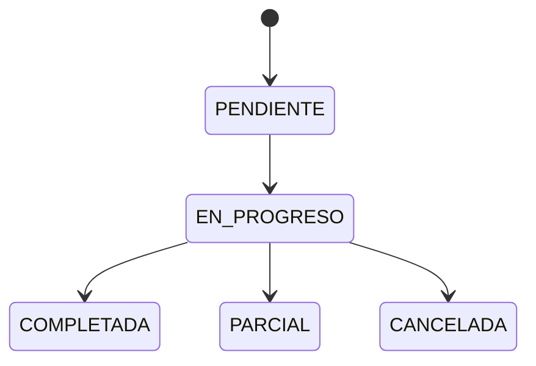

# Rutas y órdenes de trabajo

Despacho de lecturas, instalaciones y operación de campo.

> **Ficha de dominio:** documenta períodos, rutas, órdenes de trabajo y operaciones del usuario de campo, incluida la vinculación de lecturas y la evidencia externa.

## Alcance y entradas HTTP

- **Controladores:** `RoutesController`, `OrdenesTrabajoController`, `OperatorController`.
- **Servicios:** `RoutesService`, `OrdenesTrabajoService`.
- **Casos:** `CreateRouteUseCase`, `FindAllRoutesUseCase`, `FindOneRouteUseCase`, `UpdateRouteUseCase`, `DeleteRouteUseCase`, `ReassignRouteUseCase`, `GetEligibleReadingsUseCase`, `GetReadingsByRutaUseCase`, `FindOrdenesByRutaUseCase`, `ExportFieldSheetPdfUseCase`, `UpdateOrdenEstadoUseCase`, `LinkLecturaUseCase`, `GetOperatorRoutesUseCase`, `UpdateRouteStateUseCase`, `UpdateOperatorWorkOrderUseCase`.
- Los períodos se consultan directamente desde `RoutesService`; no se confirmó caso dedicado para listar rutas administrativas ni para algunos cambios de órdenes.

| Método y ruta | Caso/servicio ejecutado | Resultado |
|---|---|---|
| `GET /api/v1/routes/periods` | `RoutesService.getPeriodos()` | Períodos. |
| `GET /api/v1/routes/eligible-readings` | `getEligibleReadings()` → `GetEligibleReadingsUseCase` | Lecturas elegibles paginadas. |
| `GET /api/v1/routes/:rutaId/readings` | `getReadingsByRuta()` → `GetReadingsByRutaUseCase` | Lecturas de ruta. |
| `POST /api/v1/routes` | `create()` → `CreateRouteUseCase` | Ruta creada. |
| `GET /api/v1/routes` / `:id` | `findAll()` / `findOne()` → casos de consulta | Rutas. |
| `PATCH /api/v1/routes/:id` | `update()` → `UpdateRouteUseCase` | Ruta actualizada. |
| `PATCH /api/v1/routes/:id/reassign` | `ReassignRouteUseCase.execute()` | Operario reasignado. |
| `DELETE /api/v1/routes/:id` | `delete()` → `DeleteRouteUseCase` | Soft delete. |
| `GET /api/v1/routes/:id/pdf` | `ExportFieldSheetPdfUseCase` | PDF. |
| `GET /api/v1/routes/:id/work-orders` | `FindOrdenesByRutaUseCase` | Órdenes paginadas. |
| `PATCH /api/v1/work-orders/:id/state` | `UpdateOrdenEstadoUseCase` | Estado de orden. |
| `PATCH /api/v1/work-orders/:id/reading` | `LinkLecturaUseCase` | Lectura vinculada. |
| `GET/PATCH /api/v1/operator/routes...` | `GetOperatorRoutesUseCase` / `UpdateRouteStateUseCase` | Vista y estado del operador. |
| `PATCH /api/v1/operator/work-orders/:id` | `UpdateOperatorWorkOrderUseCase` | Ejecución/evidencia. |

## Ejemplo JSON

```json
{
  "rutaId": "42",
  "nombre": "Lecturas agosto",
  "tipoRuta": "LECTURA",
  "estado": "PENDIENTE",
  "ordenesTrabajo": []
}
```

| Campo | Tipo | Regla/uso |
|---|---|---|
| `rutaId`, `ordenTrabajoId`, `lecturaId` | string | `BigInt` serializado. |
| `tipoRuta` | enum | Actividad de la ruta. |
| `estado` | enum | Estado de ruta u orden según el DTO. |
| `operarioId`, `periodoId`, `comunidadId` | number/null | Asignación y contexto. |
| `ordenesTrabajo` | array | Órdenes asociadas. |

## Estados

| Entidad | Estados confirmados | Significado |
|---|---|---|
| Ruta | `PENDIENTE`, `EN_PROGRESO`, `COMPLETADA`, `PARCIAL`, `CANCELADA` | Pendiente, ejecutada, finalizada, incompleta o cancelada. |
| Orden | `PENDIENTE`, `EN_PROGRESO`, `COMPLETADA`, `CANCELADA`, `FALLIDA` | Ciclo de trabajo. |

## Efectos y transacciones

Crear/actualizar/eliminar rutas y órdenes escriben `Rutas`, `OrdenTrabajo` y, cuando corresponde, `EjecucionOrdenTrabajo`. Vincular una lectura completa la orden y fija `completadoEn`; cambiarla a pendiente/en progreso lo limpia. El operador puede almacenar evidencia en RustFS y su clave en la orden. Consultas, filtros, mapeadores y generación PDF son transformaciones puras; la subida de evidencia no lo es.

| Tabla Prisma | Uso |
|---|---|
| `Rutas` | Ruta, asignación, estado y soft delete. |
| `OrdenTrabajo` | Trabajo y vínculo con lectura. |
| `EjecucionOrdenTrabajo` | Resultado de ejecución. |
| `Lecturas` | Lecturas elegibles/vinculadas. |
| `Periodos` | Ciclo contable. |
| `NovedadOrdenTrabajo` | Novedades de campo. |

## Gráfico de estados



## Casos de uso

### Caso: Consultar períodos

**Descripción:** lista períodos disponibles para filtros y asignación.  
**HTTP y ruta:** `GET /api/v1/routes/periods`.  
**Permiso:** `routes:read`.  
**Cadena:** `RoutesController.getPeriods()` → `RoutesService.getPeriodos()` → repositorio.  
**Errores relevantes:** `401`; `403`.  
**Efectos:** ninguno.  
**Prisma:** `Periodos`.  
**Entrada:** sin body ni parámetros.  
**Salida:**

```json
[{"periodoId":12,"nombre":"2026-08","estado":"ACTIVO"}]
```

### Caso: Consultar lecturas elegibles

**Descripción:** devuelve lecturas disponibles para asignarlas a una ruta.  
**HTTP y ruta:** `GET /api/v1/routes/eligible-readings`.  
**Permiso:** `routes:read`.  
**Cadena:** `RoutesController.getEligibleReadings()` → `RoutesService.getEligibleReadings()` → `GetEligibleReadingsUseCase.execute()`.  
**Errores relevantes:** `400`; `401`; `403`.  
**Efectos:** ninguno.  
**Prisma:** `Lecturas`, `Contratos`, `Medidores`, `Periodos`, `OrdenTrabajo`.  
**Entrada:** sin body; query `page`, `limit` y filtros de `FilterReadingsDto`.  
**Salida:**

```json
{"data":[{"lecturaId":"101","estado":"PENDIENTE"}],"meta":{"page":1,"limit":10,"total":1,"totalPages":1},"kpis":{}}
```

### Caso: Consultar lecturas de ruta

**Descripción:** lista lecturas ya vinculadas a una ruta.  
**HTTP y ruta:** `GET /api/v1/routes/:rutaId/readings`.  
**Permiso:** `routes:read`.  
**Cadena:** `RoutesController.getReadingsByRuta()` → `RoutesService.getReadingsByRuta()` → `GetReadingsByRutaUseCase.execute()`.  
**Errores relevantes:** `400`; `401`; `403`; `404`.  
**Efectos:** ninguno.  
**Prisma:** `Rutas`, `OrdenTrabajo`, `Lecturas`.  
**Entrada:** sin body; path `{ "rutaId": "42" }`; query `page`, `limit`.  
**Salida:**

```json
{"data":[{"lecturaId":"101","estado":"PENDIENTE"}],"meta":{"page":1,"limit":10,"total":1,"totalPages":1},"kpis":{}}
```

### Caso: Crear ruta

**Descripción:** crea una ruta de trabajo con su período y tipo.  
**HTTP y ruta:** `POST /api/v1/routes`.  
**Permiso:** `routes:create`.  
**Cadena:** `RoutesController.create()` → `RoutesService.create()` → `CreateRouteUseCase.execute()` → repositorio.  
**Errores relevantes:** `400`; `401`; `403`; `404` período/guías.  
**Efectos:** alta en `Rutas` y asociaciones que determine el caso.  
**Prisma:** `Rutas`, `OrdenTrabajo`, `Contratos`, `Periodos`.  
**Entrada:** body `{ "nombre": "Lecturas agosto", "tipoRuta": "LECTURA", "periodoId": 12 }`.  
**Salida:**

```json
{"rutaId":"42","nombre":"Lecturas agosto","estado":"PENDIENTE","ordenesTrabajo":[]}
```

### Caso: Listar rutas

**Descripción:** devuelve rutas con paginación y filtros.  
**HTTP y ruta:** `GET /api/v1/routes`.  
**Permiso:** `routes:read`.  
**Cadena:** `RoutesController.findAll()` → `RoutesService.findAll()` → repositorio.  
**Errores relevantes:** `400`; `401`; `403`.  
**Efectos:** ninguno.  
**Prisma:** `Rutas` y relaciones.  
**Entrada:** sin body; query `page`, `limit`, `estado`, `operarioId`, `comunidadId`, `periodoId`, `tipoRuta`.  
**Salida:**

```json
{"data":[{"rutaId":"42","estado":"PENDIENTE"}],"meta":{"page":1,"limit":10,"total":1,"totalPages":1}}
```

### Caso: Obtener ruta

**Descripción:** consulta una ruta por ID.  
**HTTP y ruta:** `GET /api/v1/routes/:id`.  
**Permiso:** `routes:read`.  
**Cadena:** `RoutesController.findOne()` → `RoutesService.findOne()` → repositorio.  
**Errores relevantes:** `400`; `401`; `403`; `404`.  
**Efectos:** ninguno.  
**Prisma:** `Rutas`, `OrdenTrabajo`, `Contratos`, `Periodos`.  
**Entrada:** sin body; path `{ "id": "42" }`.  
**Salida:**

```json
{"rutaId":"42","estado":"PENDIENTE","ordenesTrabajo":[]}
```

### Caso: Actualizar ruta

**Descripción:** modifica los datos de una ruta existente.  
**HTTP y ruta:** `PATCH /api/v1/routes/:id`.  
**Permiso:** `routes:update`.  
**Cadena:** `RoutesController.update()` → `RoutesService.update()` → `UpdateRouteUseCase.execute()` → repositorio.  
**Errores relevantes:** `400`; `401`; `403`; `404`.  
**Efectos:** actualización de `Rutas`; DTO puro.  
**Prisma:** `Rutas`.  
**Entrada:** path `{ "id": "42" }`; body `{ "nombre": "Ruta actualizada" }`.  
**Salida:** `{ "rutaId": "42", "nombre": "Ruta actualizada", "estado": "PENDIENTE" }`.

### Caso: Reasignar ruta

**Descripción:** asigna o desasigna la ruta a un operario.  
**HTTP y ruta:** `PATCH /api/v1/routes/:id/reassign`.  
**Permiso:** `routes:update`.  
**Cadena:** `RoutesController.reassign()` → `ReassignRouteUseCase.execute()` → repositorio.  
**Errores relevantes:** `400`; `401`; `403`; `404`; ruta ya asignada.  
**Efectos:** cambia `Rutas.operarioId`.  
**Prisma:** `Rutas`, `Usuarios/Operarios`.  
**Entrada:** path `{ "id": "42" }`; body `{ "operarioId": "7" }` o `null`.  
**Salida:** `{ "rutaId": "42", "operarioId": 7, "estado": "PENDIENTE" }`.

### Caso: Eliminar ruta

**Descripción:** elimina lógicamente la ruta.  
**HTTP y ruta:** `DELETE /api/v1/routes/:id`.  
**Permiso:** `routes:delete`.  
**Cadena:** `RoutesController.delete()` → `RoutesService.delete()` → `DeleteRouteUseCase.execute()` → repositorio.  
**Errores relevantes:** `400`; `401`; `403`; `404`.  
**Efectos:** soft delete y desasignación según el caso.  
**Prisma:** `Rutas`, `OrdenTrabajo`, `Lecturas`.  
**Entrada:** sin body; path `{ "id": "42" }`.  
**Salida:** `{ "rutaId": "42", "estado": "CANCELADA" }`.

### Caso: Exportar hoja de campo

**Descripción:** genera la hoja oficial de órdenes y lecturas.  
**HTTP y ruta:** `GET /api/v1/routes/:id/pdf`.  
**Permiso:** `routes:read`.  
**Cadena:** `RoutesController.exportPdf()` → `RoutesService.exportPdf()` → `ExportFieldSheetPdfUseCase`/generador.  
**Errores relevantes:** `400`; `401`; `403`; `404`.  
**Efectos:** lectura y generación puras.  
**Prisma:** `Rutas`, `OrdenTrabajo`, `Lecturas`.  
**Entrada:** sin body; path `{ "id": "42" }`.  
**Salida:** no es JSON: `application/pdf`, `Content-Disposition: inline`, `Content-Length` y bytes PDF.

### Caso: Consultar órdenes de una ruta

**Descripción:** lista órdenes asociadas, filtradas y paginadas.  
**HTTP y ruta:** `GET /api/v1/routes/:id/work-orders`.  
**Permiso:** `routes:read`.  
**Cadena:** `RoutesController.findOrdenesByRuta()` → `OrdenesTrabajoService.findByRuta()` → `FindOrdenesByRutaUseCase.execute()`.  
**Errores relevantes:** `400`; `401`; `403`; `404`.  
**Efectos:** ninguno.  
**Prisma:** `OrdenTrabajo`, `Rutas`, `Lecturas`.  
**Entrada:** sin body; path `{ "id": "42" }`; query `estado`, `page`, `limit`.  
**Salida:** `{ "data": [{ "ordenTrabajoId": "9", "estado": "PENDIENTE" }], "meta": {}, "kpis": {} }`.

### Caso: Actualizar estado de orden

**Descripción:** cambia estado, observación y fecha de finalización de una orden.  
**HTTP y ruta:** `PATCH /api/v1/work-orders/:id/state`.  
**Permiso:** `routes:update`.  
**Cadena:** `OrdenesTrabajoController.updateEstado()` → `OrdenesTrabajoService.updateEstado()` → `UpdateOrdenEstadoUseCase.execute()` → repositorio.  
**Errores relevantes:** `400`; `401`; `403`; `404`; `409`.  
**Efectos:** persiste estado; completa o limpia `completadoEn`.  
**Prisma:** `OrdenTrabajo`, `EjecucionOrdenTrabajo`.  
**Entrada:** path `{ "id": "9" }`; body `{ "estado": "COMPLETADA", "resultadoObservacion": "Trabajo realizado" }`.  
**Salida:** `{ "ordenTrabajoId": "9", "estado": "COMPLETADA" }`.

### Caso: Vincular lectura a orden

**Descripción:** asocia una lectura y completa la orden.  
**HTTP y ruta:** `PATCH /api/v1/work-orders/:id/reading`.  
**Permiso:** `routes:update`.  
**Cadena:** `OrdenesTrabajoController.linkLectura()` → `OrdenesTrabajoService.linkLectura()` → `LinkLecturaUseCase.execute()` → repositorio.  
**Errores relevantes:** `400`; `401`; `403`; `404`; `409`.  
**Efectos:** persiste vínculo y `completadoEn`.  
**Prisma:** `OrdenTrabajo`, `Lecturas`, `Rutas`.  
**Entrada:** path `{ "id": "9" }`; body `{ "lecturaId": "101" }`.  
**Salida:** `{ "ordenTrabajoId": "9", "lecturaId": "101", "estado": "COMPLETADA" }`.

### Caso: Actualizar operación del operador

**Descripción:** registra ejecución y evidencia opcional de una orden.  
**HTTP y ruta:** `PATCH /api/v1/operator/work-orders/:id`.  
**Permiso:** `routes:update`.  
**Cadena:** `OperatorController.updateOperatorWorkOrder()` → `UpdateOperatorWorkOrderUseCase.execute()` → repositorio/RustFS.  
**Errores relevantes:** `400`; `401`; `403`; `404`; `409`.  
**Efectos:** persiste ejecución y `evidenciaFotoUrl`; la subida y rollback de archivo son efectos reales.  
**Prisma:** `OrdenTrabajo`, `EjecucionOrdenTrabajo`, `NovedadOrdenTrabajo`.  
**Entrada:** path `{ "id": "9" }`; multipart: campos DTO y archivo opcional `foto`; sin body JSON.  
**Salida:** JSON `OrderWorkResponseDto`, por ejemplo `{ "ordenTrabajoId": "9", "estado": "COMPLETADA", "evidenciaFotoUrl": "ordenes/9/foto.jpg" }`.

### Caso: Listar rutas del operador

**Descripción:** lista las rutas del período activo asignadas al operador autenticado.  
**HTTP y ruta:** `GET /api/v1/operator/routes`.  
**Permiso:** `routes:read`.  
**Cadena:** `OperatorController.getOperatorRoutes()` → `GetOperatorRoutesUseCase.execute()` → repositorio.  
**Errores relevantes:** `400`; `401`; `403`; `404` sin período activo.  
**Efectos:** ninguno; consulta y DTO puros.  
**Prisma:** `Rutas`, `OrdenTrabajo`, `Periodos`.  
**Entrada:** sin body; query opcional `tipoRuta`; operador desde JWT.  
**Salida:** lista JSON de `OperatorRouteResponseDto`.

### Caso: Actualizar estado de ruta del operador

**Descripción:** cambia el estado de una ruta que pertenece al operador autenticado.  
**HTTP y ruta:** `PATCH /api/v1/operator/routes/:id/state`.  
**Permiso:** `routes:update`.  
**Cadena:** `OperatorController.updateRouteState()` → `UpdateRouteStateUseCase.execute()` → repositorio.  
**Errores relevantes:** `400`; `401`; `403` ruta ajena; `404`; `409` transición inválida.  
**Efectos:** actualiza `Rutas` y las marcas temporales derivadas del estado.  
**Prisma:** `Rutas`, `OrdenTrabajo`, `Periodos`.  
**Entrada:** path `{ "id": "42" }`; body `{ "estado": "EN_PROGRESO" }`.  
**Salida:** `{ "rutaId": "42", "estado": "EN_PROGRESO" }`.

## No documentado o pendiente de confirmar

- Lista exhaustiva de transiciones de operador.
- Promoción automática del contrato a `ACTIVO` al completar instalación.
- Endpoints legacy basados en `EstadoAsignacion`.

## Comportamiento de negocio verificable

Las tablas relacionadas son `Rutas`, `OrdenTrabajo`, `EjecucionOrdenTrabajo`, `Lecturas`, `Periodos` y `NovedadOrdenTrabajo`. El flujo confirmado es período → ruta → orden → lectura/evidencia → cierre de orden; la evidencia puede persistirse externamente en RustFS. No se encontró una fórmula monetaria ni un handler que promueva automáticamente un contrato a `ACTIVO` al completar una orden de instalación.
