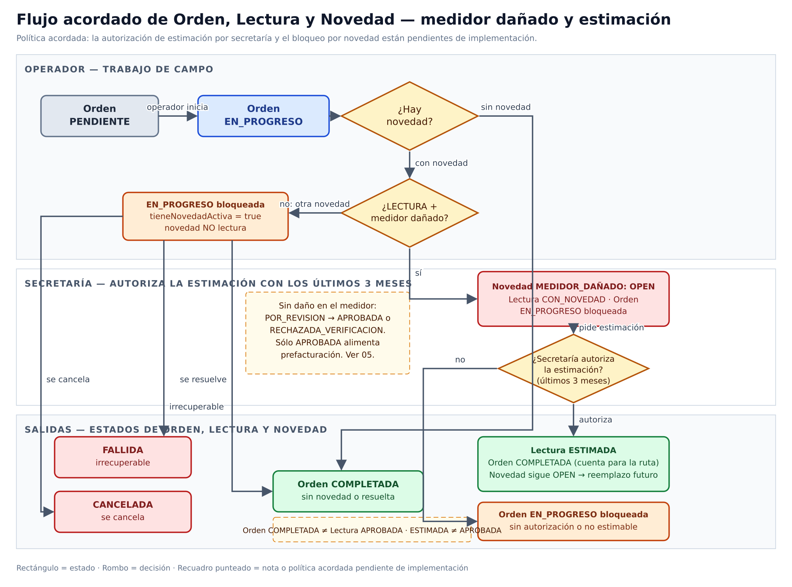

# Lecturas y consumo

Captura, revisión, cálculo de consumo, anomalías y evidencia de lecturas.

> **Ficha de dominio:** documenta consulta, captura por operador, revisión administrativa, cálculo de consumo, anomalías y evidencia vinculada a la orden. `Consumo` no es un dominio ni módulo HTTP independiente: se deriva de `Lectura` mediante sus mismos endpoints y casos de uso.

## Separación entre orden y lectura

Para una orden de tipo `LECTURA`, el flujo confirmado separa la operación de campo de la validación del dato:

1. Ruta en `EN_PROGRESO` → orden de lectura en `EN_PROGRESO`.
2. El operador registra el dato → orden `COMPLETADA`.
3. La lectura queda en `PENDIENTE`/`POR_REVISION` → `APROBADA` o `RECHAZADA_VERIFICACION`.
4. Con medidor dañado, el flujo sigue la estimación autorizada (ver sección de estimación y `images/04-orden-lectura-flujo.png`).

La orden completada indica que terminó el trabajo de campo. La lectura `APROBADA` es la que puede alimentar la prefacturación; completar la orden no aprueba automáticamente el dato. `ESTIMADA` existe en el catálogo y su transición por estimación autorizada de secretaría es una política acordada pendiente de implementación (ver sección de estimación). Si existe una anomalía, `CON_NOVEDAD` relaciona la lectura con `NovedadOrdenTrabajo`, pero no reemplaza el estado de la orden.

## Alcance y entradas HTTP

- **Controladores:** `ReadingController`, `OperatorController`.
- **Servicio:** `ReadingService`.
- **Casos:** `FindAllReadingsUseCase`, `FindOneReadingUseCase`, `UpdateReadingUseCase`, `RemoveReadingUseCase`, `GetOperatorReadingsUseCase`, `GetOperatorReadingsWithAnomaliesUseCase`, `UpdateOperatorReadingUseCase`.
- El catálogo `GET /estados` se construye desde el enum y no tiene servicio/caso dedicado.

| Método y ruta | Caso/servicio ejecutado | Resultado |
|---|---|---|
| `GET /api/v1/readings` | `findAll()` → `FindAllReadingsUseCase` | Página. |
| `GET /api/v1/readings/estados` | `getEstados()` → `buildStateCatalog()` | Catálogo. |
| `GET /api/v1/readings/:id` | `findOne()` → `FindOneReadingUseCase` | Lectura. |
| `PATCH /api/v1/readings/:id` | `update()` → `UpdateReadingUseCase` | Lectura actualizada. |
| `DELETE /api/v1/readings/:id` | `delete()` → `RemoveReadingUseCase`/repositorio | Soft delete. |
| `GET /api/v1/operator/readings` | `GetOperatorReadingsUseCase` | Lecturas propias. |
| `GET /api/v1/operator/readings/anomalies` | `GetOperatorReadingsWithAnomaliesUseCase` | Anomalías pendientes. |
| `PATCH /api/v1/operator/readings/:id` | `UpdateOperatorReadingUseCase` | Lectura/evidencia. |

## Ejemplo JSON de respuesta

El contrato actual de lectura expone `estado`, `routeEstado` y `tieneAnomalia`. La orden relacionada se muestra como contexto propuesto porque `ResponseReadingDto` no expone actualmente un campo de orden anidado.

```json
{
  "lecturaId": "101",
  "fecha": "2026-08-19",
  "lecturaAnterior": 500,
  "lecturaActual": 530,
  "consumoCalculado": 30,
  "estado": "PENDIENTE",
  "routeEstado": "EN_PROGRESO",
  "tieneAnomalia": false,
  "ordenRelacionada": {
    "ordenTrabajoId": "9",
    "estado": "COMPLETADA"
  }
}
```

> **Campo propuesto:** `ordenRelacionada` permite representar la relación y el estado de la orden en una respuesta combinada, pero no debe interpretarse como un campo disponible del `ResponseReadingDto` actual.

| Campo | Tipo | Regla/uso |
|---|---|---|
| `lecturaId` | string | `BigInt` serializado. |
| `fecha` | string | Fecha de lectura. |
| `lecturaAnterior`, `lecturaActual`, `consumoCalculado` | number | Valores y diferencia de consumo. |
| `estado` | enum | Revisión y resultado. |
| `evidenciaFotoUrl` | string/null | Evidencia de la orden vinculada cuando aplica. |

## Estados de `Lectura`

| Estado | Significado real | Transiciones confirmadas |
|---|---|---|
| `PENDIENTE` | Dato capturado pendiente de revisión. | `POR_REVISION`, `APROBADA` |
| `POR_REVISION` | Dato que requiere validación administrativa. | `APROBADA`, `RECHAZADA_VERIFICACION`, `PENDIENTE` |
| `APROBADA` | Dato validado y elegible para prefacturación. | No se confirmó una transición saliente en esta máquina. |
| `RECHAZADA_VERIFICACION` | Dato rechazado durante la verificación. | `PENDIENTE`, `POR_REVISION` |
| `ESTIMADA` | Valor estimado para la lectura. | Estado existente sin transición confirmada en la máquina actual. |
| `PLANILLADA` | Lectura incorporada a una planilla. | Estado existente sin transición confirmada en la máquina actual. |
| `CON_NOVEDAD` | Lectura relacionada con una anomalía/novedad. | Estado existente sin transición confirmada en la máquina actual. |

Estas son transiciones de `Lectura`, no de `Ruta` ni de `OrdenTrabajo`.

### Máquina de estados de la Lectura

La máquina está implementada como una tabla de transiciones explícita en `backend/src/metering/readings/domain/reading-state.ts`:

| Desde | Hacia permitidas |
|---|---|
| `PENDIENTE` | `POR_REVISION`, `APROBADA` |
| `POR_REVISION` | `APROBADA`, `RECHAZADA_VERIFICACION`, `PENDIENTE` |
| `RECHAZADA_VERIFICACION` | `PENDIENTE`, `POR_REVISION` |

La función `canTransitionReadingState(from, to)` valida la transición; `UpdateReadingUseCase.execute()` (líneas 62-79) la aplica con control de concurrencia CAS. Los estados **`APROBADA` y `RECHAZADA_VERIFICACION` son terminales** (sin transiciones salientes en la tabla). Los estados `ESTIMADA`, `PLANILLADA` y `CON_NOVEDAD` están en el enum pero **no tienen transiciones definidas** en la tabla — `CON_NOVEDAD` se asigna desde `prisma-operator.repository.ts:602, 983` cuando el operador reporta una novedad.

## Responsabilidades por estado

| Máquina | Responsabilidad |
|---|---|
| `Rutas.estado` | Representa el lote y la operación general. |
| `OrdenesTrabajo.estado` | Representa la ejecución de la tarea de campo. |
| `Lecturas.estado` | Representa la calidad y validación del dato capturado. |
| `NovedadOrdenTrabajo.estado` | Representa el análisis y resolución de la anomalía. |

`NovedadOrdenTrabajo` tiene su propia máquina: `OPEN`, `IN_PROGRESS`, `RESOLVED`, `CANCELLED`.

## Efectos y transacciones

La actualización administrativa persiste `Lecturas` y protege el cambio con control de concurrencia. La operación del operador puede persistir lectura, novedad y evidencia en RustFS; si falla, elimina la foto recién subida. Consultas, resta de consumo y DTO son transformaciones puras. DELETE usa soft delete.

| Tabla Prisma | Uso |
|---|---|
| `Lecturas` | Valores, estado y soft delete. |
| `Contratos`, `Medidores`, `Periodos` | Contexto de lectura. |
| `OrdenTrabajo`, `NovedadOrdenTrabajo` | Operación y anomalías. |

## Cálculo de consumo

El consumo es un cálculo derivado de `Lectura`, no una entidad, estado, controlador ni módulo HTTP independiente:

```text
consumoCalculado = lecturaActual - lecturaAnterior
```

La resta se evalúa al actualizar o proyectar la lectura. El resultado se persiste tal cual; un valor negativo **no** activa ninguna lógica automática (no existe el término `SALTO_NEGATIVO` en el código). No introduce un estado nuevo en la máquina de `Lectura`. La resta y la proyección al DTO son puras: la persistencia corresponde a la actualización de `Lecturas` y a sus efectos explícitos sobre anomalías y evidencia.

**Promoción a prefactura vs a `PLANILLADA`:** una lectura en estado `APROBADA` ya alimenta la prefacturación hoy (vía `generate-batch.use-case.ts:40`, que filtra lecturas `APROBADA` para incluirlas en el lote). Lo que **no** ocurre es una transición de la lectura a `PLANILLADA`: tras la prefacturación, la lectura sigue en `APROBADA`. El estado `PLANILLADA` figura en el enum y en el catálogo de iconos pero no se asigna desde ningún use case.

## Estimación autorizada por secretaría

**Política acordada, pendiente de implementación.** Cubre la orden de `LECTURA` con medidor dañado.

- Sólo secretaría autoriza la estimación, calculada con los últimos 3 meses.
- Si autoriza: la lectura pasa a `ESTIMADA` y la orden a `COMPLETADA`; la novedad de medidor dañado sigue en `OPEN` para un reemplazo posterior.
- Si no autoriza o no se puede estimar: la orden sigue bloqueada en `EN_PROGRESO` con `tieneNovedadActiva=true`.
- `ESTIMADA` no es `APROBADA`: sólo `APROBADA` puede alimentar la prefacturación. La orden `COMPLETADA` no implica lectura `APROBADA`.
- `CON_NOVEDAD` vincula la lectura con la novedad; `POR_REVISION` sigue siendo la validación administrativa del dato normal.

## Diagrama de flujo acordado



Fuente editable: `diagrams/orden-lectura-novedad.drawio`. Versión vectorial: `images/04-orden-lectura-flujo.svg` (y `images/04-orden-lectura-flujo.pdf` para LaTeX).

Resumen textual: máquina de `Lectura` confirmada en código, más la política de estimación.

- `PENDIENTE` → `POR_REVISION` (revisión) o `APROBADA` (aprobación directa permitida).
- `POR_REVISION` → `APROBADA` (aprobación), `RECHAZADA_VERIFICACION` (rechazo) o `PENDIENTE` (devolución).
- `RECHAZADA_VERIFICACION` → `PENDIENTE` (nueva captura) o `POR_REVISION` (nueva revisión).
- `CON_NOVEDAD`: lectura con anomalía vinculada a `NovedadOrdenTrabajo`. La transición **hacia** `CON_NOVEDAD` sí está implementada (`prisma-operator.repository.ts:602, 983`); lo que no existe es transición **desde** `CON_NOVEDAD` (es terminal en la tabla actual).
- `ESTIMADA`: valor estimado; la transición por estimación autorizada de secretaría es política acordada pendiente de implementación.
- `PLANILLADA`: lectura incorporada a una planilla (sin transición confirmada en código).

## Casos de uso

### Caso: Listar lecturas

**Descripción:** devuelve lecturas filtradas y paginadas.  
**HTTP y ruta:** `GET /api/v1/readings`.  
**Permiso:** `lecturas:read`.  
**Cadena:** `ReadingController.findAll()` → `ReadingService.findAll()` → `FindAllReadingsUseCase.execute()` → repositorio.  
**Errores relevantes:** `400`; `401`; `403`.  
**Efectos:** ninguno; lectura y DTO puros.  
**Prisma:** `Lecturas`, `Contratos`, `Medidores`, `Periodos`.  
**Entrada:** sin body; query `page`, `limit`, `contratoId`, `estado`, `search`.  
**Salida:**

```json
{
  "data": [
    {
      "lecturaId": "101",
      "estado": "PENDIENTE"
    }
  ],
  "meta": {}
}
```

### Caso: Consultar catálogo de estados

**Descripción:** entrega etiquetas e iconos de `EstadoLectura`.  
**HTTP y ruta:** `GET /api/v1/readings/estados`.  
**Permiso:** `lecturas:read`.  
**Cadena:** `ReadingController.getEstados()` → `buildStateCatalog()` (sin caso dedicado).  
**Errores relevantes:** `401`; `403`.  
**Efectos:** ninguno.  
**Prisma:** ninguna tabla.  
**Entrada:** sin body, path ni query.  
**Salida:**

```json
[
  {
    "codigo": "APROBADA",
    "descripcion": "Aprobada",
    "icono": "bi-check-circle"
  }
]
```

### Caso: Obtener lectura

**Descripción:** devuelve una lectura por ID.  
**HTTP y ruta:** `GET /api/v1/readings/:id`.  
**Permiso:** `lecturas:read`.  
**Cadena:** `ReadingController.findOne()` → `ReadingService.findOne()` → `FindOneReadingUseCase.execute()` → repositorio.  
**Errores relevantes:** `400`; `401`; `403`; `404`.  
**Efectos:** ninguno; DTO puro.  
**Prisma:** `Lecturas`, `Medidores`, `Periodos`, `Contratos`.  
**Entrada:** sin body; path `id=101`.
**Salida:** el JSON del ejemplo principal.

### Caso: Actualizar lectura administrativa

**Descripción:** actualiza campos no fotográficos y estado.  
**HTTP y ruta:** `PATCH /api/v1/readings/:id`.  
**Permiso:** `lecturas:update`.  
**Cadena:** `ReadingController.actualizarLectura()` → `ReadingService.update()` → `UpdateReadingUseCase.execute()` → repositorio.  
**Errores relevantes:** `400` body/transición/CAS; `401`; `403`; `404`; `409`.  
**Efectos:** persiste lectura; calcula `consumoCalculado = lecturaActual - lecturaAnterior`; la resta y el DTO son puros. El valor negativo se persiste tal cual (no hay lógica de `SALTO_NEGATIVO`). Sólo `APROBADA` puede alimentar prefacturación; la promoción a `PLANILLADA` no está implementada.
**Prisma:** `Lecturas`, `Medidores`, `OrdenTrabajo`, `NovedadOrdenTrabajo`.  
**Entrada:** path `id=101`; body:

```json
{
  "lecturaActual": 530,
  "estado": "POR_REVISION",
  "descripcionAnomalia": null
}
```
**Salida:**

```json
{
  "lecturaId": "101",
  "lecturaActual": 530,
  "consumoCalculado": 30,
  "estado": "POR_REVISION"
}
```

### Caso: Eliminar lectura

**Descripción:** aplica eliminación lógica.  
**HTTP y ruta:** `DELETE /api/v1/readings/:id`.  
**Permiso:** `lecturas:delete`.  
**Cadena:** `ReadingController.eliminarLectura()` → `ReadingService.delete()` → `RemoveReadingUseCase`/repositorio.  
**Errores relevantes:** `400`; `401`; `403`; `404`.  
**Efectos:** establece `deletedAt` en `Lecturas`.  
**Prisma:** `Lecturas`.  
**Entrada:** sin body; path `id=101`.
**Salida:**

```json
{
  "message": "Lectura eliminada"
}
```

### Caso: Listar lecturas del operador

**Descripción:** devuelve las lecturas del período activo asignadas al operador autenticado.  
**HTTP y ruta:** `GET /api/v1/operator/readings`.  
**Permiso:** `lecturas:read`.  
**Cadena:** `OperatorController.getOperatorReadings()` → `GetOperatorReadingsUseCase.execute()` → repositorio y DTO.  
**Errores relevantes:** `400`; `401`; `403`; `404` sin período activo.  
**Efectos:** ninguno; consulta y DTO puros.  
**Prisma:** `Lecturas`, `Rutas`, `OrdenTrabajo`, `Periodos`.  
**Entrada:** sin body ni query; operador desde JWT.  
**Salida:** lista JSON de `ResponseReadingDto`.

### Caso: Listar anomalías pendientes del operador

**Descripción:** devuelve las lecturas del operador que tienen anomalías pendientes de atención.  
**HTTP y ruta:** `GET /api/v1/operator/readings/anomalies`.  
**Permiso:** `lecturas:read`.  
**Cadena:** `OperatorController.getOperatorReadingsWithAnomalies()` → `GetOperatorReadingsWithAnomaliesUseCase.execute()` → repositorios y DTO.  
**Errores relevantes:** `400`; `401`; `403`; `404` sin período activo.  
**Efectos:** ninguno; consulta y DTO puros.  
**Prisma:** `Lecturas`, `Rutas`, `OrdenTrabajo`, `NovedadOrdenTrabajo`, `Periodos`.  
**Entrada:** sin body ni query; operador desde JWT.  
**Salida:** lista JSON:

```json
[
  {
    "lecturaId": "101",
    "estado": "CON_NOVEDAD"
  }
]
```

### Caso: Actualizar lectura del operador

**Descripción:** captura valor, fecha, anomalía y foto de campo. La captura puede incluir la anomalía y la foto, y persiste la evidencia vinculada a la orden de trabajo.  
**HTTP y ruta:** `PATCH /api/v1/operator/readings/:id`.  
**Permiso:** `lecturas:update`.  
**Cadena:** `OperatorController.updateOperatorReading()` → `UpdateOperatorReadingUseCase.execute()` → repositorios/RustFS.  
**Errores relevantes:** `400`; `401`; `403` fuera de ruta; `404`; `409`.  
**Efectos:** persiste lectura/novedad y guarda `foto` como `evidenciaFotoUrl` de la orden; rollback si falla. La captura no crea un módulo ni estado de `Consumo`.  
**Prisma:** `Lecturas`, `NovedadOrdenTrabajo`, `OrdenTrabajo`.  
**Entrada:** path `id=101`; multipart campos DTO y archivo opcional `foto`; sin body JSON.
**Salida:**

```json
{
  "lecturaId": "101",
  "estado": "POR_REVISION",
  "evidenciaFotoUrl": "ordenes/9/foto.jpg"
}
```

## Pendientes funcionales

Bloqueos confirmados como pendientes en el código revisado. Cuando se cierre cada uno, sacar de acá y mover a la sección correspondiente.

- **Detección de consumo negativo (`SALTO_NEGATIVO`).** El doc dice que se "identifica como `SALTO_NEGATIVO`" pero no existe lógica de detección. El valor se persiste como número negativo sin acción. Falta decidir si se rechaza la lectura, se marca para revisión, o se documenta el comportamiento tal como es.
- **Transición `APROBADA → PLANILLADA`.** No hay use case que cambie el estado a `PLANILLADA`. Si se requiere planillar, hay que agregar el cambio en el flujo de cierre del lote (`generate-batch.use-case.ts` o un nuevo job).
- **Transición `CON_NOVEDAD → PENDIENTE/POR_REVISION`.** No existe en `reading-state.ts`. Si la UI debe permitir reabrir la lectura tras resolver la novedad, falta la transición y el use case correspondiente.
- **Transición `ESTIMADA → ...` por estimación autorizada de secretaría.** Mismo punto pendiente en `02-contratos.md`, `04-rutas-y-ordenes.md` y ahora también aquí. Requiere endpoint nuevo o permiso específico (`estimates:approve` o equivalente).
- **Autorización exclusiva del rol `Secretaría` para la estimación últimos 3 meses.** No existe endpoint ni permiso que limite la estimación a secretaría.
- **Creación automática de anomalías según la superficie de captura.** Hoy la anomalía la crea el operador manualmente al reportar un defecto. No hay lógica que cree anomalía cuando, por ejemplo, el `lecturaActual` está fuera de un rango esperado.
- **Redondeo, consumo mínimo/máximo y otros límites.** `Prisma.Decimal` mantiene precisión arbitraria; no hay redondeo explícito ni límites configurados. Definir si aplica redondeo a 2 decimales, consumo mínimo configurable por categoría tarifaria o alertas por consumo atípico.

## No documentado o pendiente de confirmar

- Alta independiente `POST /readings` (no existe en código; las lecturas se crean en flujos de reemplazo/instalación de medidores).
- Validación exacta del cuerpo de `PATCH /api/v1/operator/readings/:id` (multipart con archivo opcional `foto`). Los DTOs pueden haber cambiado desde la última revisión.

## Comportamiento de negocio verificable

Las tablas relacionadas son `Lecturas`, `Contratos`, `Medidores`, `Periodos`, `Rutas`, `OrdenTrabajo` y `NovedadOrdenTrabajo`. El flujo confirmado es captura → revisión → aprobación/rechazo; el operador puede agregar anomalía y evidencia. La fórmula confirmada es `consumoCalculado = lecturaActual - lecturaAnterior`. Las lecturas `APROBADA` alimentan la prefacturación vía `generate-batch.use-case.ts:40`; lo que no está implementado es la promoción a `PLANILLADA`. No se encontró un handler propio de consumo.
