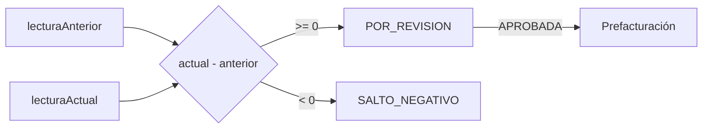

# Lectura y consumo

Reglas verificadas de cálculo y sus superficies HTTP; no agrega endpoints propios.

> **Ficha de dominio:** consolida el cálculo de consumo y sus efectos sobre lecturas, anomalías, evidencia y prefacturación. No declara un controlador independiente de consumo.

## Alcance y entradas HTTP

- **Controladores:** `ReadingController`, `OperatorController`.
- **Servicio:** `ReadingService` para la actualización administrativa.
- **Casos:** `UpdateReadingUseCase`, `UpdateOperatorReadingUseCase`, `GetOperatorReadingsWithAnomaliesUseCase`.
- Las operaciones se ejecutan en los endpoints de lecturas; no hay `ConsumoController` confirmado.

| Método y ruta | Caso/servicio ejecutado | Resultado |
|---|---|---|
| `PATCH /api/v1/readings/:id` | `ReadingService.update()` → `UpdateReadingUseCase.execute()` | Lectura y consumo calculado. |
| `PATCH /api/v1/operator/readings/:id` | `UpdateOperatorReadingUseCase.execute()` | Captura/evidencia. |
| `GET /api/v1/operator/readings/anomalies` | `GetOperatorReadingsWithAnomaliesUseCase.execute()` | Anomalías pendientes. |

## Ejemplo JSON

```json
{
  "lecturaAnterior": 500,
  "lecturaActual": 530,
  "consumoCalculado": 30,
  "estado": "POR_REVISION"
}
```

| Campo | Tipo | Regla/uso |
|---|---|---|
| `lecturaAnterior`, `lecturaActual` | number | Valores usados en la resta. |
| `consumoCalculado` | number | `lecturaActual - lecturaAnterior`. |
| `estado` | enum | Determina revisión y prefacturación. |
| `descripcionAnomalia` | string/null | Detalle de anomalía en captura de operador. |

## Estados

`PENDIENTE → POR_REVISION → APROBADA` o `RECHAZADA_VERIFICACION` es la secuencia confirmada. `ESTIMADA`, `PLANILLADA` y `CON_NOVEDAD` existen, pero su promoción completa no está confirmada. Un resultado negativo se identifica como `SALTO_NEGATIVO` y requiere revisión.

## Efectos y transacciones

La resta y la proyección DTO son puras. La actualización administrativa persiste `Lecturas`; la operación de campo puede escribir `NovedadOrdenTrabajo`, `OrdenTrabajo` y evidencia en RustFS. Sólo `APROBADA` alimenta prefacturación según la regla documentada; el momento exacto de esa promoción queda pendiente.

| Tabla Prisma | Uso |
|---|---|
| `Lecturas` | Valores, consumo y estado. |
| `NovedadOrdenTrabajo` | Anomalías. |
| `OrdenTrabajo` | Evidencia vinculada. |
| `Prefacturas` | Destino de lectura aprobada, cuando se procesa. |

## Gráfico de estados



## Casos de uso

### Caso: Calcular consumo en actualización administrativa

**Descripción:** recalcula y persiste la lectura usando la diferencia entre lectura actual y anterior.  
**HTTP y ruta:** `PATCH /api/v1/readings/:id`.  
**Permiso:** `lecturas:update`.  
**Cadena:** `ReadingController.actualizarLectura()` → `ReadingService.update()` → `UpdateReadingUseCase.execute()` → repositorio.  
**Errores relevantes:** `400` validación/transición/CAS; `401`; `403`; `404`; `409`.  
**Efectos:** escritura de `Lecturas`; la resta es pura.  
**Prisma:** `Lecturas`, `Medidores`, `OrdenTrabajo`.  
**Entrada:** path `{ "id": "101" }`; body `{ "lecturaAnterior": 500, "lecturaActual": 530, "estado": "POR_REVISION" }`.  
**Salida:** `{ "lecturaId": "101", "lecturaAnterior": 500, "lecturaActual": 530, "consumoCalculado": 30, "estado": "POR_REVISION" }`.

### Caso: Capturar consumo en campo

**Descripción:** recibe valor, fecha, anomalía y foto opcional del operador.  
**HTTP y ruta:** `PATCH /api/v1/operator/readings/:id`.  
**Permiso:** `lecturas:update`.  
**Cadena:** `OperatorController.updateOperatorReading()` → `UpdateOperatorReadingUseCase.execute()` → repositorios/RustFS.  
**Errores relevantes:** `400`; `401`; `403`; `404`; `409`.  
**Efectos:** persiste lectura/anomalía y evidencia.  
**Prisma:** `Lecturas`, `NovedadOrdenTrabajo`, `OrdenTrabajo`.  
**Entrada:** path `{ "id": "101" }`; multipart DTO y `foto` opcional; sin body JSON.  
**Salida:** JSON `ResponseReadingDto`, por ejemplo `{ "lecturaId": "101", "consumoCalculado": 30, "estado": "CON_NOVEDAD" }`.

### Caso: Consultar anomalías de consumo

**Descripción:** lista lecturas propias con estado `CON_NOVEDAD` y anomalía pendiente.  
**HTTP y ruta:** `GET /api/v1/operator/readings/anomalies`.  
**Permiso:** `lecturas:read`.  
**Cadena:** `OperatorController.getReadingsWithAnomalies()` → `GetOperatorReadingsWithAnomaliesUseCase.execute()` → mapeo DTO.  
**Errores relevantes:** `400`; `401`; `403`; `404` período activo.  
**Efectos:** ninguno; mapeo puro.  
**Prisma:** `Lecturas`, `NovedadOrdenTrabajo`, `OrdenTrabajo`, `Rutas`.  
**Entrada:** sin body ni query; operador desde JWT.  
**Salida:** `[{ "lecturaId": "101", "estado": "CON_NOVEDAD" }]`.

## No documentado o pendiente de confirmar

- Redondeo, consumo mínimo/máximo y límites adicionales.
- Momento de promoción de estados estimados o planillados.
- Creación automática de anomalía en cada superficie de captura.

## Comportamiento de negocio verificable

Las tablas relacionadas son `Lecturas`, `Contratos`, `Medidores`, `Periodos`, `OrdenTrabajo`, `NovedadOrdenTrabajo` y, como destino posterior no confirmado en detalle, `Prefacturas`. La fórmula confirmada es `consumoCalculado = lecturaActual - lecturaAnterior`; un resultado negativo requiere revisión. No se encontró fórmula confirmada de prefacturación mensual ni handler propio de consumo.
