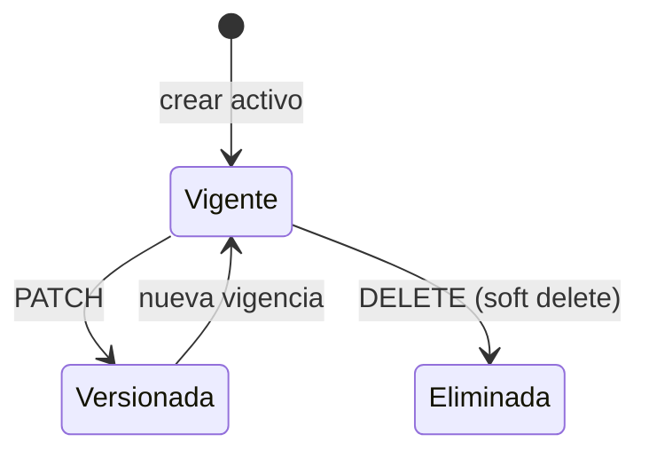

# Categorías de tarifa

Clasificación tarifaria, vigencias y rubros aplicables al contrato.

> **Ficha de dominio:** documenta altas, consultas, versionado, desactivación y relaciones con rubros y contratos de las categorías tarifarias.

## Alcance y entradas HTTP

- **Controlador:** `CategoriaTarifaController`.
- **Servicio:** `CategoriaTarifaService`.
- **Casos:** `CreateTariffCategoryUseCase`, `FindAllTariffCategoriesUseCase`, `FindOneTariffCategoryUseCase`, `UpdateTariffCategoryUseCase`, `RemoveTariffCategoryUseCase`.

| Método y ruta | Caso/servicio ejecutado | Resultado |
|---|---|---|
| `POST /api/v1/tariff-categories` | `createCategoria()` → `CreateTariffCategoryUseCase.execute()` | Categoría creada. |
| `GET /api/v1/tariff-categories` | `getCategorias()` → `FindAllTariffCategoriesUseCase.execute()` | Página activa. |
| `GET /api/v1/tariff-categories/:id` | `findOneCategoria()` → `FindOneTariffCategoryUseCase.execute()` | Detalle. |
| `PATCH /api/v1/tariff-categories/:id` | `updateCategoria()` → `UpdateTariffCategoryUseCase.execute()` | Nueva versión. |
| `DELETE /api/v1/tariff-categories/:id` | `deleteCategoria()` → `RemoveTariffCategoryUseCase.execute()` | Soft delete. |

## Ejemplo JSON

```json
{
  "categoriaTarifaId": 1,
  "nombre": "Residencial",
  "descripcion": "Tarifa básica",
  "consumoMinimoMensual": 10,
  "fechaVigenciaDesde": "2026-01-01",
  "fechaVigenciaHasta": null,
  "activo": true
}
```

| Campo | Tipo | Regla/uso |
|---|---|---|
| `categoriaTarifaId` | number | Identificador entero. |
| `nombre`, `descripcion` | string | Clasificación y explicación. |
| `consumoMinimoMensual` | number | Mínimo configurado. |
| `fechaVigenciaDesde`, `fechaVigenciaHasta` | string/null | Intervalo de vigencia. |
| `activo` | boolean | Disponibilidad lógica. |

## Estados

No existe enum de estado. La disponibilidad se expresa con `activo` y debe interpretarse junto con las fechas de vigencia. `deletedAt` es interno.

## Efectos y transacciones

Crear escribe la categoría y puede generar rubros por defecto. Actualizar crea una nueva versión tarifaria, con fechas y rubros según el caso. Eliminar aplica soft delete/desactivación. Lecturas, filtros y `TariffCategoryResponseDto.fromEntity` son transformaciones puras.

| Tabla Prisma | Uso |
|---|---|
| `CategoriaTarifa` | Categorías, versiones y soft delete. |
| `Rubros` | Cargos relacionados. |
| `Contratos` | Referencias contractuales. |

## Gráfico de estados



## Casos de uso

### Caso: Crear categoría de tarifa

**Descripción:** registra una categoría y sus rubros por defecto cuando corresponde.  
**HTTP y ruta:** `POST /api/v1/tariff-categories`.  
**Permiso:** `tarifas:create`.  
**Cadena:** `CategoriaTarifaController.create()` → `CategoriaTarifaService.createCategoria()` → `CreateTariffCategoryUseCase.execute()` → repositorio.  
**Errores relevantes:** `400`; `401`; `403`; conflicto de vigencia.  
**Efectos:** alta en `CategoriaTarifa`; puede crear `Rubros`.  
**Prisma:** `CategoriaTarifa`, `Rubros`.  
**Entrada:** `{ "nombre": "Residencial", "descripcion": "Tarifa básica", "consumoMinimoMensual": 10, "fechaVigenciaDesde": "2026-01-01" }`.  
**Salida:** JSON del ejemplo principal.

### Caso: Listar categorías

**Descripción:** devuelve categorías activas con filtros y paginación.  
**HTTP y ruta:** `GET /api/v1/tariff-categories`.  
**Permiso:** `tarifas:read`.  
**Cadena:** `CategoriaTarifaController.findAll()` → `CategoriaTarifaService.getCategorias()` → `FindAllTariffCategoriesUseCase.execute()` → repositorio.  
**Errores relevantes:** `400`; `401`; `403`.  
**Efectos:** ninguno; consulta y DTO puros.  
**Prisma:** `CategoriaTarifa`.  
**Entrada:** sin body; query `page`, `limit`, `nombre`, `search`.  
**Salida:** `{ "data": [{ "categoriaTarifaId": 1, "nombre": "Residencial", "activo": true }], "meta": {} }`.

### Caso: Obtener categoría

**Descripción:** consulta una categoría por ID.  
**HTTP y ruta:** `GET /api/v1/tariff-categories/:id`.  
**Permiso:** `tarifas:read`.  
**Cadena:** `CategoriaTarifaController.findOne()` → `CategoriaTarifaService.findOneCategoria()` → `FindOneTariffCategoryUseCase.execute()` → repositorio.  
**Errores relevantes:** `400`; `401`; `403`; `404`.  
**Efectos:** ninguno; DTO puro.  
**Prisma:** `CategoriaTarifa`, `Rubros`, `Contratos` si se incluyen.  
**Entrada:** sin body; path `{ "id": 1 }`.  
**Salida:** JSON del ejemplo principal.

### Caso: Actualizar categoría

**Descripción:** crea una nueva versión en vez de mutar silenciosamente la vigencia anterior.  
**HTTP y ruta:** `PATCH /api/v1/tariff-categories/:id`.  
**Permiso:** `tarifas:update`.  
**Cadena:** `CategoriaTarifaController.update()` → `CategoriaTarifaService.updateCategoria()` → `UpdateTariffCategoryUseCase.execute()` → repositorio.  
**Errores relevantes:** `400` datos/vigencia; `401`; `403`; `404`; solapamiento.  
**Efectos:** persiste nueva versión y fechas; DTO puro.  
**Prisma:** `CategoriaTarifa`, `Rubros`, referencias contractuales.  
**Entrada:** path `{ "id": 1 }`; body `{ "consumoMinimoMensual": 12, "fechaVigenciaDesde": "2026-10-01" }`.  
**Salida:** `{ "categoriaTarifaId": 2, "nombre": "Residencial", "consumoMinimoMensual": 12, "activo": true }`.

### Caso: Eliminar categoría

**Descripción:** desactiva y elimina lógicamente la categoría.  
**HTTP y ruta:** `DELETE /api/v1/tariff-categories/:id`.  
**Permiso:** `tarifas:delete`.  
**Cadena:** `CategoriaTarifaController.remove()` → `CategoriaTarifaService.deleteCategoria()` → `RemoveTariffCategoryUseCase.execute()` → repositorio.  
**Errores relevantes:** `400`; `401`; `403`; `404`; uso incompatible.  
**Efectos:** soft delete/desactivación.  
**Prisma:** `CategoriaTarifa`.  
**Entrada:** sin body; path `{ "id": 1 }`.  
**Salida:** `{ "categoriaTarifaId": 1, "activo": false, "fechaVigenciaHasta": "2026-09-16" }`.

## No documentado o pendiente de confirmar

- Reglas exactas de solapamiento y fecha de corte.
- Estados legacy distintos de `activo`, `deletedAt` y fechas.
- Propagación automática de cambios a contratos existentes.

## Comportamiento de negocio verificable

Las tablas relacionadas son `CategoriaTarifa`, `Rubros` y `Contratos`. La categoría aporta el contexto para seleccionar rubros; en instalación la selección vigente es por categoría y `codigoSistemaRubro=INSTALACION`. No se encontró una fórmula de consumo mensual completa ni un handler que propague automáticamente una nueva versión a contratos existentes.
