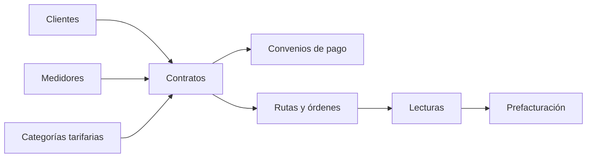

# Documentación del dominio de contratos

## Propósito

Esta carpeta reúne, en un orden estable y apto para una futura composición formal, la documentación técnica verificable del dominio de contratos del backend. Sirve como índice de lectura para revisar el comportamiento actual de la API, sus casos de uso, persistencia y pendientes conocidos.

## Alcance

El conjunto cubre clientes, contratos, convenios de pago, rutas y órdenes de trabajo, lecturas, consumo, medidores y categorías tarifarias. La API utiliza el prefijo global `/api/v1`; las rutas se muestran con ese prefijo. La documentación describe el código actual, no el comportamiento deseado ni endpoints retirados.

## Fuente de verdad

- **Comportamiento operativo:** controladores, servicios, casos de uso y repositorios implementados en `backend/`.
- **Persistencia:** modelos y relaciones Prisma referenciados por cada documento.
- **Esta carpeta:** copia reorganizada de la documentación Markdown existente en `docs/architecture/modules/mejora/contratos/`; no reemplaza el código ni pretende declarar requisitos futuros.
- Cuando una transición, atomicidad o integración no pudo confirmarse, se conserva como pendiente explícito.

## Estructura documental

1. [Alcance y convenciones](./00-alcance-y-convenciones.md): criterios transversales de lectura, formato y límites de la documentación.
2. [Clientes](./01-clientes.md): identidad y datos del titular.
3. [Contratos](./02-contratos.md): vínculo cliente–medidor–tarifa y ciclo del servicio.
4. [Convenios de pago](./03-convenios-de-pago.md): financiación de deuda, cuotas y pagos relacionados.
5. [Rutas y órdenes](./04-rutas-y-ordenes.md): despacho, instalación y operación de campo.
6. [Lecturas](./05-lecturas.md): captura, revisión y operación de lecturas.
7. [Consumo](./06-consumo.md): cálculo de consumo y alimentación de prefacturación.
8. [Medidores](./07-medidores.md): inventario, vínculos, reemplazos y retiro operativo.
9. [Categorías tarifarias](./08-categorias-tarifarias.md): vigencias, rubros y clasificación tarifaria.

## Mapa del dominio

## Flujo transversal verificable

1. **Contrato → prefactura de instalación.** Confirmado: la creación puede invocar `SELECT generar_prefactura_instalacion(...)` dentro de la transacción cuando `estadoServicio=PENDIENTE_PAGO`.
2. **Prefactura → pago validado.** Confirmado: `PagoValidadoHandler` actualiza prefacturas y, para instalación, lleva el contrato a `PENDIENTE_INSTALACION` con cobranza `NO_APLICA`.
3. **Pago validado → instalación.** Confirmado el estado `PENDIENTE_INSTALACION`; no se encontró una transición automática posterior a `ACTIVO`.
4. **Instalación → lecturas/consumo.** Confirmadas las superficies de rutas, órdenes, lecturas y cálculo de consumo; no se encontró un controlador independiente de consumo.
5. **Lecturas/consumo → prefacturación mensual.** La relación operativa está documentada, pero no se encontró una fórmula completa de prefacturación mensual.
6. **Prefacturas → convenios/pagos.** Confirmado: el resumen usa prefacturas no eliminadas en `GENERADA`, `EN_REVISION` o `APROBADA`; `CuotaPagadaHandler` verifica cuotas y dispara emisión SRI.

Los PNG opcionales se esperan en `images/` con nombres `01-flujo-general.png`, `02-contrato-prefactura.png` y `03-convenio-pago.png`. Si todavía no existen, se conservan Mermaid/código como fallback; cuando el usuario agregue los PNG, reemplazarán visualmente esos fallbacks.

## Criterio de mantenimiento

Las nuevas secciones deben conservar endpoints o casos de uso, entradas, salidas, errores, efectos, estados, tablas Prisma y pendientes de confirmación. Los enlaces internos deben permanecer relativos a esta carpeta para que funcionen tanto en el repositorio como en una futura compilación documental.
