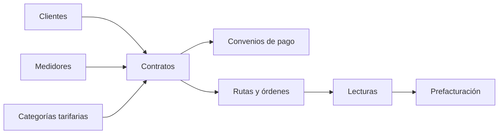

# Documentación del dominio de contratos

## Propósito

Esta carpeta reúne, en un orden estable y apto para una futura composición formal, la documentación técnica verificable del dominio de contratos del backend. Sirve como índice de lectura para revisar el comportamiento actual de la API, sus casos de uso, persistencia y pendientes conocidos.

## Alcance

El conjunto cubre clientes, contratos, convenios de pago, rutas y órdenes de trabajo, lecturas, consumo, medidores y categorías tarifarias. La API utiliza el prefijo global `/api/v1`; las rutas se muestran con ese prefijo. La documentación describe el código actual, no el comportamiento deseado ni endpoints retirados, salvo las decisiones marcadas explícitamente como propuestas y pendientes de implementación.

## Decisión funcional sobre novedades

**Decisión funcional propuesta — pendiente de implementación:** no se agregará un estado persistido `NOVEDAD` a `OrdenTrabajo`. La orden permanecerá en `EN_PROGRESO` mientras exista una novedad y la interfaz mostrará `tieneNovedadActiva` como indicador derivado de la relación con `NovedadOrdenTrabajo`. Se mantienen separadas las máquinas de `OrdenTrabajo.estado` (ejecución operativa), `NovedadOrdenTrabajo.estado` (análisis de anomalía) y `Lectura.estado` (captura y validación del dato). El backend deberá impedir `COMPLETADA` cuando una novedad abierta afecte el resultado; queda pendiente definir el criterio de bloqueo.

## Fuente de verdad

- **Comportamiento operativo:** controladores, servicios, casos de uso y repositorios implementados en `backend/`.
- **Persistencia:** modelos y relaciones Prisma referenciados por cada documento.
- **Esta carpeta:** copia reorganizada de la documentación Markdown existente en `docs/architecture/modules/mejora/contratos/`; no reemplaza el código ni pretende declarar requisitos futuros.
- Cuando una transición, atomicidad o integración no pudo confirmarse, se conserva como pendiente explícito.

## Estructura documental

1. [Alcance y convenciones](./00-alcance-y-convenciones.md): criterios transversales de lectura, formato y límites de la documentación.
2. [Clientes](./01-clientes.md): identidad y datos del titular.
3. [Contratos](./02-contratos.md): vínculo cliente–medidor–tarifa y ciclo del servicio.
4. [Convenios de pago](./03-convenios-de-pago.md): financiación de deuda, cuotas y pagos relacionados.
5. [Rutas y órdenes](./04-rutas-y-ordenes.md): despacho, instalación y operación de campo.
6. [Lecturas](./05-lecturas.md): captura, revisión y operación de lecturas.
7. El cálculo de consumo está documentado dentro de [Lecturas y consumo](./05-lecturas.md).
8. [Medidores](./07-medidores.md): inventario, vínculos, reemplazos y retiro operativo.
9. [Categorías tarifarias](./08-categorias-tarifarias.md): vigencias, rubros y clasificación tarifaria.

## Mapa del dominio



## Flujo transversal verificable

1. **Contrato → prefactura de instalación.** Confirmado: la creación puede invocar `SELECT generar_prefactura_instalacion(...)` dentro de la transacción cuando `estadoServicio=PENDIENTE_PAGO`.
2. **Prefactura → pago validado.** Confirmado: `PagoValidadoHandler` actualiza prefacturas y, para instalación, lleva el contrato a `PENDIENTE_INSTALACION` con cobranza `NO_APLICA`.
3. **Pago validado → instalación.** Confirmado el estado `PENDIENTE_INSTALACION`; no se encontró una transición automática posterior a `ACTIVO`.
4. **Instalación → lecturas/consumo.** Confirmadas las superficies de rutas, órdenes, lecturas y cálculo de consumo; no se encontró un controlador independiente de consumo.
5. **Lecturas/consumo → prefacturación mensual.** La relación operativa está documentada, pero no se encontró una fórmula completa de prefacturación mensual.
6. **Prefacturas → convenios/pagos.** Confirmado: el resumen usa prefacturas no eliminadas en `GENERADA`, `EN_REVISION` o `APROBADA`; `CuotaPagadaHandler` verifica cuotas y dispara emisión SRI.

Los diagramas de flujo generales se referencian desde `images/` con nombres `01-flujo-general.svg`, `02-contrato-prefactura.svg` y `03-convenio-pago.svg`. Mientras no existan versiones definitivas, se conservan placeholders SVG; cuando se incorporen los archivos definitivos, reemplazarán visualmente esos placeholders.

## Guía de estilo

Esta carpeta sigue convenciones estables para que la lectura sea uniforme entre archivos y entre los formatos `.md` y `.tex`. Toda sección nueva debe respetarlas.

### Voz y persona

- **Tercera persona o voz impersonal.** Evitar primera persona del autor (no “encontramos”, “nosotros”, “vimos”). Equivalentes válidos: “se confirma”, “el código expone”, “la documentación describe”.
- **Excepción:** las historias de usuario (en `../HISTORIAS-DE-USUARIO.md`) usan el formato estándar “Como / Quiero / Para”. Esa forma NO se reemplaza.
- Evitar segunda persona dirigida al lector (“cuando el usuario agregue…”). Preferir impersonal (“cuando se incorporen…”).

### Estructura de cada documento

- Primer heading `#` con el nombre del subdominio.
- Ficha de dominio como blockquote: `> **Ficha de dominio:** …`.
- Secciones principales en `##`: Alcance, Ejemplo JSON, Estados, Efectos y transacciones, Gráfico de estados, Casos de uso.
- Sub-subsecciones en `###` (por ejemplo, `### Caso: Crear cliente`).
- No usar `**Título**` como encabezado. Los títulos siempre son `#`/`##`/`###`.

### Bloques de código

- Todo JSON, TypeScript, SQL, mermaid u otro código va dentro de fences explícitos: ` ```json `, ` ```ts `, ` ```sql `, ` ```mermaid `.
- Los JSON dentro de un caso de uso se prefieren **inline dentro de la ficha** y NO como sección aparte.
- Etiquetas de campos en una ficha (`**Descripción:**`, `**HTTP y ruta:**`, etc.) siempre deben tener un espacio después de los dos puntos: `**Descripción:** texto`, no `**Descripción:**texto`.

### Diagramas e imágenes

- Los PNG/SVG de estados se almacenan en `images/` con nombres `Estado_*.png` o descriptivos (`04-orden-lectura-flujo.svg`).
- Los flujos de dominio sin imagen definitiva tienen un placeholder SVG en `images/` con el nombre canónico del flujo.
- Las referencias en `.md` son siempre rutas relativas: ``.

### Caracteres prohibidos

- **No usar `\xa0` (non-breaking space)** ni espacios iniciales en las líneas. Si el archivo los trae de una conversión desde Word, reemplazarlos por espacio normal y aplicar `lstrip()`.
- **No usar doble guión `--`** para rangos de líneas (era artefacto de Word). Usar guion simple: `líneas 30-190`.
- **No usar `***triple asterisco***`** para fichas o cualquier otro contenido. Las fichas son blockquote.

### Fuente tipográfica

- **En el PDF compilado (LaTeX):** Time Roman mediante `\usepackage{mathptmx}` en `preamble.tex`. Para Times New Roman exacta, compilar con XeLaTeX/LuaLaTeX y reemplazar por `\usepackage{fontspec} \setmainfont{Times New Roman}`.
- **En el render de `.md`:** la fuente la决定 el visor (GitHub, VS Code, navegador). Markdown no controla este aspecto. Si se quiere Time New Roman en el visor, configurar el visor mismo; el archivo `.md` no puede forzarlo de forma portable.

## Criterio de mantenimiento

Las nuevas secciones deben conservar endpoints o casos de uso, entradas, salidas, errores, efectos, estados, tablas Prisma y pendientes de confirmación. Los enlaces internos deben permanecer relativos a esta carpeta para que funcionen tanto en el repositorio como en una futura compilación documental.
